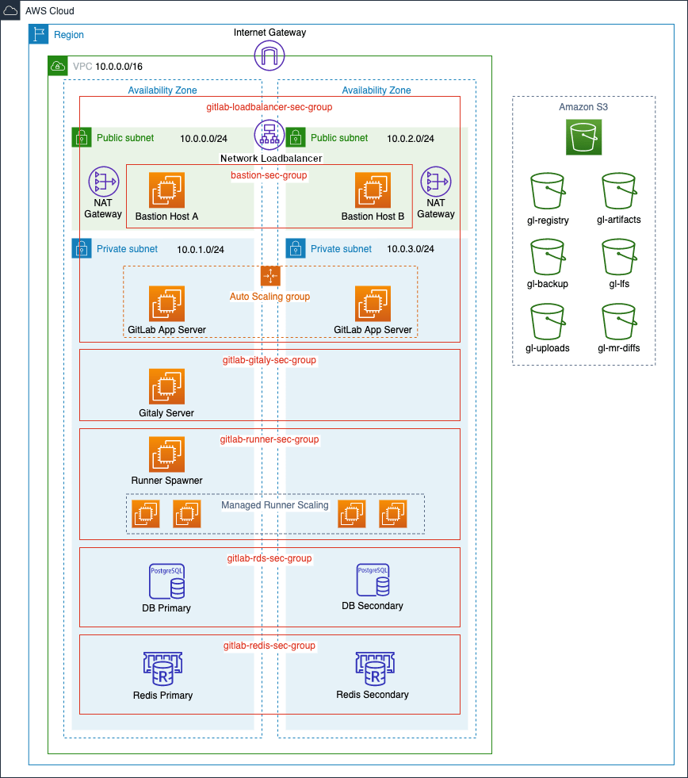
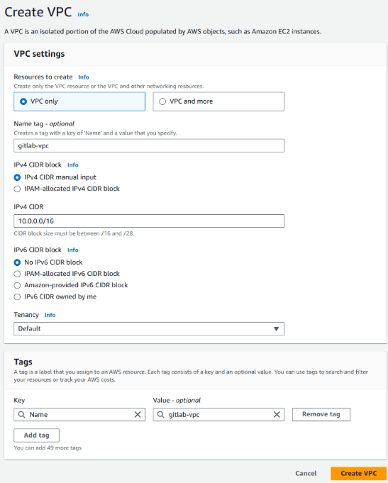
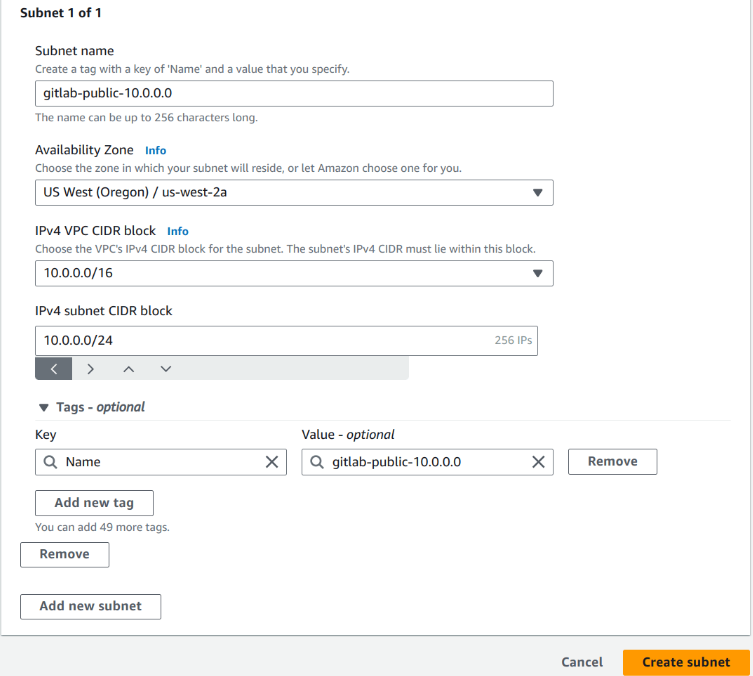
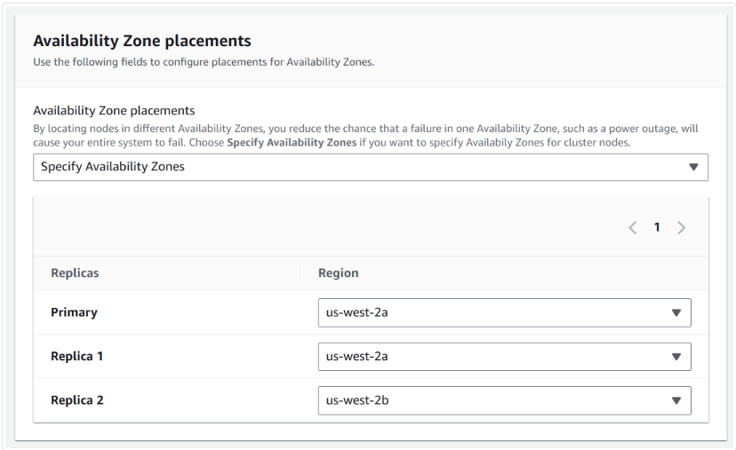
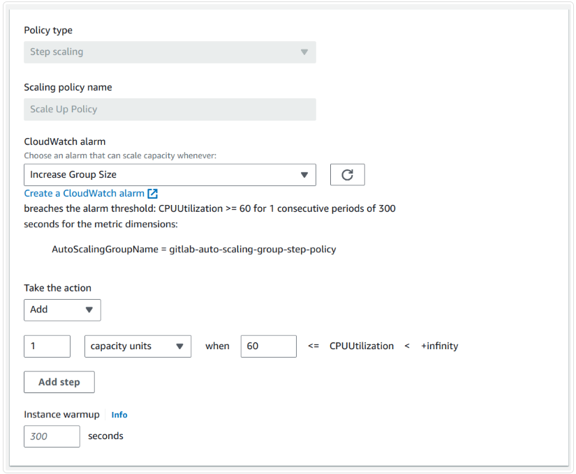
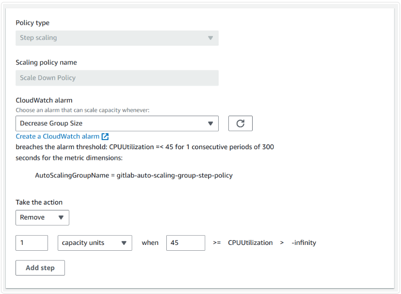

# Install Gitlab

## Cloud Provider

### Gitlab On AWS

- Gitlab On AWS
    - Architecture
        - 기본 20 RPS 또는 1000 Users (Omnibus 리눅스 패키지 사용)
            
            
            
        - 60 RPS, 3,000 Users (Omnibus 리눅스 패키지 사용)
            - HA가 필요 : Auto Scaling 그룹 사용
            - Gitaly 클러스터 구성
            - Praefects 클러스터 구성
            - RDS: 데이터베이스 서버로 Amazon RDS 사용
            - ElastiCache: Redis 클러스터 관리
    - Reference
        - [https://docs.gitlab.com/ee/install/aws/](https://docs.gitlab.com/ee/install/aws/)
        - [https://docs.gitlab.com/ee/administration/gitaly/configure_gitaly.html](https://docs.gitlab.com/ee/administration/gitaly/configure_gitaly.html)
        - [https://docs.gitlab.com/ee/administration/gitaly/praefect.html](https://docs.gitlab.com/ee/administration/gitaly/praefect.html)
    - 설치 전 준비사항
        - **AWS 계정**
        - **SSH 키**: 인스턴스에 SSH로 연결할 수 있도록 SSH 키를 생성하거나 업로드
        - **도메인 이름**: GitLab 인스턴스에 사용할 도메인
        - **SSL/TLS 인증서**: AWS Certificate Manager(ACM)를 통해 무료 인증서 발급 가능, Elastic Load Balancer에 사용
    - 설치
        - 1 > IAM Role 준비
            1. IAM 정책 생성
                - IAM 대시보드에서 왼쪽 메뉴의 **정책(Policies)** 을 선택
                - **정책 생성(Create policy)** 버튼을 클릭하고, **JSON** 탭을 선택
                - 아래의 정책 JSON을 추가하여 `gl-`로 시작하는 S3 버킷에 대한 필요한 권한을 부여
                    
                    ```json
                    {
                        "Version": "2012-10-17",
                        "Statement": [
                            {
                                "Effect": "Allow",
                                "Action": [
                                    "s3:PutObject",
                                    "s3:GetObject",
                                    "s3:DeleteObject",
                                    "s3:PutObjectAcl"
                                ],
                                "Resource": "arn:aws:s3:::gl-*/*"
                            },
                            {
                                "Effect": "Allow",
                                "Action": [
                                    "s3:ListBucket",
                                    "s3:AbortMultipartUpload",
                                    "s3:ListMultipartUploadParts",
                                    "s3:ListBucketMultipartUploads"
                                ],
                                "Resource": "arn:aws:s3:::gl-*"
                            }
                        ]
                    }
                    
                    ```
                    
                - **Next** 버튼을 클릭하고, 정책 이름을 입력 (예: `gl-s3-policy`).
                - **정책 생성(Create policy)** 버튼을 클릭하여 정책을 생성
            2. IAM 역할 생성
                - IAM 대시보드에서 **역할(Roles)** 을 선택한 후 **역할 생성(Create role)** 버튼을 클릭
                - *신뢰할 수 있는 엔터티 유형(Trusted entity type)**에서 **AWS 서비스(AWS service)** 를 선택하고, 사용 사례(Use case)에서 **EC2**를 선택한 후 **Next**를 클릭
                - 정책 필터에서 방금 생성한 정책 (`gl-s3-policy`)을 검색하여 선택하고, **Next**를 클릭
                - 역할 이름을 입력 (예: `GitLabS3Access`), 필요한 경우 태그를 추가하고 **역할 생성(Create role)** 을 클릭
                - 이 Role 은 S3 버킷에 대한 액세스를 허용
            3. 사용
                - 생성된 IAM 역할(`GitLabS3Access`)을 나중에 EC2 인스턴스를 만들 때 사용할 수 있음
        - 2 > Network 구성
            1. VPC 생성
                
                
                
                - VPC 왼쪽 메뉴에서 **Your VPCs**를 선택한 후 **Create VPC**를 클릭
                - **Name tag**에 `gitlab-vpc`를 입력하고, **IPv4 CIDR block**에는 `10.0.0.0/16`을 입력
                - **Tenancy**는 기본값을 그대로 두고, **Create VPC** 버튼을 클릭하여 VPC를 생성
                - 생성한 VPC를 선택하고, **Actions**에서 **Edit VPC Settings**를 클릭
                - **Enable DNS resolution**을 체크하고, **Save**를 클릭하여 저장
            2. Subnet 생성
                
                
                
                | Name tag | Type | Availability Zone | CIDR block |
                | --- | --- | --- | --- |
                | gitlab-public-10.0.0.0 | public | us-west-2a | 10.0.0.0/24 |
                | gitlab-private-10.0.1.0 | private | us-west-2a | 10.0.1.0/24 |
                | gitlab-public-10.0.2.0 | public | us-west-2b | 10.0.2.0/24 |
                | gitlab-private-10.0.3.0 | private | us-west-2b | 10.0.3.0/24 |
                - 왼쪽 메뉴에서 **Subnets**를 선택하고, **Create subnet**을 클릭
                - **Name tag**에 서브넷 이름을 입력(예: `gitlab-public-10.0.0.0`)
                - 이전에 생성한 VPC를 선택하고, 가용 영역(AZ)을 선택(예: `us-west-2a`).
                - **IPv4 CIDR block**에 서브넷 IP 범위(예: `10.0.0.0/24`)를 입력
                - 위와 같은 방식으로 4개의 Subnet 생성
                - 두개의 퍼블릭 서브넷을 선택하고, **Actions**에서 **Edit subnet settings**를 클릭
                - **Enable auto-assign public IPv4 address** 옵션을 체크하고, **Save**를 클릭하여 저장
            3. Internet Gateway
                - **Internet Gateways** 메뉴로 이동합니다.
                - **Create internet gateway**를 선택하고, 이름을 `gitlab-gateway`로 지정한 후 **Create**를 클릭
                - 생성된 인터넷 게이트웨이를 선택하고, **Actions** 드롭다운 메뉴에서 **Attach to VPC**를 클릭
                - **gitlab-vpc**를 선택하고 **Attach**를 클릭하여 VPC에 인터넷 게이트웨이를 연결
            4. NAT Gateway 생성
                - NAT Gateway 는 프라이빗 서브넷에 배포된 인스턴스들이 인터넷에 접근할 수 있도록 하되, 외부에서 직접 접근할 수 없게 함
                - 퍼블릭 서브넷에 배치된 두 개의 NAT 게이트웨이를 생성
                    1. VPC 대시보드에서 **NAT Gateways**를 선택 
                    2. **Create NAT Gateway**를 클릭하고, 아래와 같이 설정 
                        - **Subnet**: `gitlab-public-10.0.0.0`을 선택
                        - **Elastic IP Allocation ID**: 기존 Elastic IP를 입력하거나, **Allocate Elastic IP address**를 선택하여 새 IP를 할당
                        - 필요 시 **Tags**를 추가
                    3. **Create NAT Gateway**를 클릭하여 첫 번째 NAT 게이트웨이를 생성 
                    4. 두 번째 NAT 게이트웨이를 생성하는데, 이번에는 **gitlab-public-10.0.2.0** 서브넷을 선택하여 생성 
            5. Route Table을 설정
                - Public Route Table 생성
                    - 퍼블릭 서브넷이 인터넷 게이트웨이를 통해 인터넷에 접근할 수 있도록 라우팅 테이블을 생성
                        1. VPC 대시보드에서 **Route Tables**를 선택
                        2. **Create Route Table**을 클릭하고, **Name tag**에 `gitlab-public`을 입력하고 **VPC**에는 `gitlab-vpc`를 선택
                        3. **Create**를 클릭하여 라우팅 테이블을 생성
                        4. 인터넷 게이트웨이를 추가
                            1. 생성한 `gitlab-public` 라우팅 테이블을 선택하고, 하단의 **Routes** 탭을 클릭 
                            2. **Edit routes** > **Add route**를 클릭하고, **Destination**에 `0.0.0.0/0`을 입력 
                            3. **Target** 컬럼에서 **Internet Gateway**를 선택하고, 이전에 생성한 `gitlab-gateway`를 선택한 후 **Save changes**를 클릭 
                        5. 퍼블릭 서브넷과 라우팅 테이블 연결
                            1. **Subnet Associations** 탭을 선택하고, **Edit subnet associations**를 클릭 
                            2. 퍼블릭 서브넷만 선택하고, **Save associations**를 클릭하여 라우팅 테이블을 퍼블릭 서브넷에 연결
                - Private Route Table 생성
                    - 프라이빗 서브넷에서 인터넷에 접근할 수 있도록 두 개의 프라이빗 라우팅 테이블을 생성
                    - 각 프라이빗 서브넷은 동일 가용 영역에 있는 NAT 게이트웨이를 통해 인터넷에 접근
                        1. 퍼블릭 라우팅 테이블 생성과 동일한 방법으로 **gitlab-private-a**와 **gitlab-private-b**라는 두 개의 라우팅 테이블을 생성
                        2. NAT 게이트웨이 추가
                            1. **gitlab-private-a** 라우팅 테이블에 새 라우트를 추가하고, **Destination**에 `0.0.0.0/0`을 입력하고, **Target**에 `gitlab-public-10.0.0.0` 서브넷에 있는 NAT 게이트웨이를 선택
                            2. **gitlab-private-b** 라우팅 테이블에 새 라우트를 추가하고, **Destination**에 `0.0.0.0/0`을 입력하고, **Target**에 `gitlab-public-10.0.2.0` 서브넷에 있는 NAT 게이트웨이를 선택
                        3. 프라이빗 서브넷과 라우팅 테이블 연결
                            1. **gitlab-private-10.0.1.0** 서브넷을 **gitlab-private-a** 라우팅 테이블에 연결
                            2. **gitlab-private-10.0.3.0** 서브넷을 **gitlab-private-b** 라우팅 테이블에 연결
        - 3 > LB 구성
            1. Network Load Balancer 생성
                - **EC2 대시보드**에서 왼쪽 메뉴의 **Load Balancers**를 선택
                - **Create Load Balancer**를 클릭하고, **Network Load Balancer**를 선택한 후 **Create**를 클릭
            2. 로드 밸런서 설정 
                - **Load Balancer name**: `gitlab-loadbalancer`
                - **Scheme**: Internet-facing
                - **IP address type**: IPv4
                - **VPC**: `gitlab-vpc` 선택
                - **Mapping**: 퍼블릭 서브넷 두 개를 선택하여 로드 밸런서가 두 개의 가용 영역에 트래픽을 라우팅할 수 있게 설정
            3. 보안 그룹 설정
                - 로드 밸런서의 방화벽 역할을 하는 보안 그룹을 생성
                    - **Security Group name**: `gitlab-loadbalancer-sec-group`
                    - **Description**: 설명 입력
                    - **허용할 트래픽**:
                        - **HTTP** 및 **HTTPS**: 모든 IP에서 접근 허용 (0.0.0.0/0, ::/0)
                        - **SSH**: 신뢰된 IP 주소 또는 IP 범위(CIDR)를 설정하여 SSH 트래픽 허용
            4. 리스너 및 라우팅 설정
                - 80번, 443번, 22번 포트에 대한 리스너를 설정
                - 각 리스너에 대해 타겟 그룹을 설정
                    
                    
                    | 프로토콜 | 포트 | 타겟 그룹 |
                    | --- | --- | --- |
                    | TCP | 80 | gitlab-loadbalancer-http-target |
                    | TCP | 22 | gitlab-loadbalancer-ssh-target |
                    | TLS | 443 | gitlab-loadbalancer-http-target |
                - TLS 리스너 설정
                    - **정책 이름**: 사전 정의된 SSL 보안 정책을 선택
                    - **기본 SSL/TLS 서버 인증서**: ACM에서 인증서를 선택하거나, IAM에 인증서를 업로드
            5. 타겟 그룹 생성
                - 각 리스너에 대해 타겟 그룹을 생성
                - 인스턴스를 아직 생성하지 않았기 때문에, 타겟 등록은 나중에 자동 확장 그룹 설정에서 처리
                    - **타겟 그룹 이름**
                        - `gitlab-loadbalancer-http-target` (포트 80용 TCP 프로토콜)
                        - `gitlab-loadbalancer-ssh-target` (포트 22용 TCP 프로토콜)
                    - **타겟 유형**: Instances
                    - **IP 주소 유형**: IPv4
                    - **VPC**: `gitlab-vpc` 선택
                - 헬스 체크 설정
                    - `gitlab-loadbalancer-http-target`: Readiness check endpoint 사용, VPC의 IP 주소 범위를 헬스 체크 화이트리스트에 추가
                    - `gitlab-loadbalancer-ssh-target`: TCP로 설정
            6. **리스너와 타겟 그룹 연결**
                - **포트 80 및 443 리스너**에는 `gitlab-loadbalancer-http-target`를 연결
                - **포트 22 리스너**에는 `gitlab-loadbalancer-ssh-target`를 연결
            7. 기타 설정
                - 클라이언트 IP 보존(Client IP preservation)
                    - 기본적으로 활성화되어 있으며, GitLab 애플리케이션에서 클라이언트의 IP를 보존
                    - 필요에 따라 설정을 변경할 수 있음
                - 프록시 프로토콜(Proxy Protocol)
                    - **프록시 프로토콜**은 로드 밸런서가 클라이언트의 실제 IP 주소와 포트 정보를 헤더로 전달하도록 도와줌
                    - 기본적으로 비활성화되어 있으며, 이 기능을 활성화하려면 로드 밸런서의 리스너에서 **Proxy Protocol**을 활성화
            8. 로드 밸런서 생성 완료
                - 모든 설정을 마친 후 **Create load balancer**를 클릭하여 로드 밸런서를 생성
        - 4 > DNS 설정
            1. Route 53에서 Hosted Zone 설정 
                - Route 53 대시보드에서 **Hosted zones**를 선택
                - 이미 도메인에 대한 Hosted Zone이 있다면 선택하고, 없다면 **Create Hosted Zone**을 선택하여 도메인 이름을 입력하고 **Create**를 클릭
            2. 레코드 생성
                - **Create record**를 선택하고 다음 값을 입력
                    - **Name**: 도메인 이름 또는 서브도메인 입력
                    - **Type**: `A - IPv4 address`
                    - **Alias**: 기본값은 비활성화되어 있으므로, 이 옵션을 활성화
                    - **Route traffic to**: `Alias to Network Load Balancer` 선택
                    - **Region**: Network Load Balancer가 위치한 리전 선택
                    - **Choose network load balancer**: 이전에 생성한 Network Load Balancer를 선택
                    - **Routing Policy**: 기본값인 **Simple**을 사용하지만, 필요에 따라 다른 정책을 선택
                    - **Evaluate Target Health**
                        - 기본값은 **No**로 설정
                        - 트래픽을 타겟 상태에 따라 라우팅하려면 **Yes**를 선택할 수 있음
                - **Create**를 선택하여 레코드를 생성
        - 5 > RDS 설정
            - GitLab을 위한 Amazon RDS에서 PostgreSQL을 설정하는 과정
                1. RDS 보안 그룹 생성
                    - **목적**: GitLab EC2 인스턴스에서 RDS로의 인바운드 트래픽 허용
                    - **설정 과정**
                        1. EC2 대시보드에서 **Security Groups**을 선택
                        2. 새 보안 그룹을 생성 (예: `gitlab-rds-sec-group`)
                        3. 인바운드 규칙에서 **PostgreSQL** 트래픽을 **gitlab-loadbalancer-sec-group**에서 허용하도록 설정
                        4. 보안 그룹을 저장하고 생성
                2. RDS 서브넷 그룹 생성
                    - **목적**: RDS 인스턴스가 사용할 서브넷을 정의
                    - **설정 과정**
                        1. RDS 대시보드에서 **Subnet Groups**을 선택
                        2. 새 서브넷 그룹을 생성합니다 (예: `gitlab-rds-group`)
                        3. **gitlab-vpc**를 선택하고 **eu-west-2a**와 **eu-west-2b**를 가용 영역으로 선택
                        4. 프라이빗 서브넷(예: `10.0.1.0/24`, `10.0.3.0/24`)을 선택
                        5. 서브넷 그룹을 저장하고 생성
                3. PostgreSQL 데이터베이스 생성
                    - **목적**: GitLab용 PostgreSQL 데이터베이스 설정
                    - **설정 과정**
                        1. RDS 대시보드에서 **Databases**를 선택
                        2. **Create Database**를 클릭하고 **Standard Create**를 선택
                        3. **PostgreSQL**을 데이터베이스 엔진으로 선택하고, 필요한 버전을 선택
                        4. 템플릿에서 **Production**을 선택하고 **Multi-AZ**를 선택하여 고가용성 구성
                        5. DB 인스턴스 식별자를 `gitlab-db-ha`로 설정하고, 마스터 사용자 이름을 `gitlab`, 비밀번호를 강력한 값으로 설정
                        6. 인스턴스 크기(예: `db.m5.large`)를 선택하고, Provisioned IOPS (SSD)를 사용하여 스토리지 값을 설정 (예: 100GB 스토리지, 1000 IOPS).
                        7. **스토리지 자동 확장**을 활성화하고 최대 스토리지 한계를 설정 (선택 사항)
                        8. **공용 액세스**는 **No**로 설정하고, 보안 그룹에서 **gitlab-rds-sec-group**을 선택
                        9. 데이터베이스 이름을 `gitlabhq_production`으로 설정하고, 백업 및 유지 관리 설정을 필요에 따라 구성
                        10. 데이터베이스 인스턴스를 생성
        - 6 > ElasticCache 설정
            - Gitlab 에서 사용되는 Redis 를 위한 ElasticCache 설정 과정
                1. Redis 보안 그룹 생성
                    - **목적**: GitLab 로드 밸런서와의 연결을 위한 Redis 보안 그룹 설정
                    - **설정 과정**
                        1. EC2 대시보드에서 **Security Groups**을 선택
                        2. 새 보안 그룹을 생성 (예: `gitlab-redis-sec-group`)
                        3. 인바운드 규칙에서 **Custom TCP** 규칙을 추가하고, 포트 6379를 설정
                        4. **소스**를 **gitlab-loadbalancer-sec-group**으로 설정
                        5. 보안 그룹을 저장하고 생성
                2. Redis 서브넷 그룹 생성
                    - **목적**: Redis 인스턴스가 사용할 서브넷을 정의
                    - **설정 과정**
                        1. ElastiCache 대시보드에서 **Subnet Groups**을 선택
                        2. 새 서브넷 그룹을 생성 (예: `gitlab-redis-group`)
                        3. **gitlab-vpc**를 선택하고, 프라이빗 서브넷만 포함되도록 설정
                        4. 서브넷 그룹을 저장하고 생성
                3. Redis 클러스터 생성
                    - **목적**: Redis 클러스터를 설정하여 GitLab의 세션 데이터, 캐시, 백그라운드 작업 큐를 처리
                    - **설정 과정**
                        1. ElastiCache 대시보드로 이동 
                        2. Redis 캐시 생성
                            - 왼쪽 메뉴에서 **Redis caches**를 선택하고, **Create Redis cache**를 클릭하여 새로운 Redis 클러스터를 생성
                        3. 배포 옵션 설정
                            - **Deployment option**에서 **Design your own cache**를 선택
                        4. 생성 방법 설정
                            - **Creation method**에서 **Cluster cache**를 선택
                        5. 클러스터 모드 설정
                            - **Cluster mode**는 **Disabled**로 설정
                                - 클러스터 모드는 지원되지 않지만, 여러 가용 영역에 Redis를 배포할 수 있음
                        6. 클러스터 정보 설정
                            - **Cluster info** 섹션에서 클러스터 이름을 `gitlab-redis`로 설정하고, 설명을 추가
                        7. 위치 설정
                            - **Location**에서 **AWS Cloud**를 선택하고 **Multi-AZ** 옵션을 활성화합니다.
                        8. 클러스터 설정
                            - **엔진 버전**: GitLab에서 요구하는 Redis 버전을 선택
                            - **포트**: 6379로 설정  (이 포트는 Redis 보안 그룹에서 설정한 포트와 일치)
                            - **노드 유형**: 최소 `cache.t3.medium`을 선택하고 필요에 맞게 조정
                            - **레플리카 수**: 요구 사항에 맞는 레플리카 수를 설정
                        9. 연결 설정
                            - **Network type**: IPv4로 설정합니다.
                            - **Subnet groups**: 이전에 생성한 `gitlab-redis-group`을 선택
                        10. 가용 영역 배치
                            - 가용 영역을 수동으로 선택하고, **Replica 2**는 다른 가용 영역을 선택
                                
                                
                                
                        11. 보안 설정
                            - **Security groups**에서 이전에 생성한 `gitlab-redis-sec-group`을 선택
                        12. 기타 설정
                            - 나머지 설정은 기본값으로 두거나 필요에 맞게 수정
                        13. 클러스터 생성
                            - 모든 설정을 마친 후 **Create**를 클릭하여 Redis 클러스터를 생성
        - 7 > Gitlab AMI 설정
            - GitLab 인스턴스를 위한 사전 구성된 커스텀 AMI가 필요 (Optional)
            - GitLab 인스턴스를 만들고, PostgreSQL, Redis, Gitaly에 대한 커스텀 구성을 추가
            - 공식 GitLab AMI 대신 EC2 인스턴스를 생성하여 수동으로 GitLab을 설치할 수도 있음
                1. **GitLab 설치**
                    1. EC2 대시보드에서 AMI 선택
                        - Find official GitLab-created AMI IDs on AWS 섹션에서 적합한 AMI를 찾고, Launch를 클릭
                    2. 이름 및 태그 설정
                        - Name을 `GitLab`으로 설정
                    3. 인스턴스 유형 선택
                        - 인스턴스 유형을 선택 (최소 `c5.2xlarge`를 권장, 100명의 사용자를 지원할 수 있음)
                    4. 키 페어 설정
                        - Create new key pair를 선택하고, 이름을 `gitlab`으로 설정하여 `.pem` 파일을 저장
                    5. 네트워크 설정
                        - VPC에서 `gitlab-vpc`를 선택
                        - Subnet에서 `gitlab-private-10.0.1.0`을 선택
                        - Auto-assign Public IP는 Disable로 설정
                        - Firewall에서 gitlab-loadbalancer-sec-group을 선택
                    6. 스토리지 설정
                        - 8 GiB root volume을 사용
                    7. 검토 및 실행
                        - 모든 설정을 검토한 후 Launch Instance를 클릭
                2. **AMI 커스텀 구성 추가**
                    1. Bastion Hos 를 통해 GitLab 인스턴스에 SSH 접속
                        - SSH 에이전트 포워딩을 사용하여 접속
                    2. Let’s Encrypt 비활성화
                        - `/etc/gitlab/gitlab.rb` 파일을 열어 Let’s Encrypt를 비활성화
                            
                            ```bash
                            letsencrypt['enable'] = false
                            ```
                            
                        - 파일을 저장한 후, 변경 사항을 적용하기 위해 GitLab을 재구성
                            
                            ```bash
                            sudo gitlab-ctl reconfigure
                            ```
                            
                    3. PostgreSQL 확장 설치
                        - GitLab 인스턴스에서 RDS 인스턴스에 연결하여 필요한 PostgreSQL 확장을 설치
                            
                            ```bash
                            sudo /opt/gitlab/embedded/bin/psql -U gitlab -h <rds-endpoint> -d gitlabhq_production
                            CREATE EXTENSION pg_trgm;
                            CREATE EXTENSION btree_gist;
                            \q
                            ```
                            
                    4. GitLab의 PostgreSQL 및 Redis 설정
                        - `/etc/gitlab/gitlab.rb` 파일을 열어 PostgreSQL과 Redis 설정을 수정
                            
                            ```bash
                            postgresql['enable'] = false
                            gitlab_rails['db_adapter'] = "postgresql"
                            gitlab_rails['db_encoding'] = "unicode"
                            gitlab_rails['db_database'] = "gitlabhq_production"
                            gitlab_rails['db_username'] = "gitlab"
                            gitlab_rails['db_password'] = "mypassword"
                            gitlab_rails['db_host'] = "<rds-endpoint>"
                            
                            redis['enable'] = false
                            gitlab_rails['redis_host'] = "<redis-endpoint>"
                            gitlab_rails['redis_port'] = 6379
                            ```
                            
                        - 파일을 저장하고, GitLab을 재구성
                            
                            ```bash
                            sudo gitlab-ctl reconfigure
                            ```
                            
                    5. GitLab 상태 확인
                        - GitLab 상태를 확인하여 설정이 제대로 적용되었는지 확인
                        
                        ```bash
                        sudo gitlab-rake gitlab:check
                        sudo gitlab-ctl status
                        ```
                        
                3. Gitaly 서버 설치 및 구성
                    1. Gitaly 서버 설치
                        - EC2 대시보드에서 인스턴스 시작
                            - 이름 및 태그: `Gitaly`
                            - AMI 선택: 최신 Ubuntu Server LTS (HVM), SSD Volume Type
                            - 인스턴스 유형: `m5.xlarge`
                            - 키 페어: `Create new key pair` 선택 후 이름은 `gitaly`로 지정하고 `.pem` 파일 저장
                        - 네트워크 설정
                            - VPC: `gitlab-vpc` 선택
                            - 서브넷: `gitlab-private-10.0.1.0` (사설 서브넷)
                            - 공인 IP: `Disable` 선택
                            - 보안 그룹: 새 보안 그룹 생성 (`gitlab-gitaly-sec-group`)
                                - TCP 포트 8075: `gitlab-loadbalancer-sec-group`에서 소스로 추가
                                - SSH: `bastion-sec-group`에서 SSH 접근 허용 (SSH 에이전트 전달을 위해)
                        - 루트 볼륨 설정
                            - 크기: 20 GiB (저장소 크기에 맞게 설정)
                            - 볼륨 유형: `Provisioned IOPS SSD (io1)`
                            - IOPS: 1000 (20 GiB × 50 IOPS)
                        - 인스턴스 시작
                            - 모든 설정을 검토하고 인스턴스를 시작
                    2. GitLab 인스턴스에 Gitaly 설정
                        - [Gitaly](https://docs.gitlab.com/ee/administration/gitaly/configure_gitaly.html)
                        - [Gitaly Cluster](https://docs.gitlab.com/ee/administration/gitaly/praefect.html)
                4. Proxied SSL 지원
                    - SSL Termination 를 로드 밸런서에서  수행하므로 Proxied SSL 지원하도록 Gitlab 설정 변경
                        1. `/etc/gitlab/gitlab.rb` 파일 수정
                            
                            ```bash
                            # SSL 종료를 외부 로드 밸런서에 맡기고 GitLab 자체에서는 HTTP만 처리하도록 설정
                            
                            # NGINX가 HTTP만 리스닝하도록 설정
                            nginx['listen_https'] = false  # HTTPS 리스닝 비활성화
                            nginx['listen_port'] = 80      # HTTP 포트 80으로 리스닝
                            
                            # 확인 안된 설정이지만 일단 테스트할 가치는 있음
                            #nginx['proxy_set_headers'] = {
                            #  'X-Forwarded-For' => '$proxy_add_x_forwarded_for',
                            #  'X-Forwarded-Proto' => '$scheme',
                            #  'X-Forwarded-Host' => '$host',
                            #  'X-Real-IP' => '$remote_addr',
                            #  'X-Forwarded-Port' => '$server_port'
                            #}
                            
                            # GitLab의 다른 구성 요소(예: Container Registry, Pages, Mattermost)의 경우, 외부 SSL을 처리할 수 있도록 개별적인 설정을 적용
                            registry_external_url 'https://registry.example.com'
                            registry_nginx['listen_port'] = 80
                            registry_nginx['listen_https'] = false
                            
                            pages_external_url 'https://pages.example.com'
                            pages_nginx['listen_port'] = 80
                            pages_nginx['listen_https'] = false
                            
                            mattermost_external_url 'https://mattermost.example.com'
                            mattermost_nginx['listen_port'] = 80
                            mattermost_nginx['listen_https'] = false
                            
                            ...
                            
                            # 재구성 적용
                            sudo gitlab-ctl reconfigure
                            ```
                            
                5. Fast SSH Key Lookup 설정
                    - GitLab에서 SSH 키를 빠르게 조회하려면, 기본적으로 `/var/opt/gitlab/.ssh/authorized_keys` 파일을 사용
                    - 이 파일은 모든 GitLab 인스턴스가 접근할 수 있는 공유 저장소에 저장되어야  함
                    - 공유 저장소가 없는 경우, GitLab 데이터베이스를 사용하여 SSH 키를 빠르게 조회하도록 구성 필요
                    - 설정
                        1. Fast SSH Key Lookup 활성화
                            - 기본 설정 변경: `authorized_keys` 파일 대신 GitLab 데이터베이스에서 SSH 키를 조회하도록 설정을 변경
                                - `authorized_keys` 파일 사용에서 데이터베이스 조회로 전환하려면 GitLab의 [Fast SSH Key Lookup 설정 가이드](https://docs.gitlab.com/ee/administration/ssh_key_lookup.html)를 참고하여 필요한 설정을 적용
                            - GitLab 설정 파일 수정
                                - 설정 파일을 수정하여 GitLab이 SSH 키를 데이터베이스에서 인덱싱하여 빠르게 조회할 수 있도록 구성
                                - 이 과정에서 `/etc/gitlab/gitlab.rb` 파일을 수정하고 `gitlab-ctl reconfigure` 명령어로 변경 사항을 적용
                        2. Fast Lookup 미설정 시 발생하는 문제
                            - Fast SSH Key Lookup이 설정되지 않으면 GitLab에서 SSH를 통한 Git 작업을 수행할 때 다음과 같은 오류가 발생
                                
                                ```vbnet
                                Permission denied (publickey).
                                fatal: Could not read from remote repository.
                                Please make sure you have the correct access rights and the repository exists.
                                ```
                                
                6. Host Key 구성
                    - Host Key는 SSH 프로토콜에서 서버의 신원을 인증하기 위해 사용하는 암호화된 공개 키
                    - SSH 클라이언트(예: GitLab 사용자)가 SSH 서버에 연결할 때, 서버는 자신의 호스트 키를 클라이언트에 제공하고, 클라이언트는 이를 통해 서버의 신원을 확인
                    - GitLab 클러스터에서 로드 밸런서를 통해 여러 서버에 접근할 때, 중간자 공격 경고를 방지하려면 각 서버에서 동일한 SSH 호스트 키를 사용해야 함
                    - 이를 위해, 수동으로 각 서버의 `/etc/ssh`에 SSH 호스트 키를 복사하는 대신, **정적 호스트 키**를 자동으로 설정하는 방법을 사용
                    - 설정
                        1. 정적 호스트 키 생성 및 복사
                            1. GitLab 인스턴스에서 정적 SSH 키 저장 디렉토리 생성
                                
                                ```bash
                                sudo mkdir /etc/ssh_static
                                ```
                                
                            2. 기존 SSH 키를 정적 디렉토리로 복사
                                
                                ```bash
                                sudo cp -R /etc/ssh/* /etc/ssh_static
                                ```
                                
                        2. `sshd_config` 파일 수정
                            1. `/etc/ssh/sshd_config` 파일의 `HostKey` 항목을 수정하여 `/etc/ssh_static` 디렉토리에 저장된 SSH 호스트 키를 사용하도록 설정
                                
                                ```bash
                                HostKey /etc/ssh_static/ssh_host_rsa_key
                                HostKey /etc/ssh_static/ssh_host_dsa_key
                                HostKey /etc/ssh_static/ssh_host_ecdsa_key
                                HostKey /etc/ssh_static/ssh_host_ed25519_key
                                ```
                                
                        3. `sshd_config` 파일을 수정한 후, SSH 서비스를 재시작하여 변경 사항을 적용
                            
                            ```bash
                            sudo systemctl restart sshd
                            ```
                            
                7. Amazon S3 객체 스토리지 설정
                    - GitLab에서 NFS 대신 Amazon S3 버킷을 사용하여 백업, 아티팩트, LFS 객체, 업로드, 머지 리퀘스트 차이(diff), 컨테이너 레지스트리 이미지 등 다양한 데이터를 저장 가능
                    - 설정
                        
                        ```bash
                        gitlab_rails['object_store']['enabled'] = true
                        gitlab_rails['object_store']['connection'] = {
                          'provider' => 'AWS',
                          'region' => '${region}',
                          'use_iam_profile' => true
                        }
                        
                        gitlab_rails['object_store']['storage_options'] = {
                          'server_side_encryption' => 'aws:kms',
                          'server_side_encryption_kms_key_id' => '${gitlab_buckets.kms_key_arn}'
                        }
                        gitlab_rails['object_store']['proxy_download'] = true
                        gitlab_rails['object_store']['objects']['artifacts']['bucket'] = '${gitlab_buckets.artifacts_bucket}'
                        gitlab_rails['object_store']['objects']['external_diffs']['bucket'] = '${gitlab_buckets.external_diffs_bucket}'
                        gitlab_rails['object_store']['objects']['lfs']['bucket'] = '${gitlab_buckets.lfs_objects_bucket}'
                        gitlab_rails['object_store']['objects']['uploads']['bucket'] = '${gitlab_buckets.uploads_bucket}'
                        gitlab_rails['object_store']['objects']['packages']['bucket'] = '${gitlab_buckets.packages_bucket}'
                        gitlab_rails['object_store']['objects']['dependency_proxy']['bucket'] = '${gitlab_buckets.dependency_proxy_bucket}'
                        gitlab_rails['object_store']['objects']['terraform_state']['bucket'] = '${gitlab_buckets.terraform_state_bucket}'
                        gitlab_rails['object_store']['objects']['ci_secure_files']['bucket'] = '${gitlab_buckets.ci_secure_files_bucket}'
                        gitlab_rails['object_store']['objects']['pages']['bucket'] = '${gitlab_buckets.pages_bucket}'
                        ```
                        
                8. IP allowlist 설정
                    - 설명
                        - GitLab 인스턴스의 Health check endpoints에 접근할 수 있도록, gitlab-vpc의 IP 주소 범위를 IP Allowlist에 추가
                    - 설정
                        
                        ```bash
                        # /etc/gitlab/gitlab.rb 파일에서 설정
                        # 127.0.0.0/8: 로컬호스트(내부) IP 범위
                        # 10.0.0.0/16: gitlab-vpc의 CIDR 범위(여기서 10.0.0.0/16은 예시로, 실제 VPC CIDR에 맞게 설정)
                        gitlab_rails['monitoring_whitelist'] = ['127.0.0.0/8', '10.0.0.0/16']
                        
                        $ sudo gitlab-ctl reconfigure
                        ```
                        
                9. Proxy Protocol 설정 
                    - 로드 밸런서에서 Proxy Protocol을 사용하도록 설정한 경우, GitLab에서 이를 수락하고 클라이언트의 실제 IP 주소를 올바르게 인식하도록 `gitlab.rb` 파일을 수정
                        
                        ```bash
                        # /etc/gitlab/gitlab.rb 파일 수정
                        # 127.0.0.0/8: 로컬호스트 IP 주소 범위 (일반적으로 GitLab 서버 자체)
                        # IP_OF_THE_PROXY/32: 로드 밸런서의 IP 주소를 입력. 예: "10.0.0.1/32".
                        nginx['proxy_protocol'] = true
                        nginx['real_ip_trusted_addresses'] = [ "127.0.0.0/8", "IP_OF_THE_PROXY/32" ]
                        
                        $ sudo gitlab-ctl reconfigure
                        ```
                        
                10. 커스텀 AMI 생성
                    - GitLab 인스턴스를 커스텀 AMI로 저장하여, Auto Scaling 그룹에서 사용할 수 있도록 함
                        1. EC2 대시보드
                            - 이전에 생성한 GitLab 인스턴스를 선택
                            - Actions 메뉴에서 Image and templates를 선택하고 Create image를 클릭
                        2. 이미지 이름과 설명 설정
                            - 이미지 이름과 설명을 입력 (예: `GitLab-Source`).
                        3. 기타 설정은 기본값으로 유지
                            - 기본 설정을 그대로 두고 Create Image를 클릭하여 커스텀 AMI를 생성
        - 8 > Launch Template 생성 및 ASG 생성
            - Launch Template 생성
                - EC2 대시보드에서 Launch Templates 메뉴 선택 후 Create launch template 클릭
                - 템플릿 이름: `gitlab-launch-template`
                - AMI 선택: My AMIs 탭에서 GitLab-Source 커스텀 AMI 선택
                - 인스턴스 타입: 최소 c5.2xlarge 선택
                - 키 페어: 새 키 페어 생성 (예: `gitlab-launch-template`) 후 `.pem` 파일 저장
                - 루트 볼륨: 기본 8 GiB 설정
                - 보안 그룹: gitlab-loadbalancer-sec-group 선택
                - IAM 역할: GitLabS3Access 역할 선택
                - Launch Template 생성
            - Auto Scaling Group 생성
                - EC2 대시보드에서 Auto Scaling groups 메뉴 선택 후 Create Auto Scaling group 클릭
                - 그룹 이름: `gitlab-auto-scaling-group`
                - Launch Template 선택: `gitlab-launch-template`
                - 네트워크 설정
                    - VPC: `gitlab-vpc`
                    - 서브넷: `gitlab-private-10.0.1.0`, `gitlab-private-10.0.3.0`
                - 로드 밸런싱 설정: 기존 타겟 그룹과 Elastic Load Balancing Health Checks 설정
                - 그룹 크기: Desired capacity 2, Min desired capacity 2, Max desired capacity 4 설정
                - Auto Scaling Group 생성
            - CloudWatch에서 스케일링 정책 설정
                - Scale Up Policy
                    
                    
                    
                    - 조건: CPUUtilization 60% 이상 -> 1 capacity unit 추가
                    - 정책 이름: `Scale Up Policy`
                - Scale Down Policy
                    
                    
                    
                    - 조건: CPUUtilization 45% 이하 -> 1 capacity unit 제거
                    - 정책 이름: `Scale Down Policy`
                - 스케일링 정책을 Auto Scaling Group에 할당
            - Auto Scaling과 로드 밸런서 연동
                - Auto Scaling에 의해 새 인스턴스들이 EC2 대시보드에서 생성되고, 로드 밸런서에 자동으로 추가
                - Health Check 통과 후 로드 밸런서가 트래픽을 새로운 인스턴스로 전달
            - 기존 수동 인스턴스 종료
                - 수동으로 생성된 GitLab 인스턴스는 AMI 생성 후 필요 없으므로 종료
        - 9 > 모니터링, 백업 및 업데이트
            - [Prometheus](https://docs.gitlab.com/ee/administration/monitoring/prometheus/index.html)를 통한 건강 상태 확인 및 모니터링
                - GitLab은 Prometheus 기반의 모니터링 솔루션을 제공
                - 다양한 건강 체크 엔드포인트를 통해 시스템 상태 및 성능 보고서를 확인 가능
            - GitLab Runner
                - GitLab CI/CD를 사용하려면 최소한 하나의 GitLab Runner 설정 필요.
                - AWS에서 GitLab Runner를 자동 확장 방식으로 구성하여 동적으로 워크로드 관리 가능
            - [백업 및 복원](https://docs.gitlab.com/ee/administration/backup_restore/)
                - GitLab은 Git 데이터, 데이터베이스, 첨부 파일, LFS 객체 등을 백업 및 복원할 수 있는 도구 제공
                - 중요 사항
                    - 백업 도구는 일부 설정 파일(예: 비밀 파일)을 포함하지 않으므로 별도로 백업해야 함
                    - 기본적으로 백업은 로컬에 저장되지만, S3 를 사용할 수도 있음
                    - 특정 디렉토리는 백업에서 제외 가능
                - 백업 방법
                    - GitLab 인스턴스에 SSH로 접속 후, 백업 생성
                        
                        ```bash
                        sudo gitlab-backup create
                        ```
                        
                - 복원 방법
                    - 복원 문서를 참조하고 리눅스 패키지 설치 섹션에 따른 절차 진행
            - GitLab 업데이트
                - GitLab은 매월 새로운 버전을 출시.
                - 업데이트 방법
                    1. GitLab 인스턴스에 SSH로 접속
                    2. 백업 생성
                        
                        ```bash
                        sudo gitlab-backup create
                        ```
                        
                    3. 리포지토리 업데이트 및 최신 버전 설치
                        
                        ```bash
                        sudo apt update
                        sudo apt install gitlab-ee
                        ```