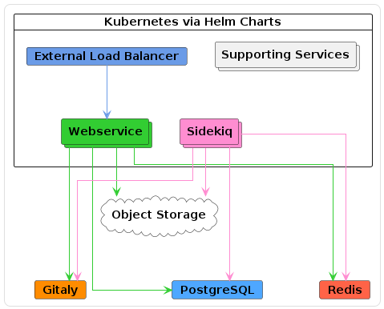

# Gitlab Reference Architecture

> Gitlab Architecture 에 대한 설명 페이지

## Gitlab Modules

- **캐싱 및 세션 관리**
    - **Redis**
        - GitLab에서 캐싱 및 세션 데이터를 저장하고 빠르게 접근할 수 있도록 지원
    - **Redis Sentinel**
        - Redis 인스턴스들의 상태를 모니터링하고, 장애 발생 시 자동으로 장애 복구를 수행하여 Redis의 고가용성을 보장

- **서비스 디스커버리 및 고가용성 관리 (Premium, Ultimate)**
    - **Consul**
        - 서비스 디스커버리 기능을 제공하여 GitLab의 각 서비스들의 위치와 상태 정보를 관리
    - **Patroni**
        - PostgreSQL 데이터베이스의 고가용성을 관리하며, 자동 장애 복구 및 리더 선출을 담당

- **데이터베이스 관리**
    - **Postgresql**
        - GitLab의 주 데이터베이스로, 사용자 데이터 및 프로젝트 정보를 저장
    - **PgBouncer**
        - PostgreSQL 데이터베이스의 connection pool을 관리하고, failover를 처리

- **Git 저장소 및 버전 관리**
    - **Gitaly**
        - Git 저장소의 데이터를 저장하고 접근을 관리하는 Git RPC 서비스
    - **Praefect**
        - Git 클라이언트와 Gitaly 스토리지 노드 간의 투명한 프록시 역할을 하여, 여러 Gitaly 서버 간의 상호작용을 관리

- **로드 밸런싱**
    - **Internal Loadbalancer**
        - GitLab의 내부 서비스 간 통신을 위한 로드밸런서로, 서비스 간의 트래픽을 효율적으로 분배
    - **External Loadbalancer**
        - 외부에서 들어오는 트래픽을 처리하는 로드밸런서로, GitLab에 대한 외부 접근을 분배하고 최적화

- **비동기 작업 처리**
    - **Sidekiq**
        - GitLab에서 비동기 작업을 처리하는 백그라운드 작업 큐로, 이메일 전송, 통계 수집 등과 같은 시간 소모적인 작업을 처리

- **웹 서비스 및 API**
    - **GitLab Rails**
        - GitLab의 비즈니스 로직을 처리하는 Ruby on Rails 애플리케이션. 데이터베이스와 상호작용하고, 클라이언트의 요청을 처리
    - **Puma**
        - GitLab Rails 애플리케이션을 실행하는 웹 서버. HTTP 요청을 받아 처리하고, 클라이언트에게 응답을 반환

- **리버스 프록시 및 파일 업로드 처리**
    - **GitLab Workhorse**
        - GitLab의 리버스 프록시로, 대용량 파일 업로드, Git 클론 및 푸시 작업을 처리
        - 이를 통해 클라이언트와 서버 간의 효율적인 데이터 전송을 지원

## Gitlab Architecture

- Gitlab Architecture
    - Omnibus
        - [Up to 20 RPS or 1,000 users](https://docs.gitlab.com/ee/administration/reference_architectures/1k_users.html) *API: 20 RPS, Web: 2 RPS, Git (Pull): 2 RPS, Git (Push): 1 RPS*
        - [Up to 40 RPS or 2,000 users](https://docs.gitlab.com/ee/administration/reference_architectures/2k_users.html) *API: 40 RPS, Web: 4 RPS, Git (Pull): 4 RPS, Git (Push): 1 RPS*
        - [Up to 60 RPS or 3,000 users](https://docs.gitlab.com/ee/administration/reference_architectures/3k_users.html) *API: 60 RPS, Web: 6 RPS, Git (Pull): 6 RPS, Git (Push): 1 RPS*
        - [Up to 100 RPS or 5,000 users](https://docs.gitlab.com/ee/administration/reference_architectures/5k_users.html) *API: 100 RPS, Web: 10 RPS, Git (Pull): 10 RPS, Git (Push): 2 RPS*
        - [Up to 200 RPS or 10,000 users](https://docs.gitlab.com/ee/administration/reference_architectures/10k_users.html) *API: 200 RPS, Web: 20 RPS, Git (Pull): 20 RPS, Git (Push): 4 RPS*
        - [Up to 500 RPS or 25,000 users](https://docs.gitlab.com/ee/administration/reference_architectures/25k_users.html) *API: 500 RPS, Web: 50 RPS, Git (Pull): 50 RPS, Git (Push): 10 RPS*
        - [Up to 1000 RPS or 50,000 users](https://docs.gitlab.com/ee/administration/reference_architectures/50k_users.html) *API: 1000 RPS, Web: 100 RPS, Git (Pull): 100 RPS, Git (Push): 20 RPS*
    - Helm (Cloud Native Hybrid Reference Architectures)
        - [Up to 40 RPS or 2,000 users](https://docs.gitlab.com/ee/administration/reference_architectures/2k_users.html#cloud-native-hybrid-reference-architecture-with-helm-charts-alternative) *API: 40 RPS, Web: 4 RPS, Git (Pull): 4 RPS, Git (Push): 1 RPS*
            
            
            
            - 설명
                - Stateful 서비스는 외부 VM 에서 운영하고 Stateless 서비스는 k8s 에서 운영하는 방식이 적합
            - 설정 예시
                - [https://gitlab.com/gitlab-org/charts/gitlab/-/blob/master/examples/ref/2k.yaml](https://gitlab.com/gitlab-org/charts/gitlab/-/blob/master/examples/ref/2k.yaml)
            - 백엔드 구성 요소
                
                
                | **컴포넌트** | **설명** | **Kubernetes에서 실행** | **정적 컴퓨팅 VM (Linux 패키지)** |
                | --- | --- | --- | --- |
                | **Webservice** | GitLab Rails 및 Web 관련 서비스 | 12 vCPU, 15 GB 메모리 (요청), 21 GB 메모리 (제한) | - |
                | **Sidekiq** | 백그라운드 작업 처리 | 3.6 vCPU, 8 GB 메모리 (요청), 16 GB 메모리 (제한) | - |
                | **NGINX** | 요청 처리 및 리버스 프록시 역할 | DaemonSet으로 Webservice 노드에 배포 | - |
                | **Toolbox** | 진단 및 관리 도구 | Kubernetes에서 실행 | - |
                | **Migrations** | 데이터베이스 마이그레이션 | Kubernetes에서 실행 | - |
                | **Prometheus** | 모니터링 서비스 | Kubernetes에서 실행 | - |
                | **PostgreSQL** | 데이터베이스 (옵션: 외부 PaaS 가능) | - | 2 vCPU, 7.5 GB 메모리, 1 노드 |
                | **Redis** | 캐시 및 세션 저장소 (옵션: 외부 PaaS 가능) | - | 1 vCPU, 3.75 GB 메모리, 1 노드 |
                | **Gitaly** | Git 저장소 처리 (Kubernetes에서는 지원되지 않음) | - | 4 vCPU, 15 GB 메모리, 1 노드 |
                | **Object Storage** | GitLab의 객체 저장소 (외부 PaaS 추천) | - | - |
        - [Up to 60 RPS or 3,000 users](https://docs.gitlab.com/ee/administration/reference_architectures/3k_users.html#cloud-native-hybrid-reference-architecture-with-helm-charts-alternative) *API: 60 RPS, Web: 6 RPS, Git (Pull): 6 RPS, Git (Push): 1 RPS*
            
            
            
            - Kubernetes에서 실행되는 GitLab 컴포넌트
                
                
                | **컴포넌트** | **설명** | **리소스 요구사항** | **Node Pool 예시 (GCP/AWS)** |
                | --- | --- | --- | --- |
                | **Webservice** | GitLab Rails 및 Web 관련 서비스 | 12 vCPU, 15 GB 메모리 (요청), 21 GB 메모리 (제한) | 3 x n1-standard-8 (GCP) / 3 x c5.2xlarge (AWS) |
                | **Sidekiq** | 백그라운드 작업 처리 | 3.6 vCPU, 8 GB 메모리 (요청), 16 GB 메모리 (제한) | 2 x n1-standard-4 (GCP) / 2 x m5.xlarge (AWS) |
                | **Supporting services** | 지원 서비스 (예: GitLab Shell, 기타 서비스) | 4 vCPU, 15 GB 메모리 | 2 x n1-standard-2 (GCP) / 2 x m5.large (AWS) |
            - Kubernetes 설정에서의 컴포넌트 리소스 상세
                
                
                | **컴포넌트** | **리소스 구성** | **설명** |
                | --- | --- | --- |
                | **Webservice** | 3 Pod, 12 Puma Workers, 4 vCPU, 5 GB 메모리 (요청), 7 GB 메모리 (제한) | 최소 3개의 Webservice pod로 Puma 워커 12개 설정 추천 |
                | **NGINX** | Webservice 노드에 DaemonSet으로 배포 | 동적 확장을 지원하는 NGINX 컨트롤러 pod 추천 |
                | **Sidekiq** | 1 Sidekiq worker, 900m vCPU, 2 GB 메모리 (요청), 4 GB 메모리 (제한) | 기본 4개의 Sidekiq 워커 설정, 추가 워커는 워크로드에 따라 증가 가능 |
            - 정적 컴퓨팅 VM (Linux 패키지)에서 실행되는 컴포넌트
                
                
                | **컴포넌트** | **노드 수** | **리소스 구성** | **GCP/AWS 예시** |
                | --- | --- | --- | --- |
                | **PostgreSQL** | 1 | 2 vCPU, 7.5 GB 메모리 | n1-standard-2 (GCP) / m5.large (AWS) |
                | **Redis** | 1 | 1 vCPU, 3.75 GB 메모리 | n1-standard-1 (GCP) / m5.large (AWS) |
                | **Gitaly** | 1 | 4 vCPU, 15 GB 메모리 | n1-standard-4 (GCP) / m5.xlarge (AWS) |
                | **Object Storage** | - | - | - |
            - 설정 예시
                - [https://gitlab.com/gitlab-org/charts/gitlab/-/blob/master/examples/ref/3k.yaml](https://gitlab.com/gitlab-org/charts/gitlab/-/blob/master/examples/ref/3k.yaml)
        - [Up to 100 RPS or 5,000 users](https://docs.gitlab.com/ee/administration/reference_architectures/5k_users.html#cloud-native-hybrid-reference-architecture-with-helm-charts-alternative) *API: 100 RPS, Web: 10 RPS, Git (Pull): 10 RPS, Git (Push): 2 RPS*
            
            
            
            - 설정 예시
                - [https://gitlab.com/gitlab-org/charts/gitlab/-/blob/master/examples/ref/5k.yaml](https://gitlab.com/gitlab-org/charts/gitlab/-/blob/master/examples/ref/5k.yaml)
            - Kubernetes 구성 요소
                
                
                | **구성 요소** | **노드 그룹** | **타겟 노드 풀 총계** | **GCP 예시** | **AWS 예시** |
                | --- | --- | --- | --- | --- |
                | **Webservice** | 36 vCPU, 45 GB 메모리(요청), 63 GB 메모리(제한) | 3 x n1-standard-16 | 3 x c5.4xlarge |  |
                | **Sidekiq** | 7.2 vCPU, 16 GB 메모리(요청), 32 GB 메모리(제한) | 3 x n1-standard-4 | 3 x m5.xlarge |  |
                | **Supporting Services** | 4 vCPU, 15 GB 메모리 | 2 x n1-standard-2 | 2 x m5.large |  |
            - Kubernetes 설정에서의 컴포넌트 리소스 상세
                
                
                | **구성 요소** | **구성** | **추천 사항** |
                | --- | --- | --- |
                | **Webservice** | 9 Pod, 36 Puma 워커, 4 vCPU, 5 GB 메모리(요청), 7 GB 메모리(제한) | 100 RPS 또는 5,000 사용자를 기준으로 최소 9개의 Webservice 파드 실행 추천 |
                | **NGINX** | - | NGINX 컨트롤러 파드를 Webservice 노드에 DaemonSet으로 배포 권장 |
                | **Sidekiq** | 1 Sidekiq 워커, 900m vCPU, 2 GB 메모리(요청), 4 GB 메모리(제한) | 초기에는 8개의 Sidekiq 워커 추천, 추가 워커는 워크플로우에 따라 필요할 수 있음 |
                | **Supporting** | - | Webservice 및 Sidekiq 풀 외의 지원 배포를 위한 풀, 필요한 경우 확장 가능 |
            - 정적 컴퓨팅 VM (Linux 패키지)에서 실행되는 컴포넌트
                
                
                | **서비스** | **노드** | **구성** | **GCP** | **AWS** |
                | --- | --- | --- | --- | --- |
                | **Consul** | 3 | 2 vCPU, 1.8 GB 메모리 | n1-highcpu-2 | c5.large |
                | **PostgreSQL** | 3 | 4 vCPU, 15 GB 메모리 | n1-standard-4 | m5.xlarge |
                | **PgBouncer** | 3 | 2 vCPU, 1.8 GB 메모리 | n1-highcpu-2 | c5.large |
                | **Internal load balancer** | 1 | 4 vCPU, 3.6 GB 메모리 | n1-highcpu-4 | c5n.xlarge |
                | **Redis/Sentinel** | 3 | 2 vCPU, 7.5 GB 메모리 | n1-standard-2 | m5.large |
                | **Gitaly** | 3 | 8 vCPU, 30 GB 메모리 | n1-standard-8 | m5.2xlarge |
                | **Praefect** | 3 | 2 vCPU, 1.8 GB 메모리 | n1-highcpu-2 | c5.large |
                | **Praefect PostgreSQL** | 1+ | 2 vCPU, 1.8 GB 메모리 | n1-highcpu-2 | c5.large |
                | **객체 저장소** | - | - | - | - |
        - [Up to 200 RPS or 10,000 users](https://docs.gitlab.com/ee/administration/reference_architectures/10k_users.html#cloud-native-hybrid-reference-architecture-with-helm-charts-alternative) *API: 200 RPS, Web: 20 RPS, Git (Pull): 20 RPS, Git (Push): 4 RPS*
            
            
            
            - 설정 예시
                - [https://gitlab.com/gitlab-org/charts/gitlab/-/blob/master/examples/ref/10k.yaml](https://gitlab.com/gitlab-org/charts/gitlab/-/blob/master/examples/ref/10k.yaml)
            - Kubernetes 구성 요소
                
                
                | **컴포넌트** | **노드 그룹** | **타겟 노드 풀 총합** | **GCP 예시** | **AWS 예시** |
                | --- | --- | --- | --- | --- |
                | **Webservice** | 80 vCPU, 100 GB 메모리 (요청), 140 GB 메모리 (한계) | 3 x n1-standard-32 | 3 x c5.9xlarge | 3 x c5.9xlarge |
                | **Sidekiq** | 12.6 vCPU, 28 GB 메모리 (요청), 56 GB 메모리 (한계) | 4 x n1-standard-4 | 4 x m5.xlarge | 4 x m5.xlarge |
                | **Supporting services** | 8 vCPU, 30 GB 메모리 | 2 x n1-standard-4 | 2 x m5.xlarge | 2 x m5.xlarge |
            - Kubernetes 설정에서의 컴포넌트 리소스 상세
                
                
                | **컴포넌트** | **구성** | **추천 리소스** | **비고** |
                | --- | --- | --- | --- |
                | **Webservice** | 20 Pod, 80 Puma 워커 | 4 vCPU, 5 GB 메모리 (요청), 7 GB 메모리 (한계) | 200 RPS 또는 10,000 사용자를 위한 최소 20개의 Webservice 포드 추천. Puma 워커 80개 권장. |
                | **NGINX** | NGINX 컨트롤러 포드 (DaemonSet) | 웹 트래픽을 처리할 수 있는 충분한 자원 | Webservice 포드와 함께 동적으로 확장. 높은 네트워크 대역폭을 위해 큰 머신 타입 사용 권장. |
                | **Sidekiq** | 14 Sidekiq 워커 | 900m vCPU, 2 GB 메모리 (요청), 4 GB 메모리 (한계) | 초기 목표는 14개 워커. 작업량에 따라 추가 워커 필요할 수 있음. |
            - 정적 컴퓨팅 VM (Linux 패키지)에서 실행되는 컴포넌트
                
                
                | **서비스** | **노드 수** | **구성** | **GCP** | **AWS** |
                | --- | --- | --- | --- | --- |
                | **Consul** | 3 | 2 vCPU, 1.8 GB 메모리 | n1-highcpu-2 | c5.large |
                | **PostgreSQL** | 3 | 8 vCPU, 30 GB 메모리 | n1-standard-8 | m5.2xlarge |
                | **PgBouncer** | 3 | 2 vCPU, 1.8 GB 메모리 | n1-highcpu-2 | c5.large |
                | **내부 로드 밸런서** | 1 | 4 vCPU, 3.6 GB 메모리 | n1-highcpu-4 | c5n.xlarge |
                | **Redis/Sentinel - 캐시** | 3 | 4 vCPU, 15 GB 메모리 | n1-standard-4 | m5.xlarge |
                | **Redis/Sentinel - 영속성** | 3 | 4 vCPU, 15 GB 메모리 | n1-standard-4 | m5.xlarge |
                | **Gitaly** | 3 | 16 vCPU, 60 GB 메모리 | n1-standard-16 | m5.4xlarge |
                | **Praefect** | 3 | 2 vCPU, 1.8 GB 메모리 | n1-highcpu-2 | c5.large |
                | **Praefect PostgreSQL** | 1+ | 2 vCPU, 1.8 GB 메모리 | n1-highcpu-2 | c5.large |
                | **객체 스토리지** | - | - | - | - |
        - [Up to 500 RPS or 25,000 users](https://docs.gitlab.com/ee/administration/reference_architectures/25k_users.html#cloud-native-hybrid-reference-architecture-with-helm-charts-alternative) *API: 500 RPS, Web: 50 RPS, Git (Pull): 50 RPS, Git (Push): 10 RPS*
            
            
            
            - 설정 예시
                - [https://gitlab.com/gitlab-org/charts/gitlab/-/blob/master/examples/ref/25k.yaml](https://gitlab.com/gitlab-org/charts/gitlab/-/blob/master/examples/ref/25k.yaml)
            - Kubernetes 구성 요소
                
                
                | **Component** | **Node Group** | **Target Node Pool Totals** | **GCP Example** | **AWS Example** |
                | --- | --- | --- | --- | --- |
                | **Webservice** | 140 vCPU, 175 GB memory (request), 245 GB memory (limit) | 5 x n1-standard-32 | 5 x c5.9xlarge | 5 x c5.9xlarge |
                | **Sidekiq** | 12.6 vCPU, 28 GB memory (request), 56 GB memory (limit) | 4 x n1-standard-4 | 4 x m5.xlarge | 4 x m5.xlarge |
                | **Supporting services** | 8 vCPU, 30 GB memory | 2 x n1-standard-4 | 2 x m5.xlarge | 2 x m5.xlarge |
            - Kubernetes 설정에서의 컴포넌트 리소스 상세
                
                
                | **컴포넌트** | **구성** | **추천 리소스** | **비고** |
                | --- | --- | --- | --- |
                | **Webservice** | 35 Pod, 140 Puma 워커 | 4 vCPU, 5 GB 메모리 (요청), 7 GB 메모리 (한계) | 500 RPS 또는 25,000 사용자를 위한 최소 35개의 Webservice 포드 추천. Puma 워커 140개 권장. |
                | **NGINX** | NGINX 컨트롤러 포드 (DaemonSet) | 웹 트래픽을 처리할 수 있는 충분한 자원 | Webservice 포드와 함께 동적으로 확장. 높은 네트워크 대역폭을 위해 큰 머신 타입 사용 권장. |
                | **Sidekiq** | 14 Sidekiq 워커 | 900m vCPU, 2 GB 메모리 (요청), 4 GB 메모리 (한계) | 초기 목표는 14개 워커. 작업량에 따라 추가 워커 필요할 수 있음. |
            - 정적 컴퓨팅 VM (Linux 패키지)에서 실행되는 컴포넌트
                
                
                | **Service** | **Nodes** | **Configuration** | **GCP** | **AWS** |
                | --- | --- | --- | --- | --- |
                | **Consul** | 3 | 2 vCPU, 1.8 GB memory | n1-highcpu-2 | c5.large |
                | **PostgreSQL** | 3 | 16 vCPU, 60 GB memory | n1-standard-16 | m5.4xlarge |
                | **PgBouncer** | 3 | 2 vCPU, 1.8 GB memory | n1-highcpu-2 | c5.large |
                | **Internal load balancer** | 1 | 8 vCPU, 7.2 GB memory | n1-highcpu-8 | c5.2xlarge |
                | **Redis/Sentinel - 캐시** | 3 | 4 vCPU, 15 GB memory | n1-standard-4 | m5.xlarge |
                | **Redis/Sentinel - 영속성** | 3 | 4 vCPU, 15 GB memory | n1-standard-4 | m5.xlarge |
                | **Gitaly** | 3 | 32 vCPU, 120 GB memory | n1-standard-32 | m5.8xlarge |
                | **Praefect** | 3 | 4 vCPU, 3.6 GB memory | n1-highcpu-4 | c5.xlarge |
                | **Praefect PostgreSQL** | 1+ | 2 vCPU, 1.8 GB memory | n1-highcpu-2 | c5.large |
                | **객체 스토리지** | - | - | - | - |
        - [Up to 1000 RPS or 50,000 users](https://docs.gitlab.com/ee/administration/reference_architectures/50k_users.html#cloud-native-hybrid-reference-architecture-with-helm-charts-alternative) *API: 1000 RPS, Web: 100 RPS, Git (Pull): 100 RPS, Git (Push): 20 RPS*
            
            
            
            - 설정 예시
                - [https://gitlab.com/gitlab-org/charts/gitlab/-/blob/master/examples/ref/50k.yaml](https://gitlab.com/gitlab-org/charts/gitlab/-/blob/master/examples/ref/50k.yaml)
            - Kubernetes 구성 요소
                
                
                | **컴포넌트** | **노드 그룹** | **타겟 노드 풀 총합** | **GCP 예시** | **AWS 예시** |
                | --- | --- | --- | --- | --- |
                | **Webservice** | 308 vCPU, 385 GB 메모리 (요청), 539 GB 메모리 (한계) | 11 x n1-standard-32 | 11 x c5.9xlarge | 11 x c5.9xlarge |
                | **Sidekiq** | 12.6 vCPU, 28 GB 메모리 (요청), 56 GB 메모리 (한계) | 4 x n1-standard-4 | 4 x m5.xlarge | 4 x m5.xlarge |
                | **Supporting services** | 8 vCPU, 30 GB 메모리 | 2 x n1-standard-4 | 2 x m5.xlarge | 2 x m5.xlarge |
            - Kubernetes 설정에서의 컴포넌트 리소스 상세
                
                
                | **컴포넌트** | **구성** | **추천 리소스** | **비고** |
                | --- | --- | --- | --- |
                | **Webservice** | 77 Pod, 308 Puma 워커 | 4 vCPU, 5 GB 메모리 (요청), 7 GB 메모리 (한계) | 1000 RPS 또는 50,000 사용자를 위한 최소 77개의 Webservice 포드 추천. Puma 워커 308개 권장. |
                | **NGINX** | NGINX 컨트롤러 포드 (DaemonSet) | 웹 트래픽을 처리할 수 있는 충분한 자원 | Webservice 포드와 함께 동적으로 확장. 높은 네트워크 대역폭을 위해 큰 머신 타입 사용 권장. |
                | **Sidekiq** | 14 Sidekiq 워커 | 900m vCPU, 2 GB 메모리 (요청), 4 GB 메모리 (한계) | 초기 목표는 14개 워커. 작업량에 따라 추가 워커 필요할 수 있음. |
            - 정적 컴퓨팅 VM (Linux 패키지)에서 실행되는 컴포넌트
                
                
                | **서비스** | **노드 수** | **구성** | **GCP** | **AWS** |
                | --- | --- | --- | --- | --- |
                | **Consul** | 3 | 2 vCPU, 1.8 GB 메모리 | n1-highcpu-2 | c5.large |
                | **PostgreSQL** | 3 | 32 vCPU, 120 GB 메모리 | n1-standard-32 | m5.8xlarge |
                | **PgBouncer** | 3 | 2 vCPU, 1.8 GB 메모리 | n1-highcpu-2 | c5.large |
                | **내부 로드 밸런서** | 1 | 16 vCPU, 14.4 GB 메모리 | n1-highcpu-16 | c5.4xlarge |
                | **Redis/Sentinel - 캐시** | 3 | 4 vCPU, 15 GB 메모리 | n1-standard-4 | m5.xlarge |
                | **Redis/Sentinel - 영속성** | 3 | 4 vCPU, 15 GB 메모리 | n1-standard-4 | m5.xlarge |
                | **Gitaly** | 3 | 64 vCPU, 240 GB 메모리 | n1-standard-64 | m5.16xlarge |
                | **Praefect** | 3 | 4 vCPU, 3.6 GB 메모리 | n1-highcpu-4 | c5.xlarge |
                | **Praefect PostgreSQL** | 1+ | 2 vCPU, 1.8 GB 메모리 | n1-highcpu-2 | c5.large |
                | **객체 스토리지** | - | - | - | - |

