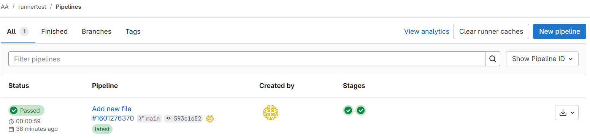
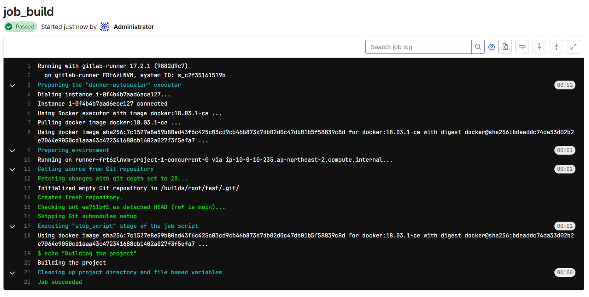

# [Gitlab Runner](https://docs.gitlab.com/runner/) 

Gitlab Runner 에 대한 설명 페이지

## Runner 기본


- GitLab Runner는 GitLab CI/CD와 함께 동작하여 파이프라인에서 작업을 실행하는 Gitlab Agent 가 설치 된 서버
- Runner 타입
    - Gitlab Hosted Runner
        - Gitlab.com 에서 관리하는 Runner
        - 사용 고객은 GitLab.com 또는 GitLab Dedicated 사용 고객
        - Gitlab.com 사용시 기본적으로 모든 프로젝트에서 활성화되어 있으며, 프로젝트 소유자는 비활성화 가능
    - Self Managed Runner
        - 자체 소유 또는 관리하는 인프라에 GitLab Runner를 설치하고 러너를 등록
        - GitLab.com 또는 자체 GitLab 인스턴스 사용시 자체 등록 가능
- Runner 버전 관리
    - GitLab Runner의 **주/부 버전**은 GitLab의 **주/부 버전**과 동기화 필요
    - **하위 호환성**: 마이너 버전 업데이트 간에는 호환성이 보장됨
    - GitLab Runner **15.0 버전**부터는 GitLab 14.8 이하 버전과 호환되지 않음
- Runner 등록
    - 러너를 설치한 후, 개별적으로 등록
    - 러너는 CI/CD 작업을 처리하는 에이전트 역할
    - 작업은 설치된 머신, 컨테이너, 쿠버네티스 클러스터, 또는 클라우드의 자동 확장 인스턴스에서 처리 가능
- Executor
    - 러너를 등록할 때 Executor (실행환경) 선택
        - PowerShell 명령 실행: Windows 서버에 Shell Executor 설정
        - Docker 컨테이너에서 실행: Linux 서버에 Docker Executor 설정
        - Docker-in-Docker(DIND)와 같은 설정도 가능
- Runner 접근 권한
    - 러너 접근 범위를 정의 가능
        - **인스턴스 러너**: 모든 프로젝트에서 사용
        - **그룹 러너**: 특정 그룹 및 하위 그룹에서 사용
        - **프로젝트 러너**: 특정 프로젝트에서 사용
- Tag 활용
    - 러너에 태그를 추가하여 특정 작업에 지정 가능
        
        ```sql
        job:
          tags:
            - ruby
        ```
        
- Runner 설정
    - **설정 파일**
        - `config.toml` 파일에서 러너 설정 가능
        - 동시 작업 수, 메모리, CPU 제한 등 설정
    - **모니터링**
        - Prometheus로 현재 작업 수, CPU 사용량 등을 모니터링
- 주요 기능
    - 다중 작업 동시 실행
    - 로컬, Docker 컨테이너, SSH, 클라우드에서 작업 실행 가능
    - 자동 재구성, Docker 캐시 등 지원
    - 다양한 운영체제(GNU/Linux, macOS, Windows)에서 실행 가능

## Runner 유형

- GitLab에서는 세 가지 유형의 러너를 제공
    - Instance 러너
        - GitLab 인스턴스의 모든 그룹 및 프로젝트에서 사용
        - Admin Area의 **`CI/CD > Runners`**
    - Group 러너
        - 그룹의 모든 프로젝트와 하위 그룹에서 사용
        - 그룹의 **`Settings > CI/CD > Runners`**
    - Project  러너
        - 특정 프로젝트와 연결
        - 일반적으로 특정 러너는 하나의 프로젝트에서만 사용
        - 프로젝트의 **`Settings > CI/CD > Runners`**

## Runner PAT 얻기

- admin
    - Search → User Settings → Access Token
    - https://<gitlab_url>/-/user_settings/personal_access_tokens
    - [https://gitlab.idtplateer.com/-/user_settings/personal_access_tokens](https://gitlab.idtplateer.com/-/user_settings/personal_access_tokens)
- project
    - https://<gitlab_url>/<user 또는 group>/<project_name>/-/settings/access_tokens
- group
    - https://<gitlab_url>/groups/<group>/-/settings/access_tokens

## [Runner 관리](https://docs.gitlab.com/ee/ci/runners/runners_scope.html)

- 범주
    - Tier : Free, Premium, Ultimate
    - Offering : GitLab.com, Self-managed, GitLab Dedicated
- Runner 종류
    - Instance Runner : GitLab 인스턴스의 모든 그룹과 프로젝트에서 사용 가능
    - Group Runner : 특정 그룹 내의 모든 프로젝트와 하위 그룹에서 사용 가능
    - Project Runner : 특정 프로젝트와 관련된 러너로, 보통 하나의 프로젝트에서만 사용
- Instance Runner
    - GitLab 인스턴스의 모든 프로젝트에서 사용 가능
    - 여러 프로젝트에서 유사한 요구 사항을 가진 작업들이 있을 때 인스턴스 러너를 사용하는 것이 좋음
    - 여러 러너를 별도로 두는 것보다 하나의 러너가 여러 프로젝트를 처리하는 것이 효율적
    - 사용사례
        - Self-managed GitLab: 관리자가 GitLab Runner를 설치하고 인스턴스 러너를 등록하여 사용
        - GitLab.com: GitLab에서 제공하는 인스턴스 러너를 선택하여 사용할 수 있으며, 이 경우 해당 러너는 계정에 포함된 컴퓨팅 분을 소모
    - 인스턴스 러너가 작업을 처리하는 방식
        - 인스턴스 러너는 **Fair Usage Queue** 알고리즘을 사용하여 작업을 처리
        - 이 큐는 프로젝트들이 동시에 많은 작업을 생성하고 모든 리소스를 사용하는 것을 방지
        - 큐는 실행 중인 작업이 가장 적은 프로젝트에 우선적으로 작업을 할당
        - 예시
            1. 작업 1 (프로젝트 1) → 첫 번째 실행
            2. 작업 4 (프로젝트 2) → 두 번째 실행
            3. 작업 6 (프로젝트 3) → 세 번째 실행
            4. 작업 2 (프로젝트 1) → 네 번째 실행
            5. 작업 5 (프로젝트 2) → 다섯 번째 실행
            6. 작업 3 (프로젝트 1) → 마지막 실행 
    - 인스턴스 러너 생성
        - Runner 등록 및 사용 섹션 참고
    - 인스턴스 러너 일시 정지 및 재개
        1. Admin에서 CI/CD > Runners를 선택
        2. 러너 목록에서 해당 러너를 찾아 Pause 또는 Resume을 클릭하여 상태를 변경
    - 인스턴스 러너 삭제
        1. Admin에서 CI/CD > Runners를 선택 
        2. 삭제할 러너 옆에 있는 Delete runner를 클릭하여 삭제 
        3. 여러 러너를 선택하여 한 번에 삭제할 수도 있음
    - 프로젝트에서 인스턴스 러너 활성화
        - GitLab.com에서는 기본적으로 모든 프로젝트에서 인스턴스 러너가 활성화
        - Self-managed GitLab에서는 관리자가 새 프로젝트에 대해 인스턴스 러너를 활성화할 수 있음
    - 프로젝트에서 인스턴스 러너 비활성화
        - 프로젝트 또는 그룹의 소유자 권한을 가진 사람만 인스턴스 러너를 비활성화할 수 있음
            1. 프로젝트에서 Settings > CI/CD로 이동
            2. Runners 섹션에서 Enable instance runners for this project 옵션을 끔
    - 그룹에서 인스턴스 러너 비활성화
        1. 그룹에서 Settings > CI/CD로 이동 
        2. Runners 섹션에서 Enable instance runners for this group 옵션을 끔
        3. 개별 프로젝트 또는 하위 그룹에서 인스턴스 러너를 활성화할 수 있는 설정을 허용하려면 **Allow projects and subgroups to override the group setting**을 선택

## Runner 등록

### [Gitlab Hosted Runner](https://docs.gitlab.com/ee/ci/runners/)

- Hosted Runner
    
    
    
    - Tier : Free, Premium, Ultimate
    - GitLab 호스팅 러너는 GitLab.com과 GitLab Dedicated에서 CI/CD 작업을 실행하는 데 사용
    - 종류
        - 리눅스 호스팅 Runner
        - GPU 지원 호스팅 Runner
        - 윈도우 호스팅 러너 (Beta)
        - macOS 호스팅 러너 (Beta)
    - 작동 방식
        - 작업 격리
            - 각 작업은 새롭게 프로비저닝 된 가상 머신(VM) 에서 실행되며 이 VM은 작업 완료 후 삭제
            - GitLab은 **Google Compute API**를 통해 VM 삭제 명령을 보냄
            - 프로젝트의 파이프라인에서 세 개의 작업이 실행되면, 각각의 작업은 별도의 VM에서 실행
        - 캐싱
            - 호스팅 러너는 Google Cloud Storage(GCS)에 저장된 분산 캐시를 공유
            - 14일 동안 업데이트되지 않은 캐시는 자동으로 삭제
            - 캐시 아티팩트의 최대 크기는 5GB
        - 보안
            - 호스팅 러너의 가상 머신은 외부 인터넷으로만 아웃바운드 통신이 가능하며, 인바운드 통신은 허용되지 않음
            - VM 간의 통신은 차단되며, Runner 관리자만 내부적으로 러너 VM과 통신할 수 있음
            - 각 에페메랄 VM(단기 사용 VM)은 작업이 끝나면 즉시 삭제
        - 이미지 생애 주기
            - 베타
                - 새로운 이미지는 베타로 출시되며, 피드백을 받아 문제를 해결한 후 일반 제공을 시작
                - 베타 이미지는 서비스 수준 계약(SLA)에 포함되지 않음
            - 일반 제공(General Availability)
                - 베타 단계를 마친 이미지는 일반 제공으로 전환되며, SLA에 포함
            - 더 이상 제공되지 않는 이미지(Deprecated)
                - 최대 2개의 일반 제공 이미지만 지원되며, 새로운 일반 제공 이미지가 출시되면 가장 오래된 이미지는 더 이상 업데이트되지 않으며 3개월 후 삭제
        - 기타
            - 실행되는 VM 은 sudo 접근권한이 있고 비밀번호 없이 실행
            - VM 은 운영 체제, 사전 설치된 소프트웨어 이미지, 클론된 저장소를 포함하는 공유된 저장소 사용
            - Untagged Job 은 x86-64 의 작은 Runner 에서 실행됨
- Hosted Runners on Linux
    - Tier : Free, Permium, Ultimate
    - Offering: GitLab.com
    - 설명
        - GitLab.com에서 제공하는 리눅스 호스팅 러너는 **Google Cloud Compute Engine**에서 실행
        - 각 Job 은 완전히 격리된 일시적인 가상 머신(VM) 에서 실행되며 기본 리전은 us-east1
    - 실행환경
        - 각 VM 은 Google Container-Optimized OS 와 최신 버전의 Docker Engine 을 사용
        - **docker+machine executor** 를 통해 실행
        - 사용되는 machine 및 processor 유형은 변경 가능
        - Untagged Job 은 기본 리눅스 x86-64 Runner 에서 실행됨
    - Container Image
        - 리눅스에서 실행되는 호스팅 러너는 docker+machine executor를 사용하므로, 사용자는 .gitlab-ci.yml 파일에서 원하는 컨테이너 이미지를 정의할 수 있음
        - 선택한 Docker 이미지는 기본 프로세서 아키텍처와 호환되어야 함
        - 기본적으로 이미지를 설정하지 않으면 `ruby:3.1` 이미지가 사용됨
    - Docker-in-Docker 지원
        - 모든 saas-linux-<size>-<architecture> 태그를 가진 러너는 privileged mode로 설정되어 있어 Docker-in-Docker를 지원
        - 이를 통해 Docker 이미지를 빌드하거나 여러 컨테이너를 격리된 작업에서 실행 가능
        - gitlab-org 태그가 붙은 러너는 privileged mode가 활성화되지 않으며, Docker-in-Docker 빌드를 지원하지 않음
    - Linux Hosted Runner 에서 사용 가능한 Machine 유형
        - Linux x86-64 아키텍처
            
            
            | **러너 태그** | **vCPUs** | **메모리** | **저장소** |
            | --- | --- | --- | --- |
            | **saas-linux-small-amd64 (기본)** | 2 | 8 GB | 30 GB |
            | saas-linux-medium-amd64 | 4 | 16 GB | 50 GB |
            | saas-linux-large-amd64 (Premium, Ultimate만 해당) | 8 | 32 GB | 100 GB |
            | saas-linux-xlarge-amd64 (Premium, Ultimate만 해당) | 16 | 64 GB | 200 GB |
            | saas-linux-2xlarge-amd64 (Premium, Ultimate만 해당) | 32 | 128 GB | 200 GB |
        - Linux Arm64 아키텍처
            
            
            | **러너 태그** | **vCPUs** | **메모리** | **저장소** |
            | --- | --- | --- | --- |
            | saas-linux-small-arm64 | 2 | 8 GB | 30 GB |
            | saas-linux-medium-arm64 (Premium, Ultimate만 해당) | 4 | 16 GB | 50 GB |
            | saas-linux-large-arm64 (Premium, Ultimate만 해당) | 8 | 32 GB | 100 GB |
    - 예시
        
        ```yaml
        job_small:
          script:
            - echo "이 작업은 태그가 없으며 기본 작은 리눅스 x86-64 인스턴스에서 실행됩니다."
        
        job_medium:
          tags:
            - saas-linux-medium-amd64
          script:
            - echo "이 작업은 중간 크기의 리눅스 x86-64 인스턴스에서 실행됩니다."
        
        job_large:
          tags:
            - saas-linux-large-arm64
          script:
            - echo "이 작업은 큰 리눅스 Arm64 인스턴스에서 실행됩니다."
        
        ```
        
- Hosted Runners on GPU
    - Tier : Premium, Ultimate
    - Offering: GitLab.com
    - 설명
        - GitLab은 모델 운영(ModelOps) 또는 고성능 컴퓨팅(HPC)을 위한 무거운 계산 작업을 가속화하기 위해 GPU가 장착된 호스팅 러너를 제공
        - 이러한 러너는 주로 대형 언어 모델(LLM)의 훈련 및 배포와 같은 모델 운영(ModelOps) 워크로드에 사용
        - GPU가 장착된 러너는 **Linux**에서만 제공
    - Container 이미지
        - GitLab 호스팅 러너에서 GPU가 장착된 가상 머신(VM)에서 작업이 실행
        - 자신만의 이미지를 사용할 수 있는 정책이 적용됨
        - GitLab은 호스트 VM에서 GPU를 가져와 격리된 환경으로 마운트
        - GPU를 사용하려면 GPU 드라이버가 설치된 Docker 이미지를 사용해야 함
        - Nvidia GPU의 경우 CUDA 툴킷을 사용할 수 있음
    - GPU-enabled Runner 에서 사용 가능한 Machine 유형
        
        
        | 러너 태그 | vCPUs | 메모리 | 저장소 | GPU | GPU 메모리 |
        | --- | --- | --- | --- | --- | --- |
        | saas-linux-medium-amd64-gpu-standard | 4 | 15 GB | 50 GB | 1 Nvidia Tesla T4 (또는 유사한 GPU) | 16 GB |
    - 예시
        
        ```yaml
        gpu-job:
          stage: build
          tags:
            - saas-linux-medium-amd64-gpu-standard
          image: nvcr.io/nvidia/cuda:12.1.1-base-ubuntu22.04
          script:
            - apt-get update
            - apt-get install -y python3.10
            - python3.10 --version
        
        ```
        
- Hosted Runners on macOS
    - Tier: Premium, Ultimate
    - Offering: GitLab.com
    - 상태: Beta
    - 설명
        - GitLab의 macOS 호스팅 러너는 GitLab CI/CD와 완전히 통합된 온디맨드 macOS 환경을 제공
        - 이를 통해 macOS, iOS, watchOS, tvOS와 같은 Apple 생태계용 앱을 빌드, 테스트 및 배포할 수 있음
        - 현재 macOS 호스팅 러너는 베타 상태로, 오픈 소스 프로그램과 Premium, Ultimate 플랜 고객에게 제공
    - 지원되는 macOS 이미지
        
        
        | **VM 이미지** | **상태** | **사전 설치된 소프트웨어** |
        | --- | --- | --- |
        | macos-13-xcode-14 | Deprecated | 사전 설치된 소프트웨어 |
        | macos-14-xcode-15 | GA | 사전 설치된 소프트웨어 |
        | macos-15-xcode-16 | Beta | 사전 설치된 소프트웨어 |
    - 이미지 업데이트 정책
        - macOS와 Xcode의 주요 및 부가 버전은 GitLab 릴리스 후 다음 마일스톤에서 사용할 수 있음
        - 새로운 릴리스 이미지는 처음에는 베타로 제공되며, 첫 번째 부가 릴리스가 출시되면 일반 제공으로 전환됨
        - 두 개의 일반 제공 이미지만 지원되며, 가장 오래된 이미지는 더 이상 지원되지 않으며 3개월 후에 삭제됨
    - iOS 프로젝트 코드 서명(fastlane 사용)
        - Apple 서비스와 GitLab을 통합하고, 장치에 설치하거나 Apple App Store에 배포하려면 애플리케이션에 코드 서명을 해야 함
        - macOS VM 이미지에는 fastlane이 포함되어 있어 모바일 앱 배포를 간소화 함
    - Cocoapods 최적화
        - Cocoapods CDN을 사용하여 패키지를 다운로드하면 빌드 성능을 향상시킬 수 있음
        - GitLab에서 제공하는 캐싱을 활용하면 `pod install`을 변경된 패키지에서만 실행할 수 있어 성능이 개선
            
            ```yaml
            cache:
              key:
                files:
                  - Podfile.lock
              paths:
                - Pods
            ```
            
    - Homebrew 최적화
        - 기본적으로 Homebrew는 모든 작업을 시작할 때 업데이트를 확인
        - GitLab macOS 이미지의 릴리스 주기와 Homebrew의 릴리스 주기가 다를 수 있기 때문에, 이를 최적화하려면 `.gitlab-ci.yml` 파일에서 `HOMEBREW_NO_AUTO_UPDATE` 변수를 설정할 수 있음
            
            ```yaml
            variables:
              HOMEBREW_NO_AUTO_UPDATE: 1
            ```
            
    - maOS 용 제공 Machine 유형
        
        
        | **Runner Tag** | **vCPUs** | **Memory** | **Storage** |
        | --- | --- | --- | --- |
        | saas-macos-medium-m1 | 4 | 8 GB | 25 GB |
    - 예시
        
        ```yaml
        .macos_saas_runners:
          tags:
            - saas-macos-medium-m1
          image: macos-14-xcode-15
          before_script:
            - echo "started by ${GITLAB_USER_NAME} / @${GITLAB_USER_LOGIN}"
        
        build:
          extends:
            - .macos_saas_runners
          stage: build
          script:
            - echo "running scripts in the build job"
        
        test:
          extends:
            - .macos_saas_runners
          stage: test
          script:
            - echo "running scripts in the test job"
        ```
        
    - 사용 제약
        - VM 이미지에 필요한 소프트웨어 버전이 포함되지 않은 경우, 소프트웨어를 다운로드하여 설치해야 하므로 실행 시간이 길어질 수 있음
        - 자체 OS 이미지를 가져올 수 없음
        - GitLab의 keychain은 공개적으로 사용할 수 없으며, 직접 키체인을 만들어야 함
        - macOS 호스팅 러너는 헤드리스 모드로 실행되므로 UI 상호작용이 필요한 작업(예: testmanagerd)은 지원되지 않음
- Hosted Runners on Windows
    - Tier: Free, Premium, Ultimate
    - Offering: GitLab.com
    - Status:  Beta
    - 설명
        - GitLab의 Windows 호스팅 러너는 Google Cloud Platform에서 가상 머신을 자동으로 실행하여 확장
        - 이 솔루션은 GitLab에서 개발한 자동 확장 드라이버를 사용하여 커스텀 실행기를 운영
        - 현재 Windows 호스팅 러너는 베타 상태이며, 안정화 및 일반 제공을 목표로 작업 중
    - 사용 가능한 Machine 유형
        
        
        | **러너 태그** | **vCPUs** | **메모리** | **저장소** |
        | --- | --- | --- | --- |
        | saas-windows-medium-amd64 | 2 | 7.5 GB | 75 GB |
    - 지원되는 Windows 버전
        - Windows 러너의 가상 머신 인스턴스는 GitLab Docker 실행기를 사용하지 않기 때문에, 파이프라인 구성에서 이미지나 서비스를 지정할 수 없음
        - 아래는 지원되는 Windows 버전
            
            
            | **버전** | **상태** |
            | --- | --- |
            | Windows 2022 | GA |
    - 지원되는 Shell
        - Windows 호스팅 러너에서는 PowerShell이 기본 셸로 설정되어 있음
        - `.gitlab-ci.yml` 파일에서 사용하는 `script` 섹션은 PowerShell 명령어를 사용해야 함
    - 예시
        
        ```yaml
        .windows_job:
          tags:
            - saas-windows-medium-amd64
          before_script:
            - Set-Variable -Name "time" -Value (date -Format "%H:%m")
            - echo ${time}
            - echo "started by ${GITLAB_USER_NAME} / @${GITLAB_USER_LOGIN}"
        
        build:
          extends:
            - .windows_job
          stage: build
          script:
            - echo "running scripts in the build job"
        
        test:
          extends:
            - .windows_job
          stage: test
          script:
            - echo "running scripts in the test job"
        ```
        
    - 알려진 문제
        - 새로운 Windows 가상 머신(VM)의 평균 프로비저닝 시간은 약 5분이며, 이로 인해 Windows 러너에서 빌드를 시작하는 데 시간이 더 걸릴 수 있음
        - 이를 개선하기 위해, 가상 머신의 사전 프로비저닝을 활성화하는 업데이트가 향후 릴리스에 포함될 예정
        - Windows 러너는 유지 관리나 업데이트로 인해 가끔 사용 불가능할 수 있음
        - 작업이 대기 상태로 오래 있을 수 있음
        - Windows 러너를 사용하는 파이프라인에 대해 파괴적인 변경이 발생할 수 있으며, 이로 인해 파이프라인을 업데이트해야 할 수 있음

### [Runner 등록 및 사용](https://docs.gitlab.com/ee/tutorials/create_register_first_runner/) (수동)

- Step 1 > 빈 프로젝트 생성하기
    - CI/CD 파이프라인과 러너를 설정할 **빈 프로젝트**를 생성
        1. GitLab에 로그인 후, 왼쪽 사이드바 상단에서 **New Project** 버튼을 클릭 
        2. **Create blank project** (빈 프로젝트 생성)을 선택
            
            
            
        3. 프로젝트의 Project name 및 Project slug  입력
            - 슬러그는 GitLab 인스턴스에서 프로젝트의 URL 경로로 사용
                
                
                
        4. **Create project** 버튼을 클릭 
- Step 2 > 프로젝트 파이프라인 생성
    - 프로젝트에 **.gitlab-ci.yml** 파일을 생성하여 CI/CD 파이프라인을 정의
    - 이 파일에서 러너가 실행할 작업들을 설정할 수 있음
        1. 생성한 프로젝트 오른쪽 상단의  **+ → New file** 을 선택
            
            
            
        2. **Filename (파일명)** 필드에 `.gitlab-ci.yml`을 입력
            
            
            
        3. 아래 내용을 복사하여 텍스트 박스에 붙여넣기 → **Commit changes** 버튼을 클릭하여 파일을 커밋
            
            ```sql
            stages:
              - build
              - test
            
            job_build:
              stage: build
              script:
                - echo "Building the project"
            
            job_test:
              stage: test
              script:
                - echo "Running tests"
            ```
            
- Step 3 > Project Runner  생성 및 등록
    - Instance runners 를 disable 하기
        
        
        
    - Project Runner 를 생성하고 등록하여, 이 러너가 프로젝트의 파이프라인 작업을 실행하도록 설정
        1. 왼쪽 사이드바에서 **Search or go to** 을 클릭하고 프로젝트를 선택
            
            
            
        2. **Settings (설정)** > **CI/CD**를 선택
            
            
            
        3. **Runners (러너)** 섹션을 확장
            
            
            
        4. **New project runner** 를 클릭
            
            
            
        5. **Tags (태그)** 섹션에서 **Run untagged (태그가 없는 작업 실행)** 체크박스를 선택
            
            
            
        6. **Create runner** 버튼을 클릭
        7. 사용할 운영 체제를 선택
            
            
            
        8. Runner 인스톨
            
            ```sql
            # Download the binary for your system
            $ sudo curl -L --output /usr/local/bin/gitlab-runner https://gitlab-runner-downloads.s3.amazonaws.com/latest/binaries/gitlab-runner-linux-amd64
            
            # Give it permission to execute
            $ sudo chmod +x /usr/local/bin/gitlab-runner
            
            # Create a GitLab Runner user
            $ sudo useradd --comment 'GitLab Runner' --create-home gitlab-runner --shell /bin/bash
            
            # Install and run as a service
            $ sudo gitlab-runner install --user=gitlab-runner --working-directory=/home/gitlab-runner
            $ sudo gitlab-runner start
            ```
            
            
            
        9. 명령어를 따라 터미널에서 Runner 를 등록
            
            ```bash
            $ gitlab-runner register  --url https://gitlab.com  --token glrt-t3_6Rz6d3hnBk_z69Xv9p8t
            ```
            
            
            
        10. 이 과정에서 다음을 입력
            
            ```bash
            $ gitlab-runner register  --url https://gitlab.com  --token glrt-t3_6Rz6d3hnBk_z69Xv9p8t
            Runtime platform                                    arch=amd64 os=linux pid=4929 revision=3153ccc6 version=17.7.0
            WARNING: Running in user-mode.                     
            WARNING: The user-mode requires you to manually start builds processing: 
            WARNING: $ gitlab-runner run                       
            WARNING: Use sudo for system-mode:                 
            WARNING: $ sudo gitlab-runner...                   
                                                               
            Created missing unique system ID                    system_id=s_b87704e05a43
            **Enter the GitLab instance URL (for example, https://gitlab.com/):
            [https://gitlab.com]:** 
            Verifying runner... is valid                        runner=t3_6Rz6d3
            **Enter a name for the runner. This is stored only in the local config.toml file:
            [ip-10-0-1-247]: testrunner**
            **Enter an executor: docker, docker-windows, instance, custom, shell, parallels, virtualbox, ssh, docker+machine, kubernetes, docker-autoscaler:
            shell**
            Runner registered successfully. Feel free to start it, but if it's running already the config should be automatically reloaded!
             
            Configuration (with the authentication token) was saved in "/home/ubuntu/.gitlab-runner/config.toml" 
            ```
            
            - **GitLab instance URL**
                - GitLab 인스턴스 URL을 입력
                    - `https://gitlab.com` (GitLab.com을 사용하는 경우)
            - Runner name
                - Runner 의 이름
            - **Executor**
                - shell 을 입력
                    - 러너가 호스트 컴퓨터에서 직접 작업을 실행하기 때문에 "shell"을 선택
        11. Runner 를 시작하려면 터미널에서 다음 명령어를 실행
            
            ```bash
            $ gitlab-runner run
            Runtime platform                                    arch=amd64 os=linux pid=5088 revision=3153ccc6 version=17.7.0
            Starting multi-runner from /home/ubuntu/.gitlab-runner/config.toml...  builds=0 max_builds=0
            WARNING: Running in user-mode.                     
            WARNING: Use sudo for system-mode:                 
            WARNING: $ sudo gitlab-runner...                   
                                                               
            Configuration loaded                                builds=0 max_builds=1
            listen_address not defined, metrics & debug endpoints disabled  builds=0 max_builds=1
            [session_server].listen_address not defined, session endpoints disabled  builds=0 max_builds=1
            Initializing executor providers                     builds=0 max_builds=1
            ```
            
        12. View Runner 클릭하여 확인
            
            
            
        
- Step 4 > Runner 구성 파일 확인
    - Runner 가 성공적으로 등록되면, `config.toml` 파일에 구성과 인증 토큰이 저장됨
    - 이 파일을 통해 더 복잡한 설정을 할 수 있음
        
        ```bash
        $ cat /home/ubuntu/.gitlab-runner/config.toml
        concurrent = 1
        check_interval = 0
        shutdown_timeout = 0
        
        [session_server]
          session_timeout = 1800
        
        [[runners]]
          name = "testrunner"
          url = "https://gitlab.com"
          id = 44971859
          token = "glrt-t3_6Rz6d3hnBk_z69Xv9p8t"
          token_obtained_at = 2024-12-24T08:14:48Z
          token_expires_at = 0001-01-01T00:00:00Z
          executor = "shell"
          [runners.custom_build_dir]
          [runners.cache]
            MaxUploadedArchiveSize = 0
            [runners.cache.s3]
            [runners.cache.gcs]
            [runners.cache.azure]
        ```
        
- Step 5 > 파이프라인 실행하여 러너 동작 확인
    1. 왼쪽 사이드바에서 **Search or go to**  을 클릭하고, 프로젝트를 선택 
    2. **Build → Pipelines** 을 선택 
        
        
        
    3. **New pipeline (새 파이프라인)** 버튼을 클릭
        
        
        
    4. 파이프라인이 실행되면, 각 작업의 로그를 확인 
        
        ```bash
        Running with gitlab-runner 17.7.0 (3153ccc6)
          on testrunner t3_6Rz6d3, system ID: s_b87704e05a43
        Preparing the "shell" executor
        00:00
        Using Shell (bash) executor...
        Preparing environment
        00:00
        Running on ip-10-0-1-247...
        Getting source from Git repository
        00:03
        Fetching changes with git depth set to 20...
        Initialized empty Git repository in /home/ubuntu/builds/t3_6Rz6d3/0/aa1954136/runnertest/.git/
        Created fresh repository.
        Checking out 593c1c52 as detached HEAD (ref is main)...
        Skipping Git submodules setup
        Executing "step_script" stage of the job script
        00:00
        $ echo "Building the project"
        Building the project
        Cleaning up project directory and file based variables
        00:00
        Job succeeded
        ```

### [Runner 생성 및 등록](https://docs.gitlab.com/runner/register/) (Template 사용)

- 범주
    - Tier : Free, Premium, Ultimate
    - Offering : GitLab.com, Self-managed
- 준비 사항
    - GitLab Runner를 GitLab이 설치된 서버와 다른 서버에 설치
    - Docker로 Runner 등록을 할 경우, GitLab Runner를 Docker 컨테이너 내에 설치
    - Runner 인증 토큰
- Runner 생성 및 등록
    - Step 1 > Personal Access Token 생성
        - Access Token 은 GitLab REST API를 사용하여 러너를 생성할 때 필요하며 안전하게 저장해야 함
        - **Personal Access Token 생성**
            1. GitLab에서 좌측 사이드바에서 Abatar 선택
                
                
                
            2. Edit Profile 선택
            3. **User settings** 창이 나타나며 좌측 메뉴에서 **Access tokens** 선택
                
                
                
            4. **Personal access tokens** 에서 **Add new token** 선택
            5. 토큰에 이름과 만료일을 설정 (만료일을 설정하지 않으면 기본적으로 365일로 설정)
                
                
                
            6. Select scopes 에서 create_runner 선택
                
                
                
            7. **Create personal access token** 클릭
        - **Group Access Token** 생성 **(**GitLab Premium ****이상 버전에서 제공)
            1. 홈에서 좌측 메뉴 **Groups → 그룹 선택** 
                
                
                
            2. Group 설정에서 Access Token 을 선택
                
                
                
            3. Project 또는 Group 설정에서 Access Token 을 선택
                
                
                
        - **Project Access Token** 생성  **(**GitLab Premium ****이상 버전에서 제공)
            1. **Project** → **Settings** → **Access Token**
                
                
                
    - Step 2 > Runner 인증 토큰 발행
        - Runner 인증 토큰
            - 러너 인증 토큰은 러너를 등록하기 위한 중요한 요소
            - 이 토큰을 사용해 러너를 GitLab 인스턴스와 연결
            - 러너 인증 토큰은 `glrt-` 접두사를 가지고 있음
        - Runner 인증 토큰 얻기 (`API`)
            
            ```yaml
              # Personal Access Token 필요하며 Runner 인증 토큰 얻는 경우 아래와 같이 수행
              response=$(curl -k --request POST -L "https://gitlab.idtice.com/api/v4/user/runners" \
                  --header "PRIVATE-TOKEN: <GITLAB-PERSONAL-ACCESS-TOKEN>" \
                  --form "tag_list=docker.t3" \
                  --form "description=docker type runner" \
                  --form "locked=false" \
                  --form "run_untagged=true" \
                  --form "maximum_timeout=${runner_registration_config.maximum_timeout}" \
                  --form "runner_type=instance" \ # "group", "project", "instance"
                  --form "access_level=not_protected"\
                  #--form "group_id=GROUP_ID") # 
                  #--form project_id=PROJECT_ID}
            
              token=$(echo $response | jq -r '.token')
            ```
            
        - Runner 인증 토큰 (Instance) 얻기 (Self-managed, UI)
            1. **Admin Area 로 이동 → CI/CD → Runners → New instance runner → Create runner**
                
                
                
            2. Register runner 하단에 보면 glrt 로 시작하는 token 이 보이며 이 토큰이 Runner 인증 토큰
                
                
                
        - Runner 인증 토큰 (project) 얻기 (Self-managed, Gitlab.com, UI)
            1. Project 선택 → 좌측에 **Settings** → **CI/CD** → **Runners** → **New project runner**
                
                
                
            2. Create runner 시 Register runner 섹션이 나오며 Runner 인증 토큰 (project) 를 얻을 수 있음
                
                
                
        - Runner 인증 토큰 (group) 얻기 (Self-managed, Gitlab.com Ultimate 이상, UI)
            1. **Group** → **Settings** → **CI/CD**
                
                
                
            2. 
    - Step 3 > Runner 등록 (With Template)
        1. template 파일 생성
            
            ```bash
            # /etc/gitlab-runner/config.toml
            concurrent = 10
            check_interval = 3
            sentry_dsn = ""
            log_format = "json"
            listen_address = ""
            
            [[runners]]
              name = "gitlab-runner"
              url = "https://gitlab.idtice.com"
              tls-ca-file = ""
              clone_url = ""
              token = "glrt-FRt6zLNVMrbzqrm7bFzs"
              executor = "docker-autoscaler"
              environment = []
              pre_build_script = ""
              post_build_script = ""
              pre_clone_script = ""
              pre_get_sources_script = ""
              request_concurrency = 1
              output_limit = 10240
              limit = 10
            
              [runners.docker]
              disable_cache = false
              disable_entrypoint_overwrite = false
              image = "docker:18.03.1-ce"
              oom_kill_disable = false
              privileged = true
              pull_policy = ["always"]
              shm_size = 0
              tls_verify = false
              volumes = ["/cache"]
            
              [runners.cache]
              Type = "s3"
              Shared = true
              [runners.cache.s3]
                AuthenticationType = "iam"
                ServerAddress = "s3.amazonaws.com"
                BucketName = "gitlab-runner-cache-cpwlsqup"
                BucketLocation = "ap-northeast-2"
                Insecure = false
            
              [runners.autoscaler]
              plugin = "fleeting-plugin-aws"
              capacity_per_instance = 4
              update_interval = "1m"
              update_interval_when_expecting = "2s"
              max_use_count = 100
              max_instances = 10
            
              [runners.autoscaler.plugin_config]
              name = "gitlab-runner3f3f40d5-asg"
              profile = "default"
              config_file = "/home/user/.aws/config"
            
              [runners.autoscaler.connector_config]
              os = "linux"
              protocol = "ssh"
              username = "ec2-user"
              use_external_addr = false
              use_static_credentials = true
              key_path = "/root/.ssh/id_rsa"
              timeout = "10m0s"
            
              [[runners.autoscaler.policy]]
              idle_count = 4
              idle_time = "20m0s"
              periods = ["* * * * * mon-fri *"]
              scale_factor = 1.5
              scale_factor_limit = 3
              timezone = "Asia/Seoul"
            
              [[runners.autoscaler.policy]]
              idle_count = 2
              idle_time = "20m0s"
              periods = ["* * * * * sat,sun *"]
              scale_factor = 1.5
              scale_factor_limit = 3
              timezone = "Asia/Seoul"
            
            ```
            
        2. gitlab runner 설치
            
            ```bash
            preflight() { 
              sudo yum -y update 
              yum install -y jq
            
              install_log "preflight"
            }
            
            install_gitlab_runner() {
              if ! ( rpm -q gitlab-runner >/dev/null )
              then
                curl --fail --retry 6 -L https://packages.gitlab.com/install/repositories/runner/gitlab-runner/script.rpm.sh | bash
                yum install gitlab-runner-17.2.1 -y
              fi
            }
            ```
            
        3. Runner 등록 확인
            
            
            
        4. Pipeline 생성하여 확인
            
            ```bash
            # .gitlab-ci.yml
            stages:
              - build
              - test
            
            job_build:
              stage: build
              script:
                - echo "Building the project"
            
            job_test:
              stage: test
              script:
                - echo "Running tests"
            ```
            
            

## [Runner Executors](https://docs.gitlab.com/runner/executors/)

### 설명

- Executor는 GitLab Runner가 빌드를 실행할 환경 또는 실행 방식
- GitLab Runner는 여러 종류의 Executor를 지원하며, 각 Executor는 빌드를 실행하는 환경과 방법이 다름
- Executor
    
    
    | **Executor** | **설명** | **주요 특징** |
    | --- | --- | --- |
    | **Shell Executor** | 가장 간단한 Executor로, 빌드에 필요한 모든 종속성을 수동으로 설치해야 함. GitLab Runner가 설치된 머신에서 실행 | 수동 종속성 설치 필요 |
    | **Virtual Machine Executor (VirtualBox/Parallels)** | 이미 생성된 가상 머신(VirtualBox 또는 Parallels)을 사용하여 빌드를 실행. GitLab Runner가 가상 머신에 연결하여 빌드를 실행 | Windows, Linux, macOS, FreeBSD에서 사용 가능 |
    | **Docker Executor** | Docker 컨테이너를 사용하여 깨끗한 빌드 환경을 제공. 모든 종속성은 Docker 이미지에 포함되며, 의존성 관리가 간단해짐 | 종속성 관리 용이 |
    | **Docker Machine Executor** | Docker Executor의 확장 버전으로, 자동 확장(auto-scaling) 기능을 지원. Docker Machine을 사용해 빌드 호스트를 자동으로 생성하여 사용 | 자동 확장 지원
    필요에 따라 빌드 호스트 생성 |
    | **Docker Autoscaler Executor** | Docker를 기반으로 한 자동 확장 기능을 제공. 클라우드 공급자(예: Google Cloud, AWS, Azure)에서 인스턴스를 자동으로 생성하여 빌드를 실행 | Fleeting 플러그인 사용하여 클라우드에서 자동으로 인스턴스를 생성하고 확장 |
    | **Instance Executor** | 자동 확장 기능을 제공하는 Executor로, 빌드를 처리하기 위해 필요한 인스턴스를 자동으로 생성합 | 호스트 인스턴스와 OS에 대한 전체 액세스 필요. 단일 테넌트 및 다중 테넌트 지원 |
    | **Kubernetes Executor** | 기존의 **Kubernetes 클러스터**에서 빌드를 실행. 각 GitLab CI 잡을 위해 Kubernetes 클러스터 API를 호출하여 새로운 Pod를 생성 | Kubernetes 클러스터에서 자동으로 Pod 생성. 빌드와 서비스 컨테이너가 포함된 Pod 사용 |
    | **SSH Executor** | 외부 서버에 SSH로 연결하여 빌드를 실행. 이 Executor는 지원이 적고, 다른 Executor 사용을 권장 | 외부 서버에서 SSH 연결을 통해 빌드 실행. 지원이 제한적 |
    | **Custom Executor** | 사용자가 원하는 실행 환경을 정의할 수 있는 Executor. GitLab Runner가 제공하지 않는 실행 환경을 위해 커스텀 실행 환경을 설정할 수 있음 | 사용자 지정 실행 환경 제공.  GitLab Runner가 제공하지 않는 환경에 대해 커스텀 설정 가능 |
- Executor 별 특성
    
    
    | 실행자 | SSH | Shell | VirtualBox | Parallels | Docker | Docker Autoscaler | Instance | Kubernetes | Custom |
    | --- | --- | --- | --- | --- | --- | --- | --- | --- | --- |
    | 매 빌드마다 깨끗한 환경 | ✗ | ✗ | ✓ | ✓ | ✓ | ✓ | conditional (4) | ✓ | conditional (4) |
    | 이전 클론 재사용 | ✓ | ✓ | ✗ | ✗ | ✓ | ✓ | conditional (4) | ✗ | conditional (4) |
    | 러너 파일 시스템 접근 보호 | ✓ | ✗ | ✓ | ✓ | ✓ | ✓ | ✗ | ✓ | conditional |
    | 러너 머신 마이그레이션 | ✗ | ✗ | partial | partial | ✓ | ✓ | ✓ | ✓ | ✓ |
    | 동시 빌드 지원 | ✗ | ✗ (1) | ✓ | ✓ | ✓ | ✓ | ✓ | ✓ | conditional (4) |
    | 복잡한 빌드 환경 | ✗ | ✗ (2) | ✓ (3) | ✓ (3) | ✓ | ✓ | ✗ (2) | ✓ | ✓ |
    | 디버깅 난이도 | 쉬움 | 쉬움 | 어려움 | 어려움 | 보통 | 보통 | 보통 | 보통 | 보통 |
- Executor 별 호환성
    
    
    | **Feature** | **SSH** | **Shell** | **VirtualBox** | **Parallels** | **Docker** | **Docker Autoscaler** | **Instance** | **Kubernetes** | **Custom** |
    | --- | --- | --- | --- | --- | --- | --- | --- | --- | --- |
    | **Secure Variables** | ✓ | ✓ | ✓ | ✓ | ✓ | ✓ | ✓ | ✓ | ✓ |
    | **.gitlab-ci.yml: image** | ✗ | ✗ | ✓ (1) | ✓ (1) | ✓ | ✗ | ✗ | ✓ | ✓ (by using $CUSTOM_ENV_CI_JOB_IMAGE) |
    | **.gitlab-ci.yml: services** | ✗ | ✗ | ✗ | ✗ | ✓ | ✗ | ✗ | ✓ | ✓ |
    | **.gitlab-ci.yml: cache** | ✓ | ✓ | ✓ | ✓ | ✓ | ✓ | ✓ | ✓ | ✓ |
    | **.gitlab-ci.yml: artifacts** | ✓ | ✓ | ✓ | ✓ | ✓ | ✓ | ✓ | ✓ | ✓ |
    | **Passing artifacts between stages** | ✓ | ✓ | ✓ | ✓ | ✓ | ✓ | ✓ | ✓ | ✓ |
    | **Use GitLab Container Registry private images** | ✗ | ✗ | ✗ | ✗ | ✓ | ✓ | ✗ | ✓ | ✗ |
    | **Interactive Web terminal** | ✗ | ✓ (UNIX) | ✗ | ✗ | ✓ | ✗ | ✗ | ✓ | ✗ |
- 지원되는 시스템
    
    
    | **Shells** | **Bash** | **PowerShell Desktop** | **PowerShell Core** | **Windows Batch (deprecated)** |
    | --- | --- | --- | --- | --- |
    | **Windows** | ✗ (4) | ✓ (3) | ✓ | ✓ (2) |
    | **Linux** | ✓ (1) | ✗ | ✓ | ✗ |
    | **macOS** | ✓ (1) | ✗ | ✓ | ✗ |
    | **FreeBSD** | ✓ (1) | ✗ | ✗ | ✗ |
- 인터렉티브 웹 터미널 지원
    
    
    | **Shells** | **Bash** | **PowerShell Desktop** | **PowerShell Core** | **Windows Batch (deprecated)** |
    | --- | --- | --- | --- | --- |
    | **Windows** | ✗ | ✗ | ✗ | ✗ |
    | **Linux** | ✓ | ✗ | ✗ | ✗ |
    | **macOS** | ✓ | ✗ | ✗ | ✗ |
    | **FreeBSD** | ✓ | ✗ | ✗ |  |
    - **Secure Variables**: 모든 Executor에서 지원됩니다.
    - **.gitlab-ci.yml 관련**: Docker, VirtualBox, Parallels, Kubernetes에서는 이미지, 서비스, 캐시, 아티팩트 등을 활용할 수 있음
    - **인터랙티브 웹 터미널**: Shell executor에서만 UNIX 기반 시스템에서 지원
    - **지원되는 시스템**: Bash는 대부분의 시스템에서 지원되며, PowerShell Desktop과 Core는 Windows에서만 지원

### Docker 타입이 아닌 경우 Executor 설치 전 확인 사항

- **Git 설치**
    - 비-Docker 실행자는 helper image 를 사용하지 않으므로, 타겟 머신에 **Git**이 설치되어 있어야 하며, Git이 **PATH**에 포함되어 있어야 함
    - 최신 버전의 Git을 사용하는 것이 좋음
- **Git LFS (Large File Storage)**
    - GitLab Runner는 **Git LFS**가 설치된 경우 `git lfs` 명령어를 사용함
    - **Git LFS**가 설치된 경우 **Git LFS**가 최신 상태로 설치되어 있는지 확인해야 함
        
        ```bash
        # git lfs 설치된 경우
        git lfs install
        
        # 전체 시스템에서 Git LFS를 초기화
        git lfs install --syste
        ```
        
- **Git 자격 증명 캐시 사용 금지**
    - `FF_GIT_URLS_WITHOUT_TOKENS` 기능을 활성화하면, 빌드 간에 **Git 자격 증명**을 캐시하지 않아야 함
        
        ```bash
        [[runners]]
          name = "my-runner"
          url = "https://gitlab.com/"
          token = "your-token"
          executor = "shell"  # 사용하려는 실행자(executor)에 따라 다를 수 있습니다.
          shell = "bash"
        
          [runners.custom_build_dir]
          [runners.cache]
        
          **# Git 자격 증명 헬퍼 비활성화
          [runners.git]
            enable = false  # Git 자격 증명 캐시 비활성화
            # 또는 아래와 같은 설정을 추가하여 git 명령어 실행 시 자격 증명 헬퍼를 비활성화
            command = "git config --global --unset credential.helper"**
        ```
        
        - Git 자격 증명 헬퍼를 사용해 자격 증명을 캐시하면, **CI_JOB_TOKEN**이 동시 실행되는 빌드나 연속된 빌드 간에 공유될 수 있어 인증 오류나 빌드 실패를 초래할 수 있음

### Docker

- Docker
- 설명
    - GitLab Runner는 Docker Executor를 사용하여 Docker 이미지에서 작업을 실행
    - Docker Executor를 사용하면 다음과 같은 이점을 제공
        - 각 작업에 대해 동일한 빌드 환경을 유지
        - CI 서버에서 작업을 실행하지 않고도 동일한 이미지를 로컬에서 테스트할 수 있음
    - Docker Executor는 Docker Engine을 사용하여 각 작업을 별도의 격리된 컨테이너에서 실행
        - 이 연결은 `.gitlab-ci.yml`에 정의된 이미지와 서비스, `config.toml`에 정의된 구성에 의해 이루어짐
    - Docker Executor 워크플로
        1. **Prepare**: 서비스를 생성하고 시작 
        2. **Pre-job**: 이전 단계의 아티팩트를 다운로드하고 캐시를 복원하며, 클론 작업을 실행합니다. 특별한 Docker 이미지를 사용하여 실행 
        3. **Job**: 사용자가 설정한 Docker 이미지를 사용하여 빌드를 실행 
        4. **Post-job**: 캐시를 생성하고, 아티팩트를 GitLab에 업로드. 이 역시 특별한 Docker 이미지를 사용하여 실행
    - 요구 사항
        - Docker 설치 필요
    - 지원되는 구성
        
        
        | **Runner 설치 위치** | **Executor** | **컨테이너 실행 위치** |
        | --- | --- | --- |
        | Windows | docker-windows | Windows |
        | Windows | docker | Linux |
        | Linux | docker | Linux |
    - 지원되지 않는 구성
        
        
        | **Runner 설치 위치** | **Executor** | **컨테이너 실행 위치** |
        | --- | --- | --- |
        | Linux | docker-windows | Linux |
        | Linux | docker | Windows |
        | Linux | docker-windows | Windows |
        | Windows | docker | Windows |
        | Windows | docker-windows | Linux |
- 사용할 Image 와 Service 설정
    - 요구사항
        - 운영 체제 PATH 에 유효한 셸이 있어야 함
            - Linux: `sh`, `bash`, `PowerShell Core (pwsh)`
            - Windows: `PowerShell`, `PowerShell Core (pwsh)`
    - Docker Executor 구성
        - Docker executor는 `.gitlab-ci.yml`과 `config.toml`에서 이미지와 서비스를 정의
    - `.gitlab-ci.yml` 에서 이미지와 서비스 정의
        - 사용 가능한 키워드
            - **image**: 실행할 Docker 이미지의 이름을 정의  (예: `ruby:2.7`).
                - 태그를 추가하여 버전을 정의 (`latest`는 기본값)
            - **services**: 추가적인 이미지를 정의하여 컨테이너를 생성하고 링크 (예: `postgres:9.3`)
        - 이미지와 서비스 정의
            - 모든 작업에 공통으로 사용할 이미지와 서비스 정의
                
                ```yaml
                # .gitlab-ci.yml
                image: ruby:2.7
                services:
                  - postgres:9.3
                before_script:
                  - bundle install
                
                test:
                  script:
                    - bundle exec rake spec
                ```
                
            - 작업별로 다른 이미지와 서비스 정의
                
                ```yaml
                # .gitlab-ci.yml
                before_script:
                  - bundle install
                
                test:2.6:
                  image: ruby:2.6
                  services:
                    - postgres:9.3
                  script:
                    - bundle exec rake spec
                
                test:2.7:
                  image: ruby:2.7
                  services:
                    - postgres:9.4
                  script:
                    - bundle exec rake spec
                ```
                
            - **이미지를 정의하지 않으면 `config.toml`에서 정의된 이미지가 사용됨**
    - `config.toml`에서 이미지와 서비스 정의
        - 모든 작업에 대해 공통적으로 사용할 이미지와 서비스를 정의하려면 `config.toml`을 업데이트
            
            ```toml
            [runners.docker]
              image = "ruby:2.7"
            
            [[runners.docker.services]]
              name = "mysql:latest"
              alias = "db"
            
            [[runners.docker.services]]
              name = "redis:latest"
              alias = "cache"
            ```
            
    - Private Registry 에서 이미지 정의 (방법1)
        1. `DOCKER_AUTH_CONFIG` CI/CD 변수 설정
            
            ```bash
            
            #  Docker priavte registry 'username:password' Base64 인코딩
            $ echo my_username:my_password | base64
            bXlfdXNlcm5hbWU6bXlfcGFzc3dvcmQ=
            
            # Gitlab repo -> Settings -> CI/CD -> Variable 추가
            #    Key : DOCKER_AUTH_CONFIG
            #    Value : 
            {
                "auths": {
                    "registry.example.com:5000": {
                        "auth": "bXlfdXNlcm5hbWU6bXlfcGFzc3dvcmQ="
                    }
                }
            }
            ```
            
        2. config.toml 에 `DOCKER_AUTH_CONFIG` CI/CD 변수 설정 (Optional)
            
            ```bash
            
            # Runner의 config.toml 파일에 DOCKER_AUTH_CONFIG 를 미리 추가하여 모든 CI 작업에 대해 인증 정보를 제공할 수도 있음
            [[runners]]
              ..
              environment = ["DOCKER_AUTH_CONFIG={\"auths\":{\"registry.example.com:5000\":{\"auth\":\"bXlfdXNlcm5hbWU6bXlfcGFzc3dvcmQ=\"}}}"]
              ..
            
            # Runner 재시작
            $ sudo gitlab-runner restart
            ```
            
        3. 사용
            
            ```yaml
            # .gitlab-ci.yml 에서 사용
            image: my.registry.tld:5000/namespace/image:tag
            ```
            
    - Private Registry 에서 이미지 정의 (방법2)
        1. GitLab Runner 에 자격 증명 저장소 외부 도우미 프로그램 설치
            - 자격 증명 저장소(Credentials Store) 를 사용하려면, 해당 자격 증명을 저장하고 관리할 수 있는 외부 도우미 프로그램이 필요
                - macOS에서는 `osxkeychain`
                - AWS의 경우 `docker-credential-ecr-login`과 같은 프로그램이 필요
                - GitLab Runner에서 이러한 도우미 프로그램을 사용할 수 있도록 GitLab Runner가 실행되는 환경에 해당 프로그램이 `$PATH`에 포함되어 있어야 함
        2. `DOCKER_AUTH_CONFIG` CI/CD 변수 설정
            
            ```bash
            #  Docker priavte registry 'username:password' Base64 인코딩
            $ echo my_username:my_password | base64
            bXlfdXNlcm5hbWU6bXlfcGFzc3dvcmQ=
            
            # macOS Cred Store 사용시
            # Gitlab repo -> Settings -> CI/CD -> Variable 추가
            #    Key : DOCKER_AUTH_CONFIG
            #    Value : 
            {
                "credsStore": "osxkeychain"
            }
            
            # AWS ECR을 사용시
            # Gitlab repo -> Settings -> CI/CD -> Variable 추가
            #    Key : DOCKER_AUTH_CONFIG
            #    Value : 
            {
              "credHelpers": {
                "<aws_account_id>.dkr.ecr.<region>.amazonaws.com": "ecr-login"
              }
            }
            ```
            
- 사용할 Image 와 Service 제한
    - config.toml 설정
        
        ```bash
        # config.toml 에서 allowed_images, allowed_services  정의
        [[runners]]
          ...
          executor = "docker"
          [runners.docker]
            ...
            **allowed_images = ["my.registry.tld:5000/ruby:*", "my.registry.tld:5000/node:*"]
            allowed_services = ["postgres:9.4", "postgres:latest"]**
            ...
        ```
        
- Network 구성
    - 각 작업에 대해 네트워크를 생성 (추천 방법)
        - 설명
            - GitLab Runner가 각 작업마다 새로운 네트워크를 생성하도록 설정
            - 이 방법을 사용하면 작업을 위한 **사용자 정의 Docker 브리지 네트워크**가 생성
            - 이렇게 하면 Docker 환경 변수는 컨테이너 간에 공유되지 않음
            - 각 작업이 시작될 때마다 **새로운 네트워크가 만들어지고**, 해당 네트워크 내에서 **작업 컨테이너와 서비스 컨테이너가 서로를 참조**할 수 있음
        - 구성 방법
            - `FF_NETWORK_PER_BUILD` 기능 플래그나 환경 변수를 활성화하여 이 모드를 설정
            - `config.toml` 파일에 다음과 같이 설정
                
                ```bash
                # config.toml 파일에 환경 변수를 설정하여 활성화
                [[runners]]
                  (...)
                  executor = "docker"
                  environment = ["FF_NETWORK_PER_BUILD=1"]
                
                # 또는 config.toml 파일에서 runners.feature_flags 섹션을 통해 활성화
                [[runners]]
                  (...)
                  executor = "docker"
                  [runners.feature_flags]
                    FF_NETWORK_PER_BUILD = true
                ```
                
        - 동작방식
            1. 작업 시작 시: GitLab Runner는 `docker network create <network>` 명령을 사용하여 사용자 정의 Docker 브리지 네트워크를 생성
            2. 서비스 및 컨테이너 연결: 생성된 네트워크에 작업 컨테이너와 서비스 컨테이너가 연결
            3. 작업 종료 시: 작업이 끝나면, 생성된 네트워크는 자동으로 제거 
        - 주의사항
            - 이 기능은 Docker 데몬에서 IPv6 지원이 활성화된 경우에만 동작
            - IPv6를 활성화하려면 Docker 설정에서 `enable_ipv6`를 `true`로 설정해야 함
            - 기본 Docker 주소 풀을 설정하려면 `default-address-pool`을 `dockerd`에 추가해야 할 수 있음
                - CIDR 범위 충돌을 방지하기 위해 필요할 수 있음
    - 컨테이너 링크를 사용하여 네트워크 구성 (기본 설정)
        - 설명
            - 컨테이너 링크를 사용하여 작업 컨테이너와 서비스 컨테이너를 연결할 수 있는 네트워크 모드
            - 이 방식은 `FF_NETWORK_PER_BUILD`가 활성화되지 않은 경우 기본적으로 사용
        - 구성
            
            ```bash
            # 사용 가능한 네트워크 모드:
            #    bridge: 기본 브리지 네트워크 사용 (기본값)
            #    host: 호스트의 네트워크 스택을 사용
            #    none: 네트워크 없음 (추천하지 않음)
            [[runners]]
              (...)
              executor = "docker"
              
              [runners.docker]
                network_mode = "bridge"
            ```
            
        - 주의사항
            - 기본 네트워크에서는 서비스 컨테이너가 작업 컨테이너를 참조할 수는 있지만, 작업 컨테이너는 서비스 컨테이너를 참조할 수 없음
- Service 호스트네임
    - `.gitlab-ci.yml` 파일에서 `services` 섹션에 해당 서비스가 추가 된 경우  Service 의 호스트네임
        
        ```yaml
        services:
          - tutum/wordpress:latest
          - registry.gitlab-wp.com:4999/tutum/wordpress:9.3
        ```
        
        - `tutum__wordpress`
        - `tutum-wordpress`
        - `registry.gitlab-wp.com__tutum__wordpress`
        - `registry.gitlab-wp.com-tutum-wordpress`
    - 서비스 별칭 규칙
        - GitLab Runner는 서비스를 시작할 때, 서비스 이미지 이름을 기반으로 호스트네임 별칭을 생성
            - 이미지 이름에서 `:` 이후는 제외됨
            - 첫 번째 별칭에서 슬래시 `/`는 더블 대시`__`로 변경
            - 두 번째 별칭에서 슬래시 `/`는단일 대시 `_`  로 변경
- Service 구성
    - 환경 변수
        - GitLab CI/CD에서 사용되는 변수들은 모든 컨테이너에 적용
            
            ```bash
            # Settings > CI / CD > Variables 에서 MY_SECURE_API_KEY 추가 후 .gitlab-ci.yml 에서 사용
            job_name:
              script:
                - echo "Using secure environment variable"
                - echo $MY_SECURE_API_KEY
            ```
            
        - 보안변수는 빌드 컨테이너에만 전달 됨
            - Settings > CI / CD > Variables 에서 변수에 **"Protected"** 또는 **"Masked"** 옵션을 설정
            
            ```bash
            job_name:
              script:
                - echo "My Docker Password is: $DOCKER_PASSWORD"  # GitLab CI/CD에서 설정한 보안 변수 사용
                
            # 서비스에서 사용하려면 변수로 따로 넘겨야 함
            job_name:
              services:
                - name: mysql:latest
                  alias: mysql
                  command: ["--default-authentication-plugin=mysql_native_password"]
                  variables:
                    MYSQL_ROOT_PASSWORD: "$DOCKER_PASSWORD"  # 보안 변수를 서비스에서 사용
            ```
            
    - RAM 에 디렉토리 마운트
        - 설명
            - GitLab Runner에서는 tmpfs 옵션을 사용하여 디렉토리를 RAM에 마운트할 수 있음
            - 이 방식은 데이터베이스와 같이 I/O 작업이 많은 작업을 테스트할 때 속도를 높이는 데 유용
            - tmpfs
                - 디렉토리를 RAM에 마운트하여 디스크에 접근하는 것보다 빠르게 데이터를 처리할 수 있게 해해주며 이는 I/O 작업이 많은 작업에 유리
            - services_tmpfs
                - 서비스 컨테이너에 대해서도 tmpfs를 설정할 수 있음
        - 설정 방법
            - **주 컨테이너의 tmpfs 마운트 설정**
                
                ```toml
                [runners.docker]
                  [runners.docker.tmpfs]
                      "/var/lib/mysql" = "rw,noexec"
                ```
                
                - `config.toml`에서 `runners.docker.tmpfs`를 사용하여 주 컨테이너의 디렉토리를 RAM에 마운트
            - **서비스 컨테이너의 tmpfs 마운트 설정**
                
                ```toml
                [runners.docker]
                  [runners.docker.services_tmpfs]
                      "/var/lib/mysql" = "rw,noexec"
                ```
                
                - `services_tmpfs` 옵션을 사용하여 **서비스 컨테이너**도  RAM에 디렉토리를 마운트
        - 옵션 설명
            - **rw**: 읽기/쓰기 권한을 설정
            - **noexec**: 실행 권한을 설정하지 않도록 지정
        - 예시
            - MySQL 컨테이너의 데이터 디렉토리를 RAM에 마운트
            - 이 설정은 I/O 작업을 빠르게 처리하는 데 유용
    - Service 공유 디렉토리
        - 설명
            - GitLab Runner는 `/builds` 디렉토리를 모든 공유 서비스에 마운트하여 CI/CD 파이프라인에서 데이터를 공유할 수 있게 함
            - 이 디렉토리는 GitLab CI/CD 파이프라인 실행 중에 사용되는 빌드 아티팩트, 로그 파일 등 여러 데이터를 저장하고 공유하는 용도로 활용
        - 예시
            
            ```bash
            stages:
              - setup
              - test
              - save_data
              - deploy
            
            # MySQL 서비스를 설정하고 /builds 디렉토리를 공유
            services:
              - mysql:latest
            
            # 환경 변수 설정
            variables:
              MYSQL_DATABASE: test_db
              MYSQL_ROOT_PASSWORD: rootpassword
              MYSQL_USER: testuser
              MYSQL_PASSWORD: testpassword
            
            # 빌드 및 테스트 수행 전에 MySQL 준비가 완료될 때까지 기다리기
            before_script:
              # MySQL 클라이언트를 설치
              - apt-get update -y && apt-get install -y mysql-client
              - until mysql -h mysql -u root -p$MYSQL_ROOT_PASSWORD -e 'SELECT 1'; do echo "Waiting for MySQL..."; sleep 5; done
            
            # MySQL 데이터베이스 설정
            setup_database:
              stage: setup
              script:
                - mysql -h mysql -u root -p$MYSQL_ROOT_PASSWORD -e "CREATE DATABASE IF NOT EXISTS $MYSQL_DATABASE;"
                - mysql -h mysql -u root -p$MYSQL_ROOT_PASSWORD -e "CREATE USER '$MYSQL_USER'@'%' IDENTIFIED BY '$MYSQL_PASSWORD';"
                - mysql -h mysql -u root -p$MYSQL_ROOT_PASSWORD -e "GRANT ALL PRIVILEGES ON $MYSQL_DATABASE.* TO '$MYSQL_USER'@'%';"
                - mysql -h mysql -u root -p$MYSQL_ROOT_PASSWORD -e "FLUSH PRIVILEGES;"
            
            # 데이터베이스 테스트 및 작업
            test:
              stage: test
              script:
                - mysql -h mysql -u $MYSQL_USER -p$MYSQL_PASSWORD $MYSQL_DATABASE -e "CREATE TABLE IF NOT EXISTS test_table (id INT AUTO_INCREMENT PRIMARY KEY, name VARCHAR(255));"
                - mysql -h mysql -u $MYSQL_USER -p$MYSQL_PASSWORD $MYSQL_DATABASE -e "INSERT INTO test_table (name) VALUES ('Test Data 1');"
                - mysql -h mysql -u $MYSQL_USER -p$MYSQL_PASSWORD $MYSQL_DATABASE -e "SELECT * FROM test_table;"
            
            # /builds 디렉토리에 MySQL 덤프 파일 저장
            **save_mysql_dump:
              stage: save_data
              script:
                - echo "Saving MySQL dump to /builds"
                - mysqldump -h mysql -u $MYSQL_USER -p$MYSQL_PASSWORD $MYSQL_DATABASE > /builds/mysql_dump.sql
                - ls -al /builds**
            
            # 배포 단계 (예시로 배포 작업 포함)
            deploy:
              stage: deploy
              script:
                - echo "Deploying application..."
                - # 배포 스크립트 추가
            ```
            
    - Service 헬스 체크
        - 설명
            - GitLab Runner는 CI/CD 파이프라인에서 서비스 컨테이너의 상태를 확인하기 위해 헬스 체크(Health Check)를 수행
            - 서비스가 시작된 후, Runner는 서비스의 응답을 기다리며, 컨테이너 내에서 지정된 포트를 통해 TCP 연결을 시도하여 서비스가 정상적으로 동작하는지 확인
        - 헬스 체크 동작 방식
            - GitLab 15.11 및 이전 버전
                - GitLab 15.11 및 그 이전 버전에서는 첫 번째로 노출된 포트만 헬스 체크가 수행
                - 예를 들어, `docker-compose`에서 서비스가 여러 포트를 노출하더라도 첫 번째 포트만을 대상으로 헬스 체크가 진행
            - GitLab 16.0 및 이후 버전
                - GitLab 16.0 이상에서는 최대 20개의 노출된 포트에 대해 헬스 체크가 진행
                - 여러 포트를 노출할 경우, 첫 번째부터 20번째까지의 포트에 대해 모두 확인
            - 특정 포트에 대한 헬스 체크 설정
                - `HEALTHCHECK_TCP_PORT`라는 서비스 변수를 사용하여 헬스 체크를 수행할 포트를 지정할 수 있음
                - 예를 들어, MongoDB 서비스를 사용하는 경우 `HEALTHCHECK_TCP_PORT` 변수에 `"27017"`을 설정하여, MongoDB의 기본 포트에 대한 헬스 체크를 수행할 수 있음
                    
                    ```yaml
                    job:
                      services:
                        - name: mongo
                          variables:
                            HEALTHCHECK_TCP_PORT: "27017"
                    ```
                    
    - Docker 볼륨 드라이버 옵션 설정
        - 설명
            - GitLab Runner에서 Docker 볼륨을 사용할 때, 빌드별로 할당된 공간 제한을 설정할 수 있음
        - 예시
            
            ```toml
            [runners.docker]
              [runners.docker.volume_driver_ops]
                  "size" = "50G"
            ```
            
            - 각 빌드가 50GB의 공간을 사용할 수 있도록 설정
    - 컨테이너 빌드 및 캐시 디렉토리 설정
        - 설명
            - Docker Executor에서 데이터를 저장할 위치를 설정하려면 `config.toml`의 `[[runners]]` 섹션에서 `/builds` 및 `/cache` 디렉토리를 정의해야 함
        - 설정
            - 기본적으로 GitLab Runner는 다음 경로에 빌드 및 캐시 데이터를 저장
                - 빌드 디렉토리: `/builds/<namespace>/<project-name>`
                - 캐시 디렉토리: 컨테이너 내 `/cache`
            - `/cache`의 저장 경로를 수정하려면 **영속적인 경로**로 설정해야 하며, `volumes` 지시어를 사용하여 설정할 수 있음
                
                ```toml
                
                [runners.docker]
                  volumes = ["/my/cache/"]
                ```
                
    - Docker 캐시 삭제
        - 설명
            - 사용되지 않는 컨테이너와 볼륨을 삭제하여 Docker의 디스크 공간을 회수할 수 있음
            - `clear-docker-cache`는 Docker 컨테이너와 볼륨을 정리하는 명령어로 **dangling**(미사용) 및 **unreferenced**(참조되지 않은) 컨테이너와 볼륨을 제거
                
                ```bash
                # clear-docker-cache space 명령어로, 현재 디스크에서 회수할 수 있는 공간을 확인
                #   TOTAL: 전체 리소스 수
                #   ACTIVE: 현재 사용 중인 리소스 수
                #   SIZE: 총 사용 중인 디스크 공간
                #   RECLAIMABLE: 회수 가능한 공간(삭제 가능한 리소스)
                $ clear-docker-cache space
                Show docker disk usage
                ----------------------
                TYPE            TOTAL     ACTIVE    SIZE      RECLAIMABLE
                Images          14        9         1.306GB   545.8MB (41%)
                Containers      19        18        115kB     0B (0%)
                Local Volumes   0         0         0B        0B
                Build Cache     0         0         0B        0B
                
                # 사용되지 않는 컨테이너 및 볼륨 정리
                $ clear-docker-cache
                
                # clear-docker-cache는 기본적으로 Docker 이미지를 삭제하지 않지만, 이미지를 포함하여 모든 사용되지 않는 리소스를 정리하려면 docker system prune 명령어를 사용
                # -a 옵션을 추가하면 태그가 없는 이미지 및 사용되지 않는 이미지까지 모두 삭제
                $ docker system prune -a
                
                # 최근 몇 개의 컨테이너만 유지하고 나머지 삭제하기
                #   최근 5개를 제외한 나머지 컨테이너를 선택
                #   xargs docker rm: 선택된 컨테이너들을 삭제
                $ docker ps -q --filter "status=exited" | tail -n +6 | xargs docker rm
                
                # 사용되지 않는 이미지만 삭제
                $ docker images -q --filter "dangling=true" | xargs docker rmi
                ```
                
        - 관리 팁
            - `clear-docker-cache`를 **매주** 또는 일정 주기로 **cron** 작업을 사용해 자동화
                
                ```bash
                $ sudo tee  clear-docker-cache.sh  > /dev/null <<EOF
                #!/bin/bash
                # 최근 5개 컨테이너를 제외한 종료된 컨테이너 삭제
                docker ps -q --filter "status=exited" | tail -n +6 | xargs docker rm
                # 태그가 없는 이미지 삭제
                docker images -q --filter "dangling=true" | xargs docker rmi
                # 사용되지 않는 볼륨 삭제
                docker volume prune -f
                EOF
                $ chmod +x /path/to/clear-docker-cache.sh
                
                # cron 작업 설정- 매주 일요일 자정(00:00)에 실행
                $ crontab -e
                0 0 * * SUN /path/to/clear-docker-cache.sh
                ```
                
            - 성능을 유지하기 위해 최근 몇 개의 컨테이너와 이미지는 삭제하지 않고 유지하는 것이 좋음
    - Persistent Storage 관리
        - 설명
            - GitLab Runner의 Docker Executor는 컨테이너가 실행되는 동안 영속적 저장소를 제공
            - `volumes` 지시어에 정의된 디렉토리는 빌드 간에 지속되며, 캐시와 빌드 데이터가 여러 빌드 간에 공유될 수 있음
        - 저장소 유형
            - 동적 저장소 vs 호스트 바인딩 저장소
                
                
                | 특성 | 동적 저장소 | 호스트 바인딩 저장소 |
                | --- | --- | --- |
                | 저장소 관리 | Docker가 자동으로 볼륨을 생성하고 관리 | 사용자가 호스트 시스템의 경로를 지정 |
                | 저장 위치 | Docker가 관리하는 볼륨에 저장 | 호스트 시스템의 디렉토리에 저장 |
                | 데이터 지속성 | Docker 볼륨이 삭제되지 않는 한 지속됨 | 호스트 시스템에 저장되어 지속됨 |
                | 설정 난이도 | GitLab Runner가 자동으로 설정 | 수동으로 호스트 시스템의 경로를 설정해야 함 |
                | 데이터 접근 | Docker가 관리하는 볼륨 내부에서만 접근 가능 | 호스트 시스템에서 직접 접근 가능 |
                | 주요 사용 사례 | 빌드 캐시, 의존성 재사용 | 빌드 결과물 저장, 여러 파이프라인 간 공유 |
                | 영속성 관리 | 데이터는 커스텀 캐시 볼륨에 저장 (예: `runner-<short-token>-project-<id>-concurrent-<concurrency-id>-cache-<md5-of-path>`) | 데이터는 호스트 시스템에 직접 저장되어 영속성 유지 |
                | 사용법 | `<path>`를 지정하여 Docker가 관리하는 동적 볼륨을 사용 | `<host-path>:<path>` 형식으로 호스트 시스템과 연결 |
            - 동적 저장소
                - /build 와 /cache 경로를 설정할 때 호스트 경로를 사용하지 않거나 따로 명시하지 않는 경우
                    
                    ```toml
                    [[runners]]
                      name = "docker-runner"
                      url = "https://gitlab.com/"
                      token = "your-token"
                      executor = "docker"
                    
                      [runners.docker]
                        image = "node:14"
                        volumes = [
                          "/builds",
                          "/cache"
                        ]
                    ```
                    
            - 호스트 바인딩 저장소
                - /build 와 /cache 경로를 설정할 때 호스트 경로를 사용
                    
                    ```toml
                    [[runners]]
                      name = "docker-runner"
                      url = "https://gitlab.com/"
                      token = "your-token"
                      executor = "docker"
                    
                      [runners.docker]
                        image = "node:14"
                        volumes = [
                          "/host/builds:/builds:rw",   # 호스트 시스템과 컨테이너의 /builds 디렉토리를 연결
                          "/host/cache:/cache:rw"      # 호스트 시스템과 컨테이너의 /cache 디렉토리를 연결
                        ]
                    ```
                    
            - 혼용해서 사용 가능
                
                ```toml
                [runners.docker]
                  image = "node:14"
                  volumes = [
                    "/builds",                    # 기본 빌드 디렉토리
                    "/cache",                     # 캐시 디렉토리
                    "/host/cache:/cache:rw",      # 호스트 시스템 캐시와 컨테이너 캐시 공유
                    "my_cache_volume:/cache:rw",  # Docker 볼륨을 캐시로 사용
                    "/host/logs:/logs:rw",        # 로그 저장소
                    "${CUSTOM_PATH}:/custom_dir:rw"  # 환경 변수를 사용한 동적 저장소
                  ]
                
                ```
                
    - 권한 관리
        - 모드
            
            
            | 모드 | 설명 | 사용 사례 | 보안 리스크 |
            | --- | --- | --- | --- |
            | **IPC 모드** | 컨테이너 간 IPC 네임스페이스 공유 | 여러 컨테이너 간 데이터 공유 필요 시 | 상대적으로 적으나, 잘못 설정 시 정보 유출 가능 |
            | **Privileged 모드** | 컨테이너 권한 강화, 보안 메커니즘 비활성화 | Docker-in-Docker(DinD) 사용 시 | 컨테이너 탈출, 권한 상승 등 보안 위험 큼 |
        - 기본적으로 IPC 모드로 동작하며 Privileged 모드는 Dind 가 필요한 경우외에는 사용하지 말것
            - [https://tttsss77.tistory.com/153](https://tttsss77.tistory.com/153)
            - [https://nearhome.tistory.com/141](https://nearhome.tistory.com/141)
        - rootless Dind 설정하여 조금 해소는 가능하지만 보안 이슈가 많음
    - ENTRYPOINT 설정
        - entrypoint 오버라이드 가능
            
            ```yaml
            image:
              name: my-image
              entrypoint: [""]
            ```
            
    - 사용자 지정
        - 설명
            - 기본적으로 GitLab Runner는 **root 사용자**로 컨테이너 내에서 작업을 실행
            - 특정 작업을 **비루트 사용자**로 실행하려면 Docker 이미지의 `USER` 지시어를 사용하여 Dockerfile에서 사용자 권한을 변경 필요
                
                ```docker
                FROM amazonlinux
                RUN ["yum", "install", "-y", "nginx"]
                RUN ["useradd", "www"]    # 'www' 사용자 생성
                USER "www"                # 'www' 사용자로 전환
                CMD ["/bin/bash"]         # 기본 명령어는 bash
                ```
                
                ```yaml
                build:
                  image: my/docker-build:image
                  script:
                    - whoami    # 실행 시 'www' 사용자로 출력됨
                ```
                
    - Image Pull 정책
        - 설명
            - GitLab Runner는 Docker 이미지를 풀 때 다양한 **풀 정책**을 설정할 수 있음
                
                ```toml
                [[runners]]
                  (...)
                  executor = "docker"
                  [runners.docker]
                    (...)
                    pull_policy = "always" 
                    # available: 
                    #   always : 기본값으로, 로컬에 이미지가 있어도 항상 레지스트리에서 이미지를 풀
                    #   if-not-present : 로컬에 이미지가 없을 때만 레지스트리에서 이미지를 풀
                    #   never : 로컬 이미지가 있어야만 사용
                ```
                
            - 여러 개의 풀 정책을 **리스트**로 지정할 수 있으며, **첫 번째 정책**이 실패할 경우 **다음 정책**으로 시도
                
                ```toml
                
                [[runners]]
                  (...)
                  executor = "docker"
                  [runners.docker]
                    (...)
                    pull_policy =  ["always", "if-not-present"]
                ```
                
            - Pull 정책 제한
                
                ```toml
                [[runners]]
                  (...)
                  executor = "docker"
                  [runners.docker]
                    (...)
                    allowed_pull_policies = ["always", "if-not-present"]
                ```
                
        - Pull 오류메시지
            
            
            | **오류 메시지** | **설명** |
            | --- | --- |
            | `Pulling docker image registry.tld/my/image:latest ... ERROR: Build failed: Error: image registry.tld/my/image:latest not found` | **`always`** 풀 정책이 설정된 경우, 레지스트리에서 이미지를 찾을 수 없을 때 발생 |
            | `Pulling docker image local_image:latest ... ERROR: Build failed: Error: image local_image:latest not found` | **`always`** 풀 정책이 설정된 경우, 로컬에서 이미지를 찾을 수 없을 때 발생. 이미지는 로컬에서 빌드되었지만, 공용 또는 기본 Docker 레지스트리에는 없음 |
            | `Pulling docker image registry.tld/my/image:latest ... WARNING: Cannot pull the latest version of image registry.tld/my/image:latest : Error: image registry.tld/my/image:latest not found WARNING: Locally found image will be used instead.` | **`always`** 풀 정책이 설정된 GitLab Runner 1.8 이하에서 발생. 레지스트리에서 이미지를 찾을 수 없지만, 로컬 이미지를 대신 사용 |
            | `Pulling docker image local_image:latest ... ERROR: Build failed: Error: image local_image:latest not found` | **`never`** 풀 정책이 설정된 경우, 로컬에서 이미지를 찾을 수 없을 때 발생 |
            | `WARNING: Failed to pull image with policy "always": Error response from daemon: received unexpected HTTP status: 502 Bad Gateway (docker.go:143:0s) Attempt #2: Trying "if-not-present" pull policy Using locally found image version due to "if-not-present" pull policy` | 여러 풀 정책을 설정한 경우, **`always`** 풀 정책이 실패하고 **`if-not-present`** 정책으로 다시 시도하여 로컬 이미지를 사용 |
        - Pull 재시도 설정
            
            ```toml
            [runners.docker]
              pull_policy = ["always", "always"]
            ```
            
    - Docker 대신 Podman 사용
    - Windows Image 사용

### Docker Machine

- GitLab 17.5부터 **Docker Machine Executor**는 사용 중단(deprecated) 됨
- **GitLab Runner Autoscaler**로의 **마이그레이션**을 권장

### Docker Autoscaler

- 사전설정
    - **IAM 정책**: 필요한 권한을 가진 IAM 정책 필요
    - **AWS Autoscaling Group**: 스케일링 정책을 "none"으로 설정 (GitLab Runner가 스케일링 처리)
        1. **그룹 크기 설정**:
            - Desired Capacity , Minimum Capacit 을 0으로 설정
        2. **최대 용량 설정**:
            - Maximum Capacity 을 구성된 Fleeting Max Size 옵션과 같거나 그 이상으로 설정
                
                
                
        3. **스케일링 정책 설정**:
            - 모든 스케일링 정책을 삭제하거나 None으로 설정
                
                
                
        4. **AZ Rebalance 프로세스 일시 중지**:
            - "고급 구성을 선택하고 일시 중지된 프로세스(Suspend Auto Scaling Processes)를 선택하고 AZRebalance를 선택하여 일시 중지
                
                
                
        5. **스케일 인 보호 활성화**:
            - 고급 구성을 선택하고 "Protect from scale in" 옵션을 활성화
                
                
                
- 설명
    - 자동 스케일링을 지원하는 Docker Executor
    - 특징
        - 자동 스케일링
            - Docker Autoscaler는 필요한 만큼 인스턴스를 동적으로 생성하여 작업을 처리
        - 기존 Docker Executor 지원
            - 모든 Docker Executor 옵션과 기능이 지원
        - Fleeting 플러그인 사용
            - Fleeting은 자동 스케일링된 인스턴스 그룹을 관리하는 추상화 계층
            - Google Cloud, AWS, Azure와 같은 클라우드 공급자를 지원하는 플러그인
    - 기본 설정
        - Docker Autoscaler Executor는 Docker Executor 설정에 runners.autoscaler 설정을 추가한 형태
            - [`[runners.docker]`](https://docs.gitlab.com/runner/configuration/advanced-configuration.html#the-runnersdocker-section)
            - [`[runners.autoscaler]`](https://docs.gitlab.com/runner/configuration/advanced-configuration.html#the-runnersautoscaler-section)
        - runners.autoscaler 는 여러 서브 구성들을 가짐
            
            ```toml
            concurrent = 10  # 최대 동시 실행 작업 수 (최대 인스턴스 수 * 용량 per instance)
            
            [[runners]]
              name = "docker autoscaler example"
              url = "https://gitlab.com"
              token = "<token>"
              shell = "sh"  # Windows AMI 사용 시 PowerShell 또는 pwsh 사용
            
              # Windows AMI에서 Runner가 Linux에서 호스팅될 때 사용할 환경 변수
              # environment = ["FF_USE_POWERSHELL_PATH_RESOLVER=1"]
            
              executor = "docker-autoscaler"
            
              # Docker Executor 설정
              [runners.docker]
                image = "busybox:latest"
            
              # Autoscaler 설정
              [runners.autoscaler]
                plugin = "aws"  # GitLab 16.11 이상에서는 자동으로 플러그인 설치
                # GitLab 16.10 이하에서는 플러그인 수동 설치 후
                # plugin = "fleeting-plugin-aws"
            
                capacity_per_instance = 1  # 각 인스턴스당 1개의 작업 실행
                max_use_count = 1          # 각 작업은 한 번만 사용
                max_instances = 10         # 최대 10개의 인스턴스 사용
            
                [runners.autoscaler.plugin_config]  # AWS 플러그인 설정
                  name             = "my-docker-asg"   # AWS Autoscaling Group 이름
                  profile          = "default"         # AWS 프로필 (기본값: 'default')
                  config_file      = "/home/user/.aws/config"  # AWS config 파일 경로
                  credentials_file = "/home/user/.aws/credentials"  # AWS credentials 파일 경로
            
                [runners.autoscaler.connector_config]
                  username          = "ec2-user"        # EC2 사용자 이름
                  use_external_addr = true              # 외부 주소 사용 여부
            
                [[runners.autoscaler.policy]]
                  idle_count = 5         # 유휴 상태로 유지할 인스턴스 수
                  idle_time = "20m0s"    # 인스턴스를 유휴 상태로 유지하는 시간
            ```
            
- [`[runners.autoscaler]`](https://docs.gitlab.com/runner/configuration/advanced-configuration.html#the-runnersautoscaler-section)
    - `[runners.autoscaler]`
        
        
        | 파라미터 | 설명 |
        | --- | --- |
        | **capacity_per_instance** | 단일 인스턴스가 동시에 실행할 수 있는 작업 수. |
        | **max_use_count** | 인스턴스가 제거되기 전에 최대 사용 횟수. |
        | **max_instances** | 허용되는 최대 인스턴스 수 (인스턴스 상태가 대기 중, 실행 중, 삭제 중 등과 관계없이 적용). 기본값은 0 (무제한). |
        | **plugin** | 사용할 fleeting 플러그인. 플러그인 설치 및 참조 방법에 대한 정보는 "Install the fleeting plugin"을 참조. |
        | **delete_instances_on_shutdown** | GitLab Runner가 종료될 때 모든 프로비저닝된 인스턴스를 삭제할지 여부를 지정. 기본값은 false. GitLab Runner 15.11에 도입됨. |
        | **instance_ready_command** | autoscaler가 프로비저닝한 각 인스턴스에서 실행하여 인스턴스가 준비되었는지 확인. 실패 시 인스턴스가 삭제됨. GitLab Runner 16.11에 도입됨. |
        | **update_interval** | fleeting 플러그인과 인스턴스 업데이트를 확인하는 간격. 기본값은 1분. GitLab Runner 16.11에 도입됨. |
        | **update_interval_when_expecting** | 상태 변화가 예상될 때 fleeting 플러그인과 인스턴스 업데이트를 확인하는 간격. 예: 인스턴스가 대기 상태에서 실행 상태로 전환될 때. 기본값은 2초. GitLab Runner 16.11에 도입됨. |
    - `[runners.autoscaler.plugin_config]`
        - 특정 플러그인의 설정을 구성하는 부분
        - 각 클라우드 밴더사별로 플러그인 설정이 다름
            - [AWS](https://gitlab.com/gitlab-org/fleeting/plugins/aws)
                
                ```toml
                  [runners.autoscaler]
                    plugin = "fleeting-plugin-aws"
                    capacity_per_instance = ..
                    update_interval = ..
                    update_interval_when_expecting =  ..
                    max_use_count = ..
                    max_instances = ..
                
                  [runners.autoscaler.plugin_config] # plugin specific configuration (see plugin documentation)
                      name = "asg-gitlab"     # AWS Autoscaling Group name
                      profile = "default"
                      config_file = "/home/user/.aws/config"
                      # iam profile 을 사용하는 경우 credential_file 은 설정하지 않아도 됨
                      # credentials_file = "/home/user/.aws/credentials"
                ```
                
    - `[runners.autoscaler.scale_throttle]`
        - 설명
            - 새로운 인스턴스를 프로비저닝하는 속도와 관련된 설정을 정의
        - 매개변수
            
            
            | 매개변수 | 설명 |
            | --- | --- |
            | **limit** | 새로운 인스턴스가 프로비저닝되는 초당 속도 제한. 값이 -1이면 제한이 없으며, 기본값(0)은 초당 100개의 인스턴스를 제한 |
            | **burst** | 새로운 인스턴스의 버스트 제한. `max_instances` 또는 `limit` 값에 따라 결정. `limit` 값이 무한(-1)일 경우, `burst`는 무시 |
        - limit과 burst의 관계
            - burst: 쿼터의 최대 크기
            - limit: 쿼터가 갱신되는 속도 (초당)
        - 예시
            
            ```toml
            [runners.autoscaler.scale_throttle]
              limit = 1      # 초당 1개의 인스턴스만 프로비저닝
              burst = 50     # 최대 50개의 인스턴스를 한 번에 프로비저닝할 수 있음
            ```
            
    - `[runners.autoscaler.connector_config]`
        - 설명
            - fleeting 플러그인을 통해서 자동 확장된 인스턴스에 연결할 때 사용할 connection 구성
        - 매개변수
            
            
            | **매개변수** | **설명** |
            | --- | --- |
            | **os** | 인스턴스의 운영 체제 |
            | **arch** | 인스턴스의 아키텍처 (예: x86_64, ARM) |
            | **protocol** | 연결에 사용할 프로토콜 (`ssh` 또는 `winrm`) |
            | **username** | 인스턴스에 연결할 때 사용할 사용자 이름 |
            | **password** | 연결 시 사용할 비밀번호 |
            | **key_path** | TLS 키 경로 또는 동적으로 자격 증명을 제공하는 경로 |
            | **use_static_credentials** | 자동 자격 증명 프로비저닝을 비활성화 (기본값은 `false`) |
            | **keepalive** | 연결을 유지하는 시간 |
            | **timeout** | 연결 타임아웃 시간 |
            | **use_external_addr** | 플러그인에서 제공하는 외부 주소를 사용할지 여부 (기본값은 `false`) |
        - 예시
            
            ```toml
                [runners.autoscaler.connector_config]
                  os = "linux"
                  protocol = "ssh"
                  username = "testuser"
                  use_external_addr = false
                  use_static_credentials = true
                  key_path = "/root/.ssh/id_rsa"
                  timeout = "10m0s"
            ```
            
    - `[runners.autoscaler.state_storage]`
        - 설명
            - Gitlab Runner 의 재시작시 기존 fleeting 인스턴스 (자동 확장된 VM들..) 관리 정책 설정
        - 동작
            - 상태 저장이 비활성화 (default)
                - 기존(GitLab Runner 에서 자동 확장으로 관리했었던)의 fleeting 인스턴스 모두를 즉시 삭제
            - 상태 저장 기능 활성화시
                - 인스턴스의 상태와 인증 정보(사용자 이름, 비밀번호, 키 등)가 로컬 디스크에 저장됨
                - 기존 fleeting 인스턴스를 삭제하지 않고, 그 인스턴스의 연결 정보와 사용 횟수 등의 설정을 복원
                - 단 fleeting 인스턴스가 기존 작업을 실행 중인 경우 작업이 끝나면 이 인스턴스에 한해서 제거됨
                    - `keep_instance_with_acquisitions`를 `true`로 설정하면 인스턴스가 삭제되지 않도록 할 수 있음
        - 매개변수
            
            
            | **매개변수** | **설명** | **기본값** |
            | --- | --- | --- |
            | **enabled** | 상태 저장 기능이 활성화되어 있는지 여부 | `false` |
            | **dir** | 상태 저장 디렉터리. 각 러너 구성 항목은 여기에서 하위 디렉터리를 가짐 | `.taskscaler` (GitLab Runner 구성 파일 디렉터리) |
            | **keep_instance_with_acquisitions** | 작업이 실행 중인 인스턴스를 삭제할지 여부 | `false` |
            - 
    - `[runners.autoscaler.policy]`
        - 설명
            - 자동 확장 정책을 설정
            - idle_count와 idle_time을 기반으로 자동 확장 시 인스턴스를 관리하며, 특정 시간에 활성화할 정책을 설정
        - 매개변수
            
            
            | 매개변수 | 설명 |
            | --- | --- |
            | `periods` | 정책이 활성화되는 주기를 Unix-Cron 형식으로 설정한 문자열 배열. 기본값: `* * * * *` |
            | `timezone` | Unix-Cron 주기를 평가할 때 사용할 시간대. 기본값: 시스템 로컬 시간대 |
            | `idle_count` | 작업을 위해 즉시 사용 가능한 목표 유휴 용량. 이 값은 일반적으로 사용되지 않는 인스턴스 수를 의미  |
            | `idle_time` | 인스턴스가 유휴 상태로 있을 수 있는 최대 시간 (이 시간이 지나면 종료됨) |
            | `scale_factor` | idle_count 외에도 즉시 사용 가능한 유휴 용량을 비례적으로 증가시키는 비율. 기본값: 0.0 |
            | `scale_factor_limit` | scale_factor 계산이 적용될 최대 용량 |
            - periods 의 Cron 형식
                
                
                | 필드 | 설명 |
                | --- | --- |
                | `*` | 모든 값 (전체 범위) |
                | `-` | 두 숫자 사이의 범위 (예: 1-5) |
                | `/` | 숫자 간격 (예: 0-12/2: 2시간 간격) |
                | `,` | 여러 값 또는 범위 (예: 1,2,6-9) |
        - 예시
            
            ```toml
            [[runners.autoscaler.policy]]
              idle_count        = 0
              idle_time         = "0s"
              periods           = ["* * * * *"]  # 기본적으로 인스턴스 없음
            
            [[runners.autoscaler.policy]]
              idle_count        = 1
              idle_time         = "1h0m"
              periods           = ["* 0-8,18-23 * * mon-fri"]  # 월-금, 9시 이전과 18시 이후에 유휴 인스턴스 1개
            ```
            
    - `[runners.autoscaler.vm_isolation]`
        - 설명
            - 가상 머신 격리(VM Isolation) 기능을 설정하는 부분
            - macOS에서만 지원되며, VM을 격리된 환경에서 실행하고자 할 때 유용
        - 매개변수
            
            
            | 매개변수 | 설명 |
            | --- | --- |
            | `enabled` | VM 격리 기능을 활성화할지 여부를 지정. 기본값은 `false` |
            | `nesting_host` | 격리된 VM 환경에서 사용하는 **네스팅 데몬**의 호스트 주소를 지정 |
            | `nesting_config` | 네스팅 데몬에 전송할 JSON 형식의 **네스팅 설정**을 지정 |
            | `image` | **기본 이미지**로, 작업 이미지가 지정되지 않았을 경우 네스팅 데몬에서 사용할 기본 이미지를 설정 |
        - 예시
            
            ```toml
            [runners.autoscaler.vm_isolation]
              enabled        = true
              nesting_host   = "localhost" # 실제 환경에서는 네스팅 데몬이 설치된 호스트 주소 필요
              nesting_config = "{\"cpu_limit\": 2, \"memory_limit\": \"4GB\"}"
              image          = "macos-guest-image"
            ```
            
    - `[runners.autoscaler.vm_isolation.connector_config]`
        - 설명
            - **네스팅된 가상 머신**에 연결하는 데 사용되는 설정
        - 파라미터
            - `[runners.autoscaler.connector_config]` 섹션과 동일
        - 예시
            
            ```toml
            [runners.autoscaler.vm_isolation.connector_config]
              os                 = "linux"
              arch               = "amd64"
              protocol           = "ssh"
              username           = "user"
              password           = "password123"
              key_path           = "/path/to/ssh/key"
              use_static_credentials = false
              keepalive          = "10m"
              timeout            = "30s"
              use_external_addr  = false
            
            ```
### Instance

- 설명
    - 자동 확장(autoscale)을 지원하는 실행기로, 필요에 따라 인스턴스를 생성하여 GitLab Runner의 작업량을 처리하는 데 사용
    - Instance Executor는 작업에 호스트 시스템과 OS 전체 접근이 필요한 경우, 자동 확장 기능을 통해 동적으로 인스턴스를 생성하여 작업을 처리하는 실행기
    - 네스팅 가상화는 Apple Silicon 시스템에서만 지원되며, GitLab에서 제공하는 네스팅 데몬을 이용해 가상 머신을 생성하고 관리
    - 환경 준비 및 자동 확장 설정을 위해 fleeting 플러그인 설치와 VM 이미지 구성, 그리고 `config.toml` 파일에서의 설정 변경이 필요
        
        ```toml
        # Git 과 GitLab Runner 설치 필수 (admin 관리자로 설치 필요)
        
        # Git 설치
        sudo apt update
        sudo apt install git
        
        # GitLab Runner 설치
        sudo apt install gitlab-runner
        
        # 필요한 의존성 설치 (예: Docker, Node.js, Python 등)
        sudo apt install docker.io
        sudo apt install nodejs npm
        ```
        
    - 예시
        
        ```toml
        # 각 인스턴스는 1개의 작업만 처리하며, 작업이 끝나면 인스턴스가 즉시 삭제됨
        # 유휴 인스턴스는 최소 20분 동안 대기하며, 유휴 용량을 지원하는 인스턴스는 최대 5개로 설정
        # 최대 인스턴스 수: 10개
        [[runners]]
          name = "instance autoscaler example"
          url = "https://gitlab.com"
          token = "<token>"
          shell = "sh"
          executor = "instance"
        
          [runners.autoscaler]
            plugin = "aws"
            capacity_per_instance = 1
            max_use_count = 1
            max_instances = 10
        
            [runners.autoscaler.plugin_config]
              name = "my-linux-asg"
              profile = "default"
              config_file = "/home/user/.aws/config"
              credentials_file = "/home/user/.aws/credentials"
        
            [runners.autoscaler.connector_config]
              username = "ec2-user"
              use_external_addr = true
        
            [[runners.autoscaler.policy]]
              idle_count = 5
              idle_time = "20m0s"
        
        # 인스턴스당 5개의 작업을 동시에 실행
        # 유휴 인스턴스는 최대 5개를 유지하며, 인스턴스가 유휴 상태일 경우 최소 20분 동안 대기
        # 무제한 사용 횟수(Unlimited use count)로 설정된 인스턴스는, 인스턴스가 계속해서 여러 작업을 실행
        [[runners]]
          name = "instance autoscaler example"
          url = "https://gitlab.com"
          token = "<token>"
          shell = "sh"
          executor = "instance"
        
          [runners.autoscaler]
            plugin = "aws"
            capacity_per_instance = 5
            max_use_count = 0
            max_instances = 10
        
            [runners.autoscaler.plugin_config]
              name = "my-windows-asg"
              profile = "default"
              config_file = "/home/user/.aws/config"
              credentials_file = "/home/user/.aws/credentials"
        
            [runners.autoscaler.connector_config]
              username = "Administrator"
              timeout = "5m0s"
              use_external_addr = true
        
            [[runners.autoscaler.policy]]
              idle_count = 5
              idle_time = "20m0s"
        
        # 추가로 Apple Silicon AMI 준비 필요: 중첩 가상화(Nested Virtualization)와 Tart 설치 필요
        # 인스턴스당 2개의 작업을 동시에 실행
        # 중첩 가상화(Nested Virtualization) 를 사용하여 각 작업을 격리
        # 유휴 인스턴스는 최대 2개로 설정하며, 최소 24시간 동안 대기 (EC2 Mac 인스턴스의 최소 할당 기간)
        # 무제한 사용 횟수로 설정된 인스턴스는 계속해서 작업을 실행
        [[runners]]
          name = "macos applesilicon autoscaler example"
          url = "https://gitlab.com"
          token = "<token>"
          executor = "instance"
        
          [runners.instance]
            allowed_images = ["*"]
        
          [runners.autoscaler]
            capacity_per_instance = 2
            max_use_count = 0
            max_instances = 4
            plugin = "aws"
        
            [[runners.autoscaler.policy]]
              idle_count = 2
              idle_time = "24h"
        
            [runners.autoscaler.connector_config]
              username = "ec2-user"
              key_path = "macos-key.pem"
              timeout = "1h"
        
            [runners.autoscaler.plugin_config]
              name = "mac2metal"
              region = "us-west-2"
        
            [runners.autoscaler.vm_isolation]
              enabled = true
              nesting_host = "unix:///Users/ec2-user/Library/Application Support/nesting.sock"
        
            [runners.autoscaler.vm_isolation.connector_config]
              username = "nested-vm-username"
              password = "nested-vm-password"
              timeout = "20m"
        ```
        
- 사전설정
    - **IAM 정책**: 필요한 권한을 가진 IAM 정책 필요
    - **AMI 준비**: Git과 GitLab Runner가 설치된 AMI 필요
    - **AWS Autoscaling Group**: 스케일링 정책을 "none"으로 설정 (GitLab Runner가 스케일링 처리)
- `[runners.instance]`
    - 설명
        - 가상 머신의 이미지가 일반적으로 **AMI(Amazon Machine Image)**와 같은 형식으로 관리되며, `allowed_images`에는 해당 AMI 식별자를 명시
        - 모든 이미지를 허용하는 경우 * 를 입력
        - 생략하면 모든 이미지 허용
    - 매개변수
        
        
        | **매개변수** | **유형** | **설명** |
        | --- | --- | --- |
        | `allowed_images` | `string` | VM Isolation이 활성화된 경우, 작업에서 사용할 수 있는 이미지를 제한. 쉼표로 구분된 이미지 목록을 지정 |
    - 예시
        
        ```toml
        [runners]
          name = "My Instance Runner"
          url = "https://gitlab.example.com/"
          token = "your-token"
          executor = "instance"
        
        [runners.instance]
          allowed_images = "ami-12345678,ami-87654321"
        ```
        
- [`[runners.autoscaler]`](https://docs.gitlab.com/runner/configuration/advanced-configuration.html#the-runnersautoscaler-section)
    - Docker Atoscaler 설정과 동일

### Kubernetes

- 설명
    - 요약
        - Kubernetes Executor 는 Kubernetes 클러스터를 사용하여 GitLab CI/CD 작업을 실행하는 실행 방식
        - Runner Pod 가 Kubernetes API 를 호출해 각 GitLab CI 작업마다 새로운 Pod를 생성
    - Build Steps 과  Kubernetes Pod 의 생성 및 구성
        - Build Steps
            - Prepare
                - Kubernetes 클러스터에서 Pod 생성
                - 빌드 및 서비스에 필요한 컨테이너 생성
            - Pre-build
                - 리포지토리 클론, 캐시 복원, 이전 단계의 아티팩트 다운로드
                - Pod의 특별한 컨테이너에서 실행
            - Build
                - 사용자가 정의한 빌드 작업 수행
            - Post-build
                - 캐시 생성, 아티팩트 업로드
                - 이 단계 역시 특별한 컨테이너에서 실행
        - Pod 구성 →  Build Steps 를 처리하기 위한 Container 로 구성
            - Build 컨테이너: 빌드 작업 실행
            - Helper 컨테이너: Git, 캐시, 아티팩트와 같은 작업 지원
            - Service 컨테이너: `svc-X` 형태의 컨테이너로 정의된 각 서비스 실행
        - Pod 특징
            - 모든 컨테이너는 같은 Pod 안에서 실행되며 동일한 `localhost` 주소를 공유
            - GitLab Runner 12.8 및 Kubernetes 1.7 이상
                - 서비스는 DNS 이름을 통해 접근 가능
                - 이전 버전에서는 `localhost` 사용 필요
            - 같은 포트를 사용하는 여러 서비스를 동시에 실행 불가
                - 예시 : 두 개의 MySQL 서비스는 실행 불가
        - Workflow
            
            
            
            - 
- Runner 설치 및 설정
    - [Helm Chart](https://docs.gitlab.com/runner/install/kubernetes_helm_chart_configuration.html) 다운로드
        
        ```toml
        $ helm repo add gitlab https://charts.gitlab.io
        $ helm repo update gitlab
        
        # 차트 조회
        $ helm search repo -l gitlab/gitlab-runner --versions
        NAME                    CHART VERSION   APP VERSION     DESCRIPTION  
        gitlab/gitlab-runner    0.72.0          17.7.0          GitLab Runner
        gitlab/gitlab-runner    0.71.0          17.6.0          GitLab Runner
        gitlab/gitlab-runner    0.70.5          17.5.5          GitLab Runner
        gitlab/gitlab-runner    0.70.4          17.5.4          GitLab Runner
        gitlab/gitlab-runner    0.70.3          17.5.3          GitLab Runner
        gitlab/gitlab-runner    0.70.2          17.5.2          GitLab Runner
        ...
        
        # 차트 다운로드 
        $ helm pull gitlab/gitlab-runner --version 0.72.0
        ```
        
    - values.yaml 중  Executor Configuration 예시
        
        ```yaml
        # values.yaml
        ...
        runners:
          config: |
            [[runners]]
              name = "myRunner"
              url = "https://gitlab.com/ci"
              token = "......"
              executor = "kubernetes"
              [runners.kubernetes]
                host = "https://45.67.34.123:4892"
                cert_file = "/etc/ssl/kubernetes/api.crt"
                key_file = "/etc/ssl/kubernetes/api.key"
                ca_file = "/etc/ssl/kubernetes/ca.crt"
                namespace = "gitlab"
                namespace_overwrite_allowed = "ci-.*"
                bearer_token_overwrite_allowed = true
                privileged = true
                cpu_limit = "1"
                memory_limit = "1Gi"
                service_cpu_limit = "1"
                service_memory_limit = "1Gi"
                helper_cpu_limit = "500m"
                helper_memory_limit = "100Mi"
                poll_interval = 5
                poll_timeout = 3600
                dns_policy = "cluster-first"
                priority_class_name = "priority-1"
                logs_base_dir = "/tmp"
                scripts_base_dir = "/tmp"
                [runners.kubernetes.node_selector]
                  gitlab = "true"
                [runners.kubernetes.node_tolerations]
                  "node-role.kubernetes.io/master" = "NoSchedule"
                  "custom.toleration=value" = "NoSchedule"
                  "empty.value=" = "PreferNoSchedule"
                  "onlyKey" = ""
        ```
        
    - k8s 클러스터와 연결 설정
        - GitLab Runner가 Kubernetes 클러스터 내부에서 실행되는 경우
            
            ```yaml
            # values.yaml
            runners:
              config: |
                [runners.kubernetes]
                  image = "docker:latest"
                  namespace = "ci"
                  privileged = true
                  cpu_limit = "500m"
                  memory_limit = "1024Mi"
            ```
            
        - GitLab Runner가 Kubernetes 클러스터 외부에서 실행되는 경우
            - 인증서로 인증
                
                ```yaml
                # API 서버에 접근하기 위한 인증 정보를 명시적으로 제공
                # values.yaml
                runners:
                  config: |
                    [runners.kubernetes]
                      image = "docker:latest"
                      namespace = "ci"
                      privileged = true
                      cpu_limit = "500m"
                      memory_limit = "1024Mi"
                  ****    **api_url = "https://your-k8s-cluster-api-url"**
                      **cert_file = "/path/to/cert_file"**
                      **key_file = "/path/to/key_file"**
                      **ca_file = "/path/to/ca_file"**
                ```
                
                - 인증 매개변수
                    - host
                        - Kubernetes API 서버의 URL
                        - 이 URL은 Kubernetes 클러스터의 API 엔드포인트로, GitLab Runner가 연결할 주소
                        - 이 항목을 명시하지 않으면, GitLab Runner는 클러스터 내부에서 자동으로 이 URL을 발견하려고 시도
                    - cert_file
                        - Kubernetes API 서버에 연결할 때 사용할 인증서 파일
                        - 이 파일을 사용하여 API 서버에 대한 SSL 연결을 보장
                    - key_file
                        - 인증서 파일과 함께 사용되는 개인 키 파일
                        - 이 파일은 API 서버에 연결할 때 인증을 위한 비공개 키를 제공
                    - ca_file
                        - API 서버 인증서의 인증 기관(CA) 파일
                        - 클러스터의 인증서가 신뢰할 수 있는지를 검증하는 데 사용
            - Bearer Token 으로 인증
                1. GitLab CI/CD 프로젝트의 secret variables에서 Bearer Token 설정
                    
                    ```yaml
                    variables:
                      KUBERNETES_BEARER_TOKEN: "thebearertokenfromanothernamespace"
                    ```
                    
                2. GitLab Runner 설정에서 Kubernetes API 서버와 연결
                    
                    ```yaml
                    # values.yaml
                    runners:
                      config: |
                       [runners.kubernetes]
                         image = "docker:latest"
                         namespace = "ci"
                         privileged = true
                         cpu_limit = "500m"
                         memory_limit = "1024Mi"
                         api_url = "https://your-k8s-cluster-api-url"  # Kubernetes API 서버 URL
                         bearer_token = "${KUBERNETES_BEARER_TOKEN}"  # GitLab CI/CD의 secret variable 사용
                    ```
                    
    - RBAC 설정
        - 설명
            - GitLab Runner가 Kubernetes API에서 필요한 작업을 수행하려면 적절한 **RBAC** 권한을 설정 필요함
            - `values.yml` 파일에서 `rbac.create` 값을 `true`로 설정하거나, 특정 서비스 계정에 권한을 부
        - 서비스 계정을 자동 생성
            
            ```yaml
            # values.yaml
            rbac:
              create: true
            ```
            
        - 기존 서비스 계정 사용
            
            ```bash
            $ cat <<-EOF > gitlab-runner.yaml
            # 1. ServiceAccount 생성
            apiVersion: v1
            kind: ServiceAccount
            metadata:
              name: gitlab-runner-sa
              namespace: default  # 서비스 계정이 생성될 네임스페이스
            
            ---
            # 2. Role 생성 (gitlab-runner 권한 설정)
            apiVersion: rbac.authorization.k8s.io/v1
            kind: Role
            metadata:
              name: gitlab-runner
              namespace: default  # Role이 적용될 네임스페이스
            rules:
            - apiGroups: [""]
              resources: ["events"]
              verbs:
              - "list"
              - "watch"  # FF_PRINT_POD_EVENTS=true일 때 필요
            - apiGroups: [""]
              resources: ["namespaces"]
              verbs:
              - "create"  # kubernetes.NamespacePerJob=true일 때 필요
              - "delete"  # kubernetes.NamespacePerJob=true일 때 필요
            - apiGroups: [""]
              resources: ["pods"]
              verbs:
              - "create"
              - "delete"
              - "get"
              - "watch"  # FF_KUBERNETES_HONOR_ENTRYPOINT=true일 때 필요
            - apiGroups: [""]
              resources: ["pods/attach"]
              verbs:
              - "create"  # FF_USE_LEGACY_KUBERNETES_EXECUTION_STRATEGY=false일 때 필요
              - "delete"  # FF_USE_LEGACY_KUBERNETES_EXECUTION_STRATEGY=false일 때 필요
              - "get"  # FF_USE_LEGACY_KUBERNETES_EXECUTION_STRATEGY=false일 때 필요
              - "patch"  # FF_USE_LEGACY_KUBERNETES_EXECUTION_STRATEGY=false일 때 필요
            - apiGroups: [""]
              resources: ["pods/exec"]
              verbs:
              - "create"
              - "delete"
              - "get"
              - "patch"
            - apiGroups: [""]
              resources: ["pods/log"]
              verbs:
              - "get"  # FF_KUBERNETES_HONOR_ENTRYPOINT=true일 때 필요
              - "list"  # FF_KUBERNETES_HONOR_ENTRYPOINT=true일 때 필요
            - apiGroups: [""]
              resources: ["secrets"]
              verbs:
              - "create"
              - "delete"
              - "get"
              - "update"
            - apiGroups: [""]
              resources: ["serviceaccounts"]
              verbs:
              - "get"
            - apiGroups: [""]
              resources: ["services"]
              verbs:
              - "create"
              - "get"
            
            ---
            # 3. RoleBinding 생성 (ServiceAccount에 Role 할당)
            apiVersion: rbac.authorization.k8s.io/v1
            kind: RoleBinding
            metadata:
              name: gitlab-runner-binding
              namespace: default  # RoleBinding이 적용될 네임스페이스
            subjects:
              - kind: ServiceAccount
                name: gitlab-runner-sa  # 위에서 생성한 서비스 계정 이름
                namespace: default  # 서비스 계정이 속한 네임스페이스
            roleRef:
              kind: Role
              name: gitlab-runner  # 할당할 Role 이름
              apiGroup: rbac.authorization.k8s.io
            EOF
            
            $ kubectl apply -f gitlab-runner.yaml
            
            $ vi values.yaml
            ...
            rbac:
              create: false
              serviceAccountName: gitlab-runner-sa
            ...
            ```
            
    - Cache 설정
        - S3 스토리지를 Cache 로 설정
            
            ```yaml
            # values.yaml 설정
            ...
            runners:
              config: |
                [[runners]]
                  [runners.kubernetes]
                    image = "ubuntu:22.04"
                  [runners.cache]
                    Type = "s3"
                    Path = "runner"
                    Shared = true
                    [runners.cache.s3]
                      ServerAddress = "s3.amazonaws.com"
                      BucketName = "my_bucket_name"
                      BucketLocation = "eu-west-1"
                      Insecure = false
                      AuthenticationType = "access-key"
            
              cache:
                  secretName: s3access
            ...
            
            # s3access 시크릿 생성
            $ kubectl create secret generic s3access \
                --from-literal=accesskey="YourAccessKey" \
                --from-literal=secretkey="YourSecretKey"
            ```
            
    - Private Registry 사용 설정
        
        ```yaml
        # Kubernetes에서 프라이빗 레지스트리 이미지를 풀할 때 필요한 인증 정보를 담은 docker-registry 시크릿을 생성
        $ kubectl create secret docker-registry <SECRET_NAME> \
          --namespace <NAMESPACE> \
          --docker-server="https://<REGISTRY_SERVER>" \
          --docker-username="<REGISTRY_USERNAME>" \
          --docker-password="<REGISTRY_PASSWORD>"
        
        # values.yaml 설정
        #  GitLab Runner Helm 차트 버전 0.53.x 이상에서는 config.toml 파일에  image_pull_secrets를 설정
        runners:
          config: |
            [[runners]]
              [runners.kubernetes]
                image_pull_secrets = [your-image-pull-secret]
        
        # GitLab Runner Helm 차트 버전 0.52 이하는 runners.imagePullSecrets를 설정
        runners:
          imagePullSecrets: [your-image-pull-secret]
        ```
        
    - GitLab Runner에서 GitLab 서버와의 연결에 사용자 정의 인증서 설정
        
        ```yaml
        # 인증서 준비
        #   gitlab 의 public 인증서를 준비 ( <gitlab.hostname>.crt 형식으로 뽑은 인증서 )
        
        # 인증서 Secret 생성
        #   <TARGET_FILENAME>: GitLab Runner 컨테이너에서 사용할 인증서 파일명 (예: gitlab.your-domain.com.crt)
        #   <CERTIFICATE_FILENAME>: 실제 인증서 파일 경로 (예: cert-directory/my-gitlab-certificate.crt)
        $ kubectl create secret generic <SECRET_NAME> \
          --namespace <NAMESPACE> \
          --from-file=<TARGET_FILENAME>=<CERTIFICATE_FILENAME>
        
        # Kubernetes 시크릿을 values.yaml 에 설정
        ..
        certsSecretName: <SECRET_NAME>
        ```
        
    - GitLab Runner 인스턴스에서 비루트(non-root) 사용자로 실행
        - gitlab-runner와 gitlab-runner-helper 이미지를 비루트 사용자 환경에 적합한 UBI 이미지로 변경 필요
        - Pod Security Context 설정 필요
        - 설정 예시
            
            ```yaml
            # gitlab-runner 이미지를 비루트 사용자 환경에 적합한 UBI 이미지로 변경
            image:
              registry: registry.gitlab.com
              image: gitlab-org/ci-cd/gitlab-runner-ubi-images/gitlab-runner-ocp
              tag: v16.11.0
            
            #  gitlab-runner-helper 이미지를 비루트 사용자 환경에 적합한 UBI 이미지로 변경
            #  gitlab runner pod 에 대한 Security Context 를 비루트 사용자로 설정
            runners:
              config: |
                [[runners]]
                  [runners.kubernetes]
                    helper_image = "registry.gitlab.com/gitlab-org/ci-cd/gitlab-runner-ubi-images/gitlab-runner-helper-ocp:x86_64-v16.11.0"
                    # Pod의 보안 컨텍스트 설정 (모든 컨테이너에 적용)
                    [runners.kubernetes.pod_security_context]
                      run_as_non_root = true            #  컨테이너가 비루트 사용자로 실행되어야 한다는 설정
                      run_as_user = 59417               # 컨테이너 프로세스의 진입점을 실행할 때 사용할 UID
                      run_as_group = 59417              # 그룹 ID 59417로 실행
                      fs_group = 59417                  # 파일 시스템 그룹도 59417로 설정
                    # initPermissions 컨테이너의 보안 컨텍스트 설정
                    #   초기화 작업을 담당하는 init 컨테이너의 보안 컨텍스트를 정의
                    [runners.kubernetes.init_permissions_container_security_context]
                      run_as_user = 1000                # init 컨테이너는 사용자 ID 1000으로 실행
                      run_as_group = 1000               # init 컨테이너는 그룹 ID 1000으로 실행
                    # build 컨테이너의 보안 컨텍스트 설정
                    #   빌드 작업을 수행하는 컨테이너의 보안 컨텍스트를 정의
                    [runners.kubernetes.build_container_security_context]
                      run_as_user = 65534               # build 컨테이너는 사용자 ID 65534로 실행
                      run_as_group = 65534              # build 컨테이너는 그룹 ID 65534로 실행
                      [runners.kubernetes.build_container_security_context.capabilities]
                        add = ["NET_ADMIN"]             # build 컨테이너에 'NET_ADMIN' 권한 추가
                    # helper 컨테이너의 보안 컨텍스트 설정 
                    [runners.kubernetes.helper_container_security_context]
                      run_as_user = 1000                # helper 컨테이너는 사용자 ID 1000으로 실행
                      run_as_group = 1000               # helper 컨테이너는 그룹 ID 1000으로 실행
                    # service 컨테이너의 보안 컨텍스트 설정
                    [runners.kubernetes.service_container_security_context]
                      run_as_user = 1000                # service 컨테이너는 사용자 ID 1000으로 실행
                      run_as_group = 1000               # service 컨테이너는 그룹 ID 1000으로 실행
            
            # Runner 대한 Security Context 를 비루트 사용자로 설정
            securityContext:
              runAsNonRoot: true
              runAsUser: 999
            ```
            
    - Executor 가 생성할 Pods 의 구성 설정
        - CPU
            - 파라미터
                - **cpu_limit**: 빌드 컨테이너에 할당할 최대 CPU 양
                - **cpu_request**: 빌드 컨테이너에 요청할 최소 CPU 양
                - **cpu_limit_overwrite_max_allowed**: CPU 제한을 변경할 수 있는 최대 값
                - **cpu_request_overwrite_max_allowed**: CPU 요청을 변경할 수 있는 최대 값
                - **helper_cpu_limit**: 헬퍼 컨테이너에 할당할 CPU 제한
                - **helper_cpu_request**: 헬퍼 컨테이너에 요청할 CPU 양
                - **service_cpu_limit**: 서비스 컨테이너에 할당할 CPU 제한
                - **service_cpu_request**: 서비스 컨테이너에 요청할 CPU 양
            - 예시
                
                ```yaml
                # values.yaml
                runners:
                  config: |
                    [[runners]]
                      name = "kubernetes-runner"
                      executor = "kubernetes"
                      [runners.kubernetes]
                        cpu_limit = "2"  # 빌드 컨테이너 CPU 제한
                        cpu_request = "1"  # 빌드 컨테이너 CPU 요청
                        cpu_limit_overwrite_max_allowed = "4"  # 최대 CPU 제한 변경 가능 값
                        cpu_request_overwrite_max_allowed = "2"  # 최대 CPU 요청 변경 가능 값
                        helper_cpu_limit = "1"  # 헬퍼 컨테이너 CPU 제한
                        helper_cpu_request = "0.5"  # 헬퍼 컨테이너 CPU 요청
                        service_cpu_limit = "2"  # 서비스 컨테이너 CPU 제한
                        service_cpu_request = "1"  # 서비스 컨테이너 CPU 요청
                ```
                
        - Memory
            - 파라미터
                - **memory_limit**: 빌드 컨테이너에 할당할 최대 메모리 양
                - **memory_request**: 빌드 컨테이너에 요청할 최소 메모리 양
                - **memory_limit_overwrite_max_allowed**: 메모리 제한을 변경할 수 있는 최대 값
                - **memory_request_overwrite_max_allowed**: 메모리 요청을 변경할 수 있는 최대 값
                - **helper_memory_limit**: 헬퍼 컨테이너에 할당할 메모리 제한
                - **helper_memory_request**: 헬퍼 컨테이너에 요청할 메모리 양
                - **service_memory_limit**: 서비스 컨테이너에 할당할 메모리 제한
                - **service_memory_request**: 서비스 컨테이너에 요청할 메모리 양
            - 예시
                
                ```yaml
                # values.yaml
                runners:
                  config: |
                    [[runners]]
                      name = "kubernetes-runner"
                      executor = "kubernetes"
                      [runners.kubernetes]
                        memory_limit = "2Gi"  # 빌드 컨테이너 메모리 제한
                        memory_request = "1Gi"  # 빌드 컨테이너 메모리 요청
                        memory_limit_overwrite_max_allowed = "4Gi"  # 최대 메모리 제한 변경 가능 값
                        memory_request_overwrite_max_allowed = "2Gi"  # 최대 메모리 요청 변경 가능 값
                        helper_memory_limit = "1Gi"  # 헬퍼 컨테이너 메모리 제한
                        helper_memory_request = "0.5Gi"  # 헬퍼 컨테이너 메모리 요청
                        service_memory_limit = "2Gi"  # 서비스 컨테이너 메모리 제한
                        service_memory_request = "1Gi"  # 서비스 컨테이너 메모리 요청
                
                ```
                
        - Storage
            - 파라미터
                - **ephemeral_storage_limit**: 빌드 컨테이너에 할당할 임시 스토리지의 최대 크기
                - **ephemeral_storage_request**: 빌드 컨테이너에 요청할 임시 스토리지 크기
                - **ephemeral_storage_limit_overwrite_max_allowed**: 임시 스토리지 제한을 변경할 수 있는 최대 값
                - **ephemeral_storage_request_overwrite_max_allowed**: 임시 스토리지 요청을 변경할 수 있는 최대 값
                - **helper_ephemeral_storage_limit**: 헬퍼 컨테이너에 할당할 임시 스토리지의 최대 크기
                - **helper_ephemeral_storage_request**: 헬퍼 컨테이너에 요청할 임시 스토리지 크기
                - **service_ephemeral_storage_limit**: 서비스 컨테이너에 할당할 임시 스토리지의 최대 크기
                - **service_ephemeral_storage_request**: 서비스 컨테이너에 요청할 임시 스토리지 크기
            - 예시
                
                ```yaml
                # values.yaml
                runners:
                  config: |
                    [[runners]]
                      name = "kubernetes-runner"
                        executor = "kubernetes"
                        [runners.kubernetes]
                          ephemeral_storage_limit = "5Gi"  # 빌드 컨테이너 임시 스토리지 제한
                          ephemeral_storage_request = "3Gi"  # 빌드 컨테이너 임시 스토리지 요청
                          ephemeral_storage_limit_overwrite_max_allowed = "10Gi"  # 최대 임시 스토리지 제한 변경 가능 값
                          ephemeral_storage_request_overwrite_max_allowed = "6Gi"  # 최대 임시 스토리지 요청 변경 가능 값
                          helper_ephemeral_storage_limit = "2Gi"  # 헬퍼 컨테이너 임시 스토리지 제한
                          helper_ephemeral_storage_request = "1Gi"  # 헬퍼 컨테이너 임시 스토리지 요청
                          service_ephemeral_storage_limit = "5Gi"  # 서비스 컨테이너 임시 스토리지 제한
                          service_ephemeral_storage_request = "3Gi"  # 서비스 컨테이너 임시 스토리지 요청
                ```
                
        - 보안 설정
            - 파라미터
                - **allow_privilege_escalation**
                    - 컨테이너에서 권한 상승을 허용할지 여부 설정
                - **build_container_security_context**
                - **helper_container_security_context**
                - **service_container_security_context**
                    - 빌드, 헬퍼, 서비스 컨테이너 각각의 보안 설정
                - **init_permissions_container_security_context**
                    - 초기화 권한 컨테이너의 보안 설정
                - **cap_add**
                    - 빌드 컨테이너에 추가할 Linux 기능(capabilities) 설정
                - **cap_drop**
                    - 빌드 컨테이너에서 제거할 Linux 기능 설정
                - **privileged**
                    - 컨테이너가 privileged 모드로 실행될지 여부 설정
            - 예시
                
                ```yaml
                # values.yaml
                runners:
                  config: |
                    [[runners]]
                    [[runners]]
                      name = "secure-kubernetes-runner"
                      executor = "kubernetes"
                      [runners.kubernetes]
                        # 보안 설정
                        # 컨테이너에서 권한 상승을 허용할지 여부 설정 (기본값은 false)
                        allow_privilege_escalation = false
                        # 각 컨테이너의 보안 설정 (보안 컨텍스트)
                        build_container_security_context = """
                          runAsUser: 1000
                          runAsGroup: 1000
                          fsGroup: 1000
                          capabilities:
                            add: ["NET_ADMIN"]
                            drop: ["MKNOD"]
                        """
                        helper_container_security_context = """
                          runAsUser: 2000
                          runAsGroup: 2000
                          fsGroup: 2000
                          capabilities:
                            add: ["NET_RAW"]
                            drop: ["KILL"]
                        """
                        service_container_security_context = """
                          runAsUser: 3000
                          runAsGroup: 3000
                          fsGroup: 3000
                          capabilities:
                            add: ["NET_BIND_SERVICE"]
                            drop: ["DAC_OVERRIDE"]
                        """
                        # 초기화 권한 컨테이너의 보안 설정
                        init_permissions_container_security_context = """
                          runAsUser: 4000
                          runAsGroup: 4000
                          fsGroup: 4000
                        """
                        # 빌드 컨테이너에 추가할 Linux 기능 (capabilities) 설정
                        cap_add = ["NET_ADMIN", "SYS_TIME"]
                        # 빌드 컨테이너에서 제거할 Linux 기능 (capabilities) 설정
                        cap_drop = ["MKNOD", "AUDIT_WRITE"]
                        # 컨테이너가 privileged 모드로 실행될지 여부 설정 (true로 설정 시 모든 권한 부여)
                        privileged = false
                ```
                
        - Pod 설정 및 실행 관련
            - 파라미터
                - **affinity**: 노드에 대한 Affinity 규칙 설정
                - **namespace**: 빌드를 실행할 Kubernetes 네임스페이스 설정
                - **namespace_per_job**: 각 빌드 작업을 별도의 네임스페이스에서 실행하도록 설정
                - **node_selector**: 특정 노드에서만 빌드 작업이 실행되도록 설정 (예: 디스크 유형별로 선택)
                - **node_tolerations**: 특정 taint가 있는 노드에 대해 Pod를 스케줄링하도록 설정
                - **pod_annotations**: 빌드 Pod에 추가할 애너테이션 설정
                - **pod_labels**: 빌드 Pod에 추가할 레이블 설정
                - **pod_security_context**: 빌드 Pod의 보안 설정
                - **pod_termination_grace_period_seconds**: Pod 종료 시 대기 시간 설정
                - **poll_interval**: 빌드 Pod 상태를 확인하는 주기 설정
                - **poll_timeout**: Pod 연결을 시도하는 최대 대기 시간 설정
                - **priority_class_name**: Pod의 우선 순위 클래스 설정
                - **scheduler_name**: 사용할 스케줄러 이름 설정
                - **terminationGracePeriodSeconds**: Pod 종료 시 대기 시간 설정 (deprecated)
                - **cleanup_grace_period_seconds**: 빌드 완료 후 Pod의 종료 전 대기 시간 설정
                - **pod_spec**: Pod 사양을 오버라이드하여 사용자 정의 설정
            - 예시
                
                ```yaml
                # values.yaml
                runners:
                  config: |
                    [[runners]]
                      name = "kubernetes-runner-with-advanced-settings"
                      executor = "kubernetes"
                      [runners.kubernetes]
                        affinity = '{"nodeAffinity": {"requiredDuringSchedulingIgnoredDuringExecution": {"nodeSelectorTerms": [{"matchExpressions": [{"key": "disktype", "operator": "In", "values": ["ssd"]}]}]}}}'  # 노드에 대한 Affinity 규칙 설정
                        namespace = "ci-namespace"  # 빌드를 실행할 Kubernetes 네임스페이스 설정
                        namespace_per_job = true  # 각 빌드 작업을 별도의 네임스페이스에서 실행하도록 설정
                        node_selector = {"disktype": "ssd"}  # 특정 노드에서만 빌드 작업이 실행되도록 설정 (예: 디스크 유형별로 선택)
                        node_tolerations = [{"key": "dedicated", "value": "ci", "effect": "NoSchedule"}]  # 특정 taint가 있는 노드에 대해 Pod를 스케줄링하도록 설정
                        pod_annotations = {"build": "true", "ci-run": "true"}  # 빌드 Pod에 추가할 애너테이션 설정
                        pod_labels = {"app": "ci-pipeline", "env": "production"}  # 빌드 Pod에 추가할 레이블 설정
                        pod_security_context = {"runAsUser": 1000, "runAsGroup": 3000, "fsGroup": 2000}  # 빌드 Pod의 보안 설정
                        pod_termination_grace_period_seconds = 60  # Pod 종료 시 대기 시간 설정
                        poll_interval = 5  # 빌드 Pod 상태를 확인하는 주기 설정 (초 단위)
                        poll_timeout = 180  # Pod 연결을 시도하는 최대 대기 시간 설정 (초 단위)
                        priority_class_name = "high-priority"  # Pod의 우선 순위 클래스 설정
                        scheduler_name = "default-scheduler"  # 사용할 스케줄러 이름 설정
                        terminationGracePeriodSeconds = 30  # Pod 종료 시 대기 시간 설정 (deprecated)
                        cleanup_grace_period_seconds = 120  # 빌드 완료 후 Pod의 종료 전 대기 시간 설정
                        pod_spec = '{"containers": [{"name": "build-container", "image": "my-build-image"}]}'  # Pod 사양을 오버라이드하여 사용자 정의 설정
                ```
                
        - 서비스 및 볼륨 설정
            - 파라미터
                - **services**: 빌드 컨테이너와 함께 실행할 서비스 목록 설정
                - **volumes**: Pod에 마운트할 볼륨 목록 설정
                - **image_pull_secrets**: 개인 레지스트리에서 이미지를 당겨오기 위한 인증 정보 설정
            - 예시
                
                ```yaml
                # values.yaml
                runners:
                  config: |
                    [[runners]]
                      name = "kubernetes-runner-with-services-and-volumes"
                      executor = "kubernetes"
                      [runners.kubernetes]
                        # 빌드 컨테이너와 함께 실행할 서비스 목록 설정
                        services = [
                          "docker:19.03.12-dind",  # Docker-in-Docker 서비스
                          "redis:latest"           # Redis 서비스
                        ]
                        # Pod에 마운트할 볼륨 목록 설정
                        volumes = [
                          "/cache",                # 캐시 볼륨
                          "/mnt/data"              # 데이터 볼륨
                        ]
                        # 개인 레지스트리에서 이미지를 당겨오기 위한 인증 정보 설정
                        image_pull_secrets = ["my-registry-secret"]  # 도커 레지스트리 인증 비밀
                ```
                
        - 빌드 환경 관련 설정
            - 파라미터
                - **helper_image**: GitLab Runner에서 사용하는 기본 헬퍼 이미지 설정
                - **helper_image_flavor**: 헬퍼 이미지의 Flavor(예: alpine, ubuntu 등) 설정
                - **service_account**: 빌드 Pod에 사용할 서비스 계정 설정
                - **automount_service_account_token**: 서비스 계정 토큰을 자동으로 마운트할지 여부 설정
                - **bearer_token**: 기본 배어러 토큰 설정
                - **bearer_token_overwrite_allowed**: 프로젝트에서 배어러 토큰을 덮어쓸 수 있는지 여부 설정
                - **retry_limit**: Kubernetes API와의 연결 재시도 횟수 설정
                - **retry_backoff_max**: 각 재시도 간 최대 대기 시간 설정
                - **retry_limits**: 요청 오류에 대한 최대 재시도 횟수 설정
            - 예시
                
                ```yaml
                # values.yaml
                runners:
                  config: |
                    [[runners]]
                      name = "kubernetes-runner-with-helper-image-and-tokens"
                      executor = "kubernetes"
                      [runners.kubernetes]
                        helper_image = "gitlab/gitlab-runner-helper:latest"  # GitLab Runner에서 사용하는 기본 헬퍼 이미지 설정
                        helper_image_flavor = "alpine"  # 헬퍼 이미지의 Flavor 설정 (예: alpine, ubuntu 등)
                        service_account = "gitlab-runner-sa"  # 빌드 Pod에 사용할 서비스 계정 설정
                        automount_service_account_token = true  # 서비스 계정 토큰을 자동으로 마운트할지 여부 설정
                        bearer_token = "your-bearer-token-here"  # 기본 배어러 토큰 설정
                        bearer_token_overwrite_allowed = true  # 프로젝트에서 배어러 토큰을 덮어쓸 수 있는지 여부 설정
                        retry_limit = 5  # Kubernetes API와의 연결 재시도 횟수 설정
                        retry_backoff_max = 2000  # 각 재시도 간 최대 대기 시간 설정 (밀리초 단위)
                        retry_limits = 3  # 요청 오류에 대한 최대 재시도 횟수 설정
                ```
                
        - 이미지 및 풀 정책 설정
            - 파라미터
                - **allowed_images**: `.gitlab-ci.yml` 파일에서 사용할 수 있는 이미지 목록 설정
                - **allowed_pull_policies**: `.gitlab-ci.yml` 파일에서 사용할 수 있는 이미지 풀 정책 설정
                - **pull_policy**: Docker 이미지의 풀 정책 설정 (항상 풀, 만약 없다면 기본 정책 사용)
                - **use_service_account_image_pull_secrets**: 서비스 계정의 이미지 풀 시크릿 사용 여부 설정
            - 예시
                
                ```yaml
                # values.yaml
                runners:
                  config: |
                    [[runners]]
                      name = "kubernetes-runner-with-image-pull-settings"
                      executor = "kubernetes"
                      [runners.kubernetes]
                        allowed_images = ["my-registry/my-image:latest", "another-registry/allowed-image:*"]  # .gitlab-ci.yml 파일에서 사용할 수 있는 이미지 목록 설정
                        allowed_pull_policies = ["IfNotPresent", "Always"]  # .gitlab-ci.yml 파일에서 사용할 수 있는 이미지 풀 정책 설정
                        pull_policy = "IfNotPresent"  # Docker 이미지의 풀 정책 설정 (항상 풀, 만약 없다면 기본 정책 사용)
                        use_service_account_image_pull_secrets = true  # 서비스 계정의 이미지 풀 시크릿 사용 여부 설정
                ```
                
        - Pod 상태 및 리소스 관리
            - 파라미터
                - **resource_availability_check_max_attempts**: 리소스의 가용성을 확인할 최대 시도 횟수 설정
                - **cleanup_resources_timeout**: 빌드 완료 후 리소스를 정리하는 최대 시간 설정
            - 예시
                
                ```yaml
                # values.yaml
                runners:
                  config: |
                    [[runners]]
                      name = "kubernetes-runner-with-resource-check-and-cleanup"
                      executor = "kubernetes"
                      [runners.kubernetes]
                        resource_availability_check_max_attempts = 5  # 리소스의 가용성을 확인할 최대 시도 횟수 설정
                        cleanup_resources_timeout = "10m"  # 빌드 완료 후 리소스를 정리하는 최대 시간 설정 (예: 10분)
                ```
                
        - 기타설정
            - 파라미터
                - **logs_base_dir**: 빌드 로그가 저장될 기본 디렉토리 설정
                - **scripts_base_dir**: 빌드 스크립트가 저장될 기본 디렉토리 설정
                - **pod_annotations_overwrite_allowed**: Pod 애너테이션 덮어쓰기를 허용할지 여부 설정
                - **pod_labels_overwrite_allowed**: Pod 레이블 덮어쓰기를 허용할지 여부 설정
                - **namespace_overwrite_allowed**: 네임스페이스 덮어쓰기를 허용할지 여부 설정
            - 예시
                
                ```yaml
                # values.yaml
                runners:
                  config: |
                    [[runners]]
                      name = "kubernetes-runner-with-overwrite-settings"
                      executor = "kubernetes"
                      [runners.kubernetes]
                        logs_base_dir = "/mnt/logs"  # 빌드 로그가 저장될 기본 디렉토리 설정
                        scripts_base_dir = "/mnt/scripts"  # 빌드 스크립트가 저장될 기본 디렉토리 설정
                        pod_annotations_overwrite_allowed = true  # Pod 애너테이션 덮어쓰기를 허용할지 여부 설정
                        pod_labels_overwrite_allowed = true  # Pod 레이블 덮어쓰기를 허용할지 여부 설정
                        namespace_overwrite_allowed = true  # 네임스페이스 덮어쓰기를 허용할지 여부 설정
                
                ```
                
    - 기타 설정
        - Runner 동시성 제어
            
            ```yaml
            # 하나의 GitLab Runner가 여러 작업을 병렬로 실행할 수 있도록 추가적인 Runner Pods를 시작할 수 있음
            # concurrent 설정을 통해 동시에 실행할 수 있는 최대 작업 수를 변경
            concurrent: 10
            ```
            
        - Docker-in-docker 사용
            
            ```yaml
            # GitLab CI/CD 작업에서 Docker-in-Docker(DinD)를 사용하려면, GitLab Runner를 privileged mode로 설정
            runners:
              config: |
                [[runners]]
                  [runners.kubernetes]
                    privileged = true
                    ...
            ```
            
        - Ubuntu 기반 GitLab Runner Docker 이미지로 변경
            - GitLab Runner Helm 차트는 Alpine 버전의 `gitlab/gitlab-runner` 이미지를 사용
            - Ubuntu 기반 이미지로 전환이 필요한 경우 ububtu 사용하는 tag 를 사용
            - Ubuntu 기반 이미지로 변경할 때, 기본적으로 이미지에서 사용하는 사용자 ID와 그룹 ID를 맞추기 위해 보안 컨텍스트를 업데이트 필요할 수 있음
                
                ```yaml
                ...
                image: gitlab/gitlab-runner
                tag: ubuntu-ceaf3042
                ..
                securityContext:
                  fsGroup: 999
                  runAsUser: 999
                ...
                ```
### Reference

- [kubernetes executor](https://docs.gitlab.com/runner/executors/kubernetes/index.html)
- [kubernetes_helm_chart_configuration](https://docs.gitlab.com/runner/install/kubernetes_helm_chart_configuration.html)
- [Instance Runner](https://docs.gitlab.com/runner/configuration/advanced-configuration.html#the-runnersinstance-section)