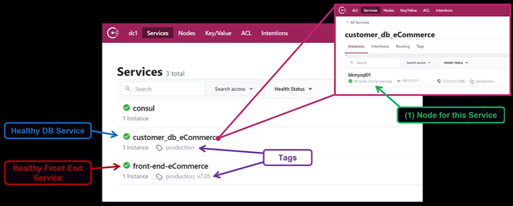

# Gitlab Service Discovery

Gitlab 에서 Consul 을 통한 Service Discovery 에 대한 설명 페이지

## About Consul

- Consul 에서 제공하는 Service Discovery 기능은 크게 3가지가 있으며 이를 구분해 보면 아래와 같음
    - [**Register Service**](https://www.consul.io/docs/discovery/services)
        - App 이 실행되는 위치에 Consul Client 를 설치하고 Service Definition 을 작성 후 Consul Client 를 실행시켜 Service 를 등록
            
            ```bash
            # Consul Client
            
            $ sudo su
            $ cd /tmp
            $ sudo  cat <<EOF > web.json
            {
               "service": {
                "name": "web",
                "port": 80
              }
            }
            EOF
            
            # Register Service By Command
            $ consul services register web.json
            
            # Deregister Service By Command
            $  consul services deregister web.json
            
            # Register Service By API
            $ curl \
            --request PUT \
            --data @web.json
            https://<SERVER_IP>:8500/v1/agent/service/register 
            
            # Deregister Service By API
            $  curl \
            --request PUT \ 
            --data @web.json
            https://<SERVER_IP>:8500/v1/agent/service/deregister
            ```
            
        - Service Definition 샘플
            
            ```ruby
            **service** {
              id = "red0" # 서비스 ID 로 유일해야 하며 보통 노드 hostname 을 사용
              name = "redis" # 서비스명
              tags = [ # 서비스에서 사용하는 옵셔널 테그
                "primary"
              ]
              address = "10.3.13.112" # 서비스의 IP Address
              port = 6000 # 서비스가 사용중인 포트
              checks = [ # 서비스 헬스 체크
                {
                  args = ["/bin/check_redis", "-p", "6000"]
                  interval = "5s"
                  timeout = "20s"
                }
              ]
            }
            ```
            
            - name (required)
                - Service 이름
            - id
                - 서비스 ID 를 지정하는 문자열
                - default
                    - 지정하지 않는 경우 name 값이 사용됨
                - tag 와 id 로 Service 를 여러 버전으로 구분 가능
                - Service 별로 여러 id 사용 가능
            - tags
                - Tags
                - Service 의 레이블로 version 정보 같은 meta 정보를 넣을 때 사용
            - address
                - 연결할 Service 의 ip 주소
                - NIC 카드가 여러개 있을 때 특정 사용할 IP Address 를 지정
                - default
                    - 지정하지 않는 경우 Consul agent 의 default address 가 사용됨
            - port
                - Service 실행 port
            - checks
                - Health checks
                - 서비스 Health Check
    - Query Service
        - Consul Client 는 사용자가 등록한 Service 를 Service Catalog 에 저장
            
            
            
        - Service Catalog 를 통해 DNS Query 가능
            
            ```bash
            #  Server Side
            
            $ cd /etc/consul.d
            $ cat <<EOF > web1.json
            {
              "service": {
                "name": "web",
                 "id": "web1",
                "port": 8080,
                "tags": ["v1"]
              }
            }
            EOF
            
            $ cat <<EOF > web2.json
            {
              "service": {
                "name": "web",
                 "id": "web2",
                "port": 9080,
                "tags": ["v2"]
              }
            }
            EOF
            
            $ consul reload
            
            # 서비스 조회 형식
            # Consul 의 DNS 인터페이스는 디폴트로 8600 포트를 사용
            #  [<tag>.]**<service>.service**[.<datacenter>.dc][.<cluster-peer>.peer][.<sameness-group>.sg].**<domain>**
            $  dig @localhost -p 8600 web.service.consul SRV
            ...
            ;; ANSWER SECTION:
            web.service.consul.     0       IN      SRV     1 1 8080 consul-client-2.node.dc1.consul.
            web.service.consul.     0       IN      SRV     1 1 9080 consul-client-2.node.dc1.consul.
            ....
            
            $  dig @localhost -p 8600 v1.web.service.consul SRV
            ...
            ;; ANSWER SECTION:
            v1.web.service.consul.  0       IN      SRV     1 1 8080 consul-client-2.node.dc1.consul.
            ....
            ```
            
            - dig 명령어 사용법
                - **dig -p [port] @[server] [domain] [type] [filter]**
                    - server
                        - 확인할 때 사용할 네임 서버를 지정한다.
                        - 지정하지 않으면 /etc/resolv.conf 에 등록된 Nameserver 를 이용하여 Root 서버를 조회한다.
                    - type
                        - a/mx/ns/soa/srv/any
                    - filter
                        - +short
                            - 응답 부분만 보기
                        - +trace
                            - 추적 과정도 보기
    - Monitoring Service
        - 문제가 생긴 node 나 service 를 모니터링 하여 문제가 없는 Node 나 Service 만 선별하여 Service 를 찾거나 건강한 Service 에만 트래픽을 보내도록 돕는 기능
        - 예시
            
            ```bash
            $ cd /etc/consul.d/
            $ sudo vi consul.hcl
            data_dir = "/etc/consul.d/consul-dir"
            start_join = ["3.35.43.234"]
            bind_addr = "0.0.0.0"
            advertise_addr = "52.79.247.105"
            node_name = "consul-client-1"
            
            $ sudo systemctl restart consul
            
            $ sudo vi web.json
            {
              "service": {
                "name": "web",
                "port": 80,
                "check": {
                "args": [
                    "curl",
                    "127.0.0.1"
                  ],
                  "interval": "10s"
                }
              }
            }
            
            $ consul validate /etc/consul.d 
            
            $ consul reload
            Configuration reload triggered
            
            #  Web Service  사용하는 App 설치
            $  sudo amazon-linux-extras install -y nginx1
            $  nginx -v 
            $  sudo  systemctl start nginx
            
            # nginx 중지
            $  sudo systemctl stop nginx
            
            # Consul UI 에서 Service Catalog 확인 혹은 API 를 통해 확인
            // GET  /health/node/:node
            $ curl \
                -H "X-Consul-Namespace: *" \
                http://127.0.0.1:8500/v1/health/node/my-node
            [
              {
                "ID": "40e4a748-2192-161a-0510-9bf59fe950b5",
                "Node": "foobar",
                "CheckID": "serfHealth",
                "Name": "Serf Health Status",
                "Status": "passing",
                "Notes": "",
                "Output": "",
                "ServiceID": "",
                "ServiceName": "",
                "ServiceTags": [],
                "Namespace": "default"
              },
              {
                "ID": "40e4a748-2192-161a-0510-9bf59fe950b5",
                "Node": "foobar",
                "CheckID": "service:redis",
                "Name": "Service 'redis' check",
                "Status": "passing",
                "Notes": "",
                "Output": "",
                "ServiceID": "redis",
                "ServiceName": "redis",
                "ServiceTags": ["primary"],
                "Namespace": "foo"
              }
            ]
            
            //GET  /health/checks/:service	 
            $ curl \
                http://127.0.0.1:8500/v1/health/checks/my-service?ns=default
            [
              {
                "Node": "foobar",
                "CheckID": "service:redis",
                "Name": "Service 'redis' check",
                "Status": "passing",
                "Notes": "",
                "Output": "",
                "ServiceID": "redis",
                "ServiceName": "redis",
                "ServiceTags": ["primary"],
                "Namespace": "default"
              }
            ]
            ```

## Consul 통신 보안

- **Gossip Encryption** (8301 TPC/UDP)
    - Gossip 통신(Consul 서버 사이의 데이터 공유 프로토콜) 시의 암호화
    - 대칭키를 통한 암호화
- **RPC Encryption**
    - Server 와 Client 사이의 Encryption
    - TLS 통신
- **Mesh Encryption**
    - Consul Connect 에 의해 제공됨
    - Service Mesh 구성에서 Proxy 사이에 Encryption, Authenticity
    - mutual TLS 통신

## Gitlab 에서 Consul 노드 구성

- Gitlab Consul
    - GitLab 프리미엄에는 [Consul](https://www.consul.io/)의 번들 버전이 포함되어 있어 `/etc/gitlab/gitlab.rb`을 사용하여 관리할 수 있는 서비스 디스커버리가 제공됨
- 전제 조건
    - Consul을 설정하려면 GitLab Self-Managed Premium 또는 Ultimate 버전에서 제공되는 내장 Consul을 사용해야 함
    - Consul 서버 노드 수를 결정해야 함
    - 필요한 포트가 방화벽에서 열려 있는지 확인
        - 8500, 8501
- Consul Node 구성
    - Server
        1. GitLab 설치: GitLab을 설치하되 `EXTERNAL_URL` 값을 입력하지 않음
        2. /etc/gitlab/gitlab.rb 수정
            
            ```ruby
            # Consul 역할만 활성화
            # 10.0.10.100 10.0.11.100 10.0.12.100 는 Consul Server 의 IP
            roles ['consul_role']
            consul['enable'] = true
            consul['monitoring_service_discovery'] =  true
            consul['configuration'] = {
              server: true,
              retry_join: %w(10.0.10.100 10.0.11.100 10.0.12.100),
              ui: true,
              datacenter: 'gitlab_consul',
              client_addr: '0.0.0.0',
            }
            ...
            ```
            
        3. GitLab 재구성 
            
            ```bash
            sudo gitlab-ctl reconfigure
            ```
            
        4. Consul 상태 확인
            
            ```bash
            sudo /opt/gitlab/embedded/bin/consul members
            ```
            
        5. 정상적인 출력 예시
            
            ```
            Node                 Address               Status  Type    Build  Protocol  DC
            CONSUL_NODE_ONE      XXX.XXX.XXX.YYY:8301  alive   server  0.9.2  2         gitlab_consul
            CONSUL_NODE_TWO      XXX.XXX.XXX.YYY:8301  alive   server  0.9.2  2         gitlab_consul
            CONSUL_NODE_THREE    XXX.XXX.XXX.YYY:8301  alive   server  0.9.2  2         gitlab_consul
            ```
            
    - Client
        
        ```ruby
        consul['enable'] = true
        consul['monitoring_service_discovery'] =  true
        consul['configuration'] = {
          retry_join: %w(10.0.10.100 10.0.11.100 10.0.12.100),
        }
        ```
        
- Consul 노드 TLS  설정
    - 기본적으로 TLS는 활성화되지 않으며, 기본 구성은 다음과 같음
        
        ```ruby
        ...
        consul['use_tls'] = false
        consul['tls_ca_file'] = nil
        consul['tls_certificate_file'] = nil
        consul['tls_key_file'] = nil
        consul['tls_verify_client'] = nil
        ```
        
    - TLS를 활성화하려면 `consul['use_tls'] = true`로 설정하고, 추가 구성도 필요
        - 서버 노드에서 TLS 설정
            - 서버 노드는 최소한 `tls_ca_file`, `tls_certificate_file`, `tls_key_file`을 설정해야 함
        - 클라이언트 노드에서 TLS 설정
            - 클라이언트 노드는 기본적으로 서버에서 TLS 인증을 요구하지 않음
            - 서버에서 클라이언트 인증을 비활성화하려면 `consul['tls_verify_client'] = false`로 설정할 수 있음
    - TLS 설정 예시
        - 최소 TLS 지원
            - 서버는 TLS로 수신 요청을 처리하되, 클라이언트 인증은 요구하지 않는 경우
                1. 서버 노드 구성 (/etc/gitlab/gitlab.rb)
                    
                    ```ruby
                    ...
                    consul['use_tls'] = true
                    consul['tls_ca_file'] = '/path/to/ca.crt.pem'
                    consul['tls_certificate_file'] = '/path/to/server.crt.pem'
                    consul['tls_key_file'] = '/path/to/server.key.pem'
                    consul['tls_verify_client'] = false
                    consul['https_port'] = 8501
                    ```
                    
                2. 클라이언트 노드 구성
                    
                    ```bash
                    ...
                    consul['enable'] = true
                    consul['use_tls'] = true
                    consul['tls_ca_file'] = '/path/to/ca.crt.pem'
                    consul['https_port'] = 8501

                    # patroni 인스턴스 설정시
                    patroni['consul']['url'] = 'https://localhost:8501'
                    ```
                    
                3. GitLab 재구성
                    
                    ```bash
                    sudo gitlab-ctl reconfigure
                    ```
                    
        - 기본 TLS 지원
            - 서버에서 상호 TLS 인증을 사용하는 경우
                1. 서버 노드 구성 (/etc/gitlab/gitlab.rb)
                    
                    ```ruby
                    ...
                    consul['use_tls'] = true
                    consul['tls_ca_file'] = '/path/to/ca.crt.pem'
                    consul['tls_certificate_file'] = '/path/to/server.crt.pem'
                    consul['tls_key_file'] = '/path/to/server.key.pem'
                    consul['https_port'] = 8501
                    ```
                    
                2. 클라이언트 노드 구성
                    
                    ```bash
                    .
                    consul['use_tls'] = true
                    consul['tls_ca_file'] = '/path/to/ca.crt.pem'
                    consul['tls_certificate_file'] = '/path/to/client.crt.pem'
                    consul['tls_key_file'] = '/path/to/client.key.pem'
                    consul['https_port'] = 8501
                    
                    # patroni 인스턴스 설정시
                    patroni['consul']['url'] = 'https://localhost:8501'
                    ```
                    
                3. GitLab 재구성
                    
                    ```bash
                    sudo gitlab-ctl reconfigure
                    ```
                    
        - 전체 TLS 지원 (서버 및 클라이언트 상호 TLS 인증)
            - 서버, 클라이언트 및 Patroni 클라이언트 인증서를 동일한 CA로 발급해야 상호 TLS 인증이 가능
                1. 서버  구성 (/etc/gitlab/gitlab.rb)
                    
                    ```ruby
                    ...
                    consul['use_tls'] = true
                    consul['tls_ca_file'] = '/path/to/ca.crt.pem'
                    consul['tls_certificate_file'] = '/path/to/server.crt.pem'
                    consul['tls_key_file'] = '/path/to/server.key.pem'
                    consul['https_port'] = 8501
                    ```
                    
                2. 클라이언트 구성
                    
                    ```bash
                    ...
                    consul['use_tls'] = true
                    consul['tls_verify_client'] = true
                    consul['tls_ca_file'] = '/path/to/ca.crt.pem'
                    consul['tls_certificate_file'] = '/path/to/client.crt.pem'
                    consul['tls_key_file'] = '/path/to/client.key.pem'
                    consul['https_port'] = 8501
                    
                    patroni['consul']['url'] = 'https://localhost:8501'
                    patroni['consul']['cacert'] = '/path/to/ca.crt.pem'
                    patroni['consul']['cert'] = '/opt/tls/patroni.crt.pem'
                    patroni['consul']['key'] = '/opt/tls/patroni.key.pem'
                    patroni['consul']['verify'] = true
                    ```
                    
                3. GitLab 재구성
                    
                    ```bash
                    sudo gitlab-ctl reconfigure
                    ```
                    
- Consul 노드 Gossip Encryption 설정
    - Consul 에이전트 간의 통신을 보호하기 위해 암호화키 사용 설정 가능
    - 설정 방법
        1. gitlab 설치 후 encryption key 생성
            
            ```bash
            $ gitlab-ctl consul keygen
            ```
            
        2. gitlab.rb 파일 수정
            
            ```ruby
            consul['encryption_key'] = <base-64-key>
            consul['encryption_verify_incoming'] = true
            consul['encryption_verify_outgoing'] = true
            ```
            
        3. reconfigure
            
            ```bash
            $ sudo gitlab-ctl reconfigure
            ```
            
- Consul Service 명 설정
    
    ```ruby
    praefect['consul_service_name'] = 'praefect'
    gitaly['consul_service_name'] = 'gitaly'
    gitlab_exporter['consul_service_name'] = 'gitlab-exporter'
    postgres_exporter['consul_service_name'] = 'postgres-exporter'
    redis_exporter['consul_service_name'] = 'redis-exporter'
    postgres_exporter['consul_service_name'] = 'postgres-exporter'
    prometheus['consul_service_name'] = 'prometheus'
    nginx['consul_service_name'] = 'nginx'
    sidekiq['consul_service_name'] = 'sidekiq'
    puma['consul_service_name'] = 'rails'
    gitlab_workhorse['consul_service_name'] = 'workhorse'
    ```
    
- Gitlab  Service DNS 조회
    
    ```ruby
    dig A praefect.service.consul @127.0.0.1
    ```