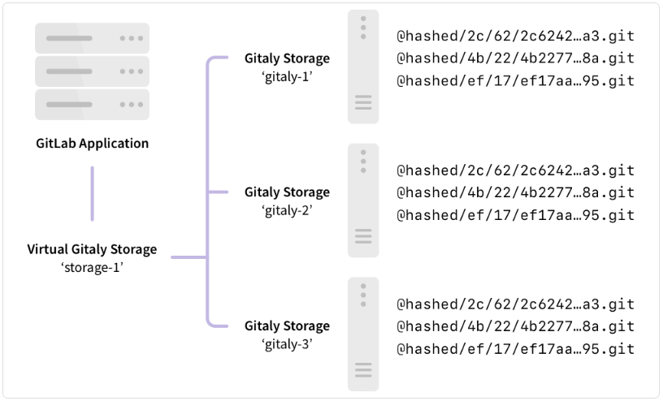

# Configure Gitlab Storage

Gitlab Storage Configuration 에 대한 설명 페이지

## Repository Storage

- 설명
    - GitLab에서 저장소(repository storage)는 프로젝트 데이터를 저장하는 공간을 의미
    - GitLab에서는 물리적 저장소와 가상 저장소를 설정하여 데이터를 저장
    - 저장 방식은 Hashed Storage 방식을 통해 저장소의 구조를 최적화하고 효율적으로 관리
- 저장소 유형
    - 물리적 저장소 (Physical Storage)
        
        
        
        - 각 저장소는 Gitaly 주소로 연결되며, Gitaly 서버에서 관리
        - 이 방식은 GitLab이 저장소를 직접 다루는 방식
    - 가상 저장소 (Virtual Storage)
        
        
        
        - 여러 Gitaly 서버를 사용하여 클러스터를 n 개 구축하고, 여러 서버 간에 저장소를 분산하여 관리
            
            
            
- 저장소 경로 구성
    - 물리적(Gitaly, Gitaly Cluster) 또는 가상 저장소(Praefect)를 Gitlab 서버 설정에서 매핑
    - `/config/gitlab.yml`에서 저장소와 Gitaly 서버 간의 매핑을 정의
        
        ```bash
        # 물리적 저장소
        gitaly['enable'] = true
        gitlab_rails['gitaly_token'] = '${gitaly_settings.token}'
        git_data_dirs(
          {
            "default" => {
              "gitaly_address" => "tcp://${gitaly_settings.addresses[0]}:8075"
            },
            "storage1" => {
              "gitaly_address" => "tcp://${gitaly_settings.addresses[0]}:8075"
            },
          }
        )
        
        # 가상 저장소 
        gitaly['enable'] = false
        git_data_dirs(
          {
            "default" => {
              "gitaly_address" => "tcp://${praefect_settings.lb_dns_name}:2305",
              "gitaly_token" => "${praefect_settings.external_token}"
            }, 
          }
        )
        ```
        
- 저장소 관리
    - **Hashed Storage**
        - Hashed Storage는 GitLab에서 프로젝트를 관리하는 방식 중 하나로, 프로젝트의 ID를 기반으로 해시 값을 생성하여 저장소를 관리
        - 이 방식의 주요 특징은 폴더 구조가 변경되지 않으므로, 프로젝트 이름 변경 시 디스크 구조를 동기화할 필요가 없어 효율적
        - 장점
            - 폴더 구조 불변성
                - 프로젝트 이름 변경 시 DB 트랜잭션만 필요하고, 디스크 구조는 변경되지 않음
            - 디스크 분배
                - 해시값을 사용하여 저장소를 고르게 분배하여 성능을 최적화
            - 즉시 적용
                - 프로젝트 이름, 그룹 이름 등을 변경해도 즉시 적용
        - 해시 포맷
            - SHA256을 사용하여 프로젝트 ID를 해시값으로 변환
            - 예시
                - 프로젝트 저장소: `@hashed/#{hash[0..1]}/#{hash[2..3]}/#{hash}.git`
                - 위키 저장소: `@hashed/#{hash[0..1]}/#{hash[2..3]}/#{hash}.wiki.git`
        - 해시된 경로 변환
            - 프로젝트 이름에서 해시된 경로로 변환
                - GitLab 관리자는 Admin 영역 또는 Rails 콘솔을 통해 프로젝트의 해시 경로를 찾을 수 있음
            - 해시된 경로에서 프로젝트 이름으로 변환
                - Rails 콘솔에서 명령어를 사용해 프로젝트 이름을 확인하거나, `.git` 디렉토리의 설정 파일에서 확인
    - **Hashed Object Pools**
        - Hashed Object Pools는 GitLab에서 Git 객체를 중복 저장하지 않도록 효율적으로 관리하는 방식
        - GitLab에서 프로젝트가 포크(fork) 되거나 복제되는 경우, 여러 프로젝트가 동일한 객체를 공유
        - 이러한 객체들은 객체 풀(Object Pool)에 저장되어 중복을 제거하고 저장소의 효율성을 높이는 역할
        - Gitaly와 Hashed Object Pools의 관계
            - Gitaly는 GitLab에서 Git 저장소를 효율적으로 관리하는 백엔드 서비스로, 저장소에 대한 읽기/쓰기 작업을 처리
            - Gitaly는 Hashed Object Pools를 관리하며, 이를 통해 여러 프로젝트에서 공유되는 Git 객체들을 단일 객체 풀에 저장하고 필요할 때 재사용할 수 있도록 함
        - 작동 방식
            1. 객체 풀(Object Pool)은 원본 프로젝트와 그 포크 프로젝트들이 공유하는 객체를 저장하는 저장소
                - 예를 들어, 두 개의 프로젝트가 동일한 Git 객체를 사용할 때, 그 객체는 `@pools` 디렉토리 내에 저장
            2. Gitaly는 Git 객체를 `@pools` 디렉토리에 저장하여, 이를 여러 프로젝트 간에 공유할 수 있도록 관리
            3. 이때, GitLab은 `objects/info/alternates` 파일을 사용하여 원본 프로젝트와 포크 프로젝트가 같은 객체 풀을 참조하도록 설정
            4. 객체 풀 경로 예시
                - `@pools/#{hash[0..1]}/#{hash[2..3]}/#{hash}.git`
                - 예를 들어, GitLab 서버에서 객체 풀에 저장된 Git 객체는 `@pools` 디렉토리에 위치하게 됨
        - 주의사항
            - 객체 풀에서는 `git prune`이나 `git gc` 명령을 실행하지 않아야 함
                - `git prune`은 사용되지 않는 Git 객체(garbage collection 대상 객체)를 삭제하는 명령
                - `git gc`(Garbage Collection)는 Git 저장소의 최적화를 위해 불필요한 객체들을 삭제하고 저장소를 압축하여 효율적으로 관리하는 명령
                - 이를 실행하면, 객체 풀에서 공유된 정보가 날라가서 다른 프로젝트들에서 데이터 손실이 발생할 수 있음
            - Gitaly는 객체 풀을 통해 Git 객체들을 효율적으로 관리하며, 저장소 간의 중복 데이터를 줄이고 디스크 공간을 절약하는 데 중요한 역할
    - Group Wiki 저장소
        - **Group Wiki**는 프로젝트 위키와 비슷하지만, 그룹 단위로 위키를 관리하는 방식
        - 이 위키는 `@groups` 디렉토리에 저장되며, 그룹 ID를 기반으로 해시 경로가 생성
            
            ```bash
            @groups/#{hash[0..1]}/#{hash[2..3]}/#{hash}.wiki.git
            ```
            
- 저장소 종류
    
    - 저장 가능한 객체
      | 저장 가능한 객체 | Hashed Storage | S3 호환 저장소 |
      | --- | --- | --- |
      | Repository | Yes | - |
      | Attachments | Yes | - |
      | Avatars | No | - |
      | CI/CD Job Logs | No | Yes |
      | CI/CD Artifacts | No | Yes |
      | LFS Objects | Similar | Yes |
      | Repository Pools | Yes | - |
    - Gitaly에서 관리되는 저장소
        - 프로젝트 저장소 (Project Repository)
            - GitLab의 각 프로젝트는 Git 저장소로 관리되며, 이는 Gitaly에서 처리
            - GitLab이 관리하는 Git 데이터(버전 관리, 브랜치, 커밋 등)는 Gitaly에서 담당
                
                ```bash
                @hashed/01/23/0123456789abcdef0123456789abcdef0123456789abcdef0123456789abcdef.wiki.git
                # @hashed는 GitLab에서 해시된 저장소 경로가 저장되는 기본 폴더 
                # 01과 23은 SHA256 해시의 처음 두 문자로, 디렉토리 구조를 나누는 데 사용 
                # 0123456789abcdef...는 프로젝트 ID에 대해 계산된 SHA256 해시 값의 나머지 부분 
                # .git은 Git 저장소를 나타내는 확장자
                ```
                
        - 프로젝트 Wiki 저장소 (Project Wiki Repository)
            - 각 프로젝트의 Wiki도 Git 저장소로 관리되며, Gitaly에서 처리
            - Wiki는 Git을 통해 버전 관리되므로 Gitaly에서 관리
                
                ```bash
                @hashed/#{hash[0..1]}/#{hash[2..3]}/#{hash}.wiki.git
                ```
                
        - 그룹 Wiki 저장소 (Group Wiki Repository)
            - 그룹 Wiki도 Git 저장소로 처리되며, Gitaly에서 관리
            - 그룹 단위로 관리되는 Wiki는 GitLab에서 Git 저장소로 취급하고, Gitaly에서 관리
                
                ```bash
                @groups/#{hash[0..1]}/#{hash[2..3]}/#{hash}.wiki.git
                ```
                
        - Hashed Object Pools
            - GitLab에서 객체 풀(Object Pools)은 여러 프로젝트가 공유하는 Git 객체를 저장하는 공간
            - Git 객체의 중복을 방지하고, 여러 프로젝트가 동일한 객체를 공유할 수 있게 하는 방식이 Gitaly에서 처리
                
                ```bash
                @pools/#{hash[0..1]}/#{hash[2..3]}/#{hash}.git
                ```
                
        - LFS 객체 저장소 (LFS Objects)
            - Gitaly 에서 저장 가능하고 S3 에도 저장 가능
            - GitLab에서는 LFS(large file storage)를 사용하여 대용량 파일을 Git 저장소 외부에 관리
            - LFS 객체는 GitLab의 Git 저장소 관리 시스템에서 처리되며, Gitaly에서 관리
            - LFS 객체가 **해시 경로** 방식으로 저장되지만, 전통적인 Git 저장소와는 달리 LFS 객체를 다루는 특수한 저장 방식이 사용
                
                ```bash
                shared/lfs-objects/#{oid[0..1]}/#{oid[2..3]}/#{oid[4..-1]}
                
                # shared/lfs-objects: GitLab LFS 객체들이 저장되는 최상위 디렉토리 
                # oid[0..1]: LFS 객체 ID의 첫 2자리 
                # oid[2..3]: LFS 객체 ID의 3번째와 4번째 자리 
                # oid[4..-1]: LFS 객체 ID의 나머지 부분 
                
                # LFS 객체 ID가 8909029eb962194cfb326259411b22ae3f4a814b5be4f80651735aeef9f3229c일 경우
                # 해당 LFS 객체의 경로
                shared/lfs-objects/89/09/029eb962194cfb326259411b22ae3f4a814b5be4f80651735aeef9f3229c
                ```
                
    - Gitaly에서 관리되지 않는 저장소
        - Gitaly는 Git 저장소 관리에 중점을 두기 때문에, **Git이 아닌 저장소**나 **다른 유형의 데이터를 관리하는 저장소**는 Gitaly에서 관리되지 않음
        - 이러한 저장소는 다른 서비스에서 관리
        - 종류
            - CI/CD 아티팩트 저장소 (CI/CD Artifacts)
                - CI/CD 아티팩트는 GitLab의 CI/CD 파이프라인에서 생성된 결과물
                - 이 저장소는 보통 S3 호환 스토리지나 다른 외부 저장소에 저장
            - CI/CD 캐시 저장소 (CI/CD Cache)
                - CI/CD 캐시는 GitLab에서 CI/CD 파이프라인을 빠르게 실행하기 위한 임시 파일들을 저장하는 공간
                - S3 호환 스토리지 또는 다른 외부 스토리지에 저장
            - Docker 레지스트리 저장소 (Docker Registry)
                - Docker 이미지 저장소는 GitLab의 내장 Docker 레지스트리에서 관리
                - 이는 Gitaly에서 관리되지 않으며, Docker 레지스트리 서비스가 별도로 처리
            - 첨부 파일 저장소 (Attachments)
                - 이슈나 병합 요청(Merge Request)에 첨부된 파일들은 GitLab의 다른 저장소에 저장
                - 첨부 파일은 S3 호환 스토리지에 저장 가능
            - 파일 저장소 (User Files, Avatars 등)
                - 사용자 아바타와 같은 파일들은 별도의 스토리지 시스템에 저장
                - Gitaly와는 관련이 없으며, 파일 업로드는 GitLab의 파일 저장 시스템을 통해 처리
            - 페이지 저장소 (GitLab Pages)
                - GitLab Pages는 정적 웹사이트를 호스팅하는 GitLab 기능
                - 이 저장소는 GitLab의 파일 시스템 또는 S3 호환 스토리지에 저장
            - LFS 객체 저장소 (LFS Objects)
                - S3 호환 저장소에서는 LFS 객체가 완전히 호환되어 저장
                - GitLab은 S3 호환 저장소에서 LFS 객체를 관리하는 데 최적화
- 저장소 경로 확인 함수
    - 그냥 만들어본 함수
        
        ```bash
        # 프로젝트 저장소 경로 생성 함수
        get-repository-path() {
            PROJECT_HASH=$(echo -n $1 | openssl dgst -sha256 | sed 's/^.* //')
            echo "@hashed/${PROJECT_HASH:0:2}/${PROJECT_HASH:2:2}/${PROJECT_HASH}.git"
        }
        
        $ get-repository-path "<PROJECT_ID>"
        
        # 프로젝트 Wiki 저장소 경로 생성 함수
        get-wiki-path() {
            PROJECT_HASH=$(echo -n $1 | openssl dgst -sha256 | sed 's/^.* //')
            echo "@hashed/${PROJECT_HASH:0:2}/${PROJECT_HASH:2:2}/${PROJECT_HASH}.wiki.git"
        }
        
        # LFS 객체 저장소 경로 생성 함수
        get-lfs-path() {
            PROJECT_HASH=$(echo -n $1 | openssl dgst -sha256 | sed 's/^.* //')
            echo "shared/lfs-objects/${PROJECT_HASH:0:2}/${PROJECT_HASH:2:2}/${PROJECT_HASH}"
        }
        
        # Repository Pool 경로 생성 함수
        get-repository-pool-path() {
            PROJECT_HASH=$(echo -n $1 | openssl dgst -sha256 | sed 's/^.* //')
            echo "@pools/${PROJECT_HASH:0:2}/${PROJECT_HASH:2:2}/${PROJECT_HASH}.git"
        }
        
        ```

## Gitaly & Gitaly Cluster

- 설명
    - Gitaly와 Gitaly Cluster는 Git 리포지토리의 저장 및 검색을 관리하는 서비스
    - Gitaly는 GitLab에서 Git 데이터를 읽고 쓸 수 있도록 고급 RPC 접근을 제공
- 아키텍처
    - Gitaly ↔ Gitaly Client
        
        
        
        - Gitaly 클라이언트
            - Gitaly 서버에 요청을 보내는 프로세스를 실행하는 노드
            - GitLab Rails 애플리케이션, GitLab Shell, GitLab Workhorse 등
    - Gitaly
        
        
        
        - Gitaly 가 서버를 여러개 만들어 Gitlab 과 연결
        - Gitaly 서버를 여러개 구성하는 경우 Gitaly Cluster 가 아니며 각 노드는 동기화 되지 않음
        - Gitaly
    - Gitaly Cluster
        
        
        
        
        
        - 설명
            - Gitaly Cluster 로 구성시 리포지토리가 여러 Gitaly 노드에 분산되어 저장되어, 고가용성과 성능을 제공
            - Praefect 프록시를 통한 데이터 관리
            - Gitaly Cluster의 핵심 구성 요소 중 하나인 Praefect는 클러스터의 프록시 역할
            - 모든 요청은 Praefect를 통해 라우팅되며, 각 노드(Gitaly 서버)에 요청이 분산
        - Gitaly Cluster 기능
            - 데이터 복제
                - Git 리포지토리는 클러스터 내의 여러 노드에 복제
                - 이를 통해 고가용성과 데이터의 중복성을 확보
                - 일반적으로 최소 3개의 노드가 권장되며, 데이터가 노드들 간에 동기화
                - 쓰기 작업은 비동기 복제. 장애 시 일부 쓰기 손실 가능
                - 복제 인자(Replication Factor)
                    - 각 저장소를 여러 노드에 복제(예: 복제 인자 3일 경우, 각 저장소는 3개의 Gitaly 노드에 저장)
            - 일관성 보장
                - 데이터 일관성을 유지하기 위해 쓰기가 발생할 때 동기화 프로세스가 실행
                - Praefect는 일관성 모델을 구성할 수 있도록 지원
                    - Strong consistency: 쓰기가 모든 복제본에 성공적으로 기록될 때까지 완료되지 않음
                    - Eventual consistency: 일시적으로 데이터가 불일치할 수 있지만, 시간이 지나면 동기화
            - 장애 내성
                - 쓰기 작업을 다른 Gitaly 노드에 복제
                - Gitaly 노드 장애 자동 감지 및 요청 재라우팅
                - 재해 복구 계획을 통한 완전한 클러스터 장애 대비
            - 가상 스토리지
                - 저장소 관리를 단순화하기 위해 가상 스토리지를 사용.
                - Gitaly Cluster의 가상 스토리지는 직접 Gitaly 스토리지 구성보다 장애 내성이 우수
            - 장애 조치 (Failover)
                - 하나의 노드가 장애가 발생하더라도 다른 노드에서 요청을 처리할 수 있음
                - Praefect는 클러스터 내에서 가용 노드를 탐지하여 요청을 재할당
                - RPO(복구 지점 목표): 1분 이내
                - RTO(복구 시간 목표): 10초 이내
                    - Praefect 노드가 매초 상태를 점검하여 10회 연속 실패 시 장애 복구 수행
            - 데이터 관리
                - 여러 Virtual Storage 를 구성
                - 각 Virtual Storage 는 n 개의 Gitaly Server 로 구성
                - 예
                    - Virtual Storage 1
                        - Gitaly 서버 A, B, C → 공유 데이터: Repo 1, Repo 2(Praefect가 복제를 관리)
                    - Virtual Storage 2
                        - Gitaly 서버 X, Y, Z → 공유 데이터: Repo 3, Repo 4(Praefect가 복제를 관리)
                    - Virtual Storage 1과 2
                        - 서로 데이터가 완전히 독립적(Repo 1, Repo 2는 Virtual Storage 2에 존재하지 않음)
        - Gitaly Cluster vs Geo
            
            
            | 특징 | Gitaly Cluster | Geo |
            | --- | --- | --- |
            | 노드 | 단일 위치의 여러 노드 | 여러 위치의 여러 노드 |
            | 지연 허용치 | 1초 미만, 이상적으론 ms | 최대 1분 |
            | 장애 복구 | 자동 | 수동 |
            | 일관성 | 강한 일관성 | 최종적 일관성 |
            | 중복 제공 대상 | Git 데이터 저장소 | GitLab 인스턴스 전체 |
    - Gitaly Cluster에서 저장소 작업의 시퀀스
        - 저장소 생성 시퀀스
            - 상황
                - 두 명의 사용자가 동시에 `repo1`이라는 저장소를 생성하려고 시도
            - 시퀀스
                1. ID 예약
                    - 두 사용자가 동시에 `repo1` 생성 요청 보냄
                    - `사용자A` 요청에서 PostgreSQL에서 `repo1` 저장소를 위한 고유한 ID  `12345`를 예약
                    - `사용자B` 요청에서 Gitaly는 저장소의 ID를 예약할 때 고유한 ID가 이미 예약되어 있다는 사실을 확인
                    - 두번째 요청에 대해  Gitaly는 `repo1`이 이미 존재한다는 메시지를 반환
                2. 저장소 복제본 생성
                    - `repo1`의 ID인 `12345`를 기반으로 Gitaly는 해당 저장소의 복제본을 Gitaly 클러스터의 여러 노드에 생성
                    - 예를 들어, `repo1`은 `gitaly-1`, `gitaly-2`, `gitaly-3` 노드에 복제본이 생성됨
                3. 메타데이터 생성
                    - 복제본이 성공적으로 생성되면, 메타데이터가 PostgreSQL에 기록
                        - 저장소 ID
                            - `repo1`의 고유 ID (`12345`)가 포함됨
                        - 저장소 경로
                            - 저장소가 위치한 물리적 경로
                                - `@cluster/repositories/6f/96/54771`처럼 Gitaly 클러스터 내에서의 위치를 나타냄
                            - 상대 경로
                                - `storage-1/repo1` 처럼 상대 경로도 기록함
                        - 저장소 상태
                            - 해당 저장소가 정상적으로 생성되었는지, 또는 오류가 발생했는지 여부를 나타내는 정보도 포함됨
                    - 메타데이터는 저장소의 경로, ID 등을 포함하며, 이는 저장소가 클러스터 내에서 "실제 존재"하는 것으로 간주됨
                4. 오류 처리
                    - `사용자B`의 생성 요청은 실패하지만, Gitaly는 이를 자동으로 정리하고, `repo1`은 정상적으로 운영됨
                    - 실패한 작업은 백그라운드 프로세스에서 정리됨
        - 저장소 삭제 시퀀스
            - 상황
                - `repo1` 저장소를 삭제하려고 시도
            - 시퀀스
                1. 메타데이터 삭제
                    - `repo1`의 메타데이터가 PostgreSQL에서 삭제됨
                    - 즉, `repo1`은 이제 GitLab에서 "존재하지 않는 것"으로 간주됨
                2. 저장소 복제본 삭제 시도
                    - Gitaly는 `repo1`의 복제본을 Gitaly 클러스터 내의 각 노드에서 삭제하려고 시도
                3. 실패한 삭제 작업
                    - 예를 들어, `gitaly-2`에서 `repo1`을 삭제하는 데 실패할 수 있음
                    - 이 경우, `gitaly-2`에 `repo1` 복제본은 남게 됨
                4. 디스크 상태 정리
                    - 실패한 삭제 작업으로 남은 복제본은 백그라운드 프로세스 의해 자동으로 삭제
                    - 이 과정에서 Gitaly는 실제 디스크 상태를 정리하여 잉여 데이터를 제거
        - 저장소 이동 시퀀스
            - 상황
                - `repo1`을 `storage-1`에서 `storage-2`로 이동
            - 시퀀스
                1. 상대 경로 업데이트
                    - Gitaly에서는 실제 파일 이동 없이, 메타데이터의 상대 경로만 변경하여 `repo1`의 위치를 `storage-1`에서 `storage-2`로 이동
- 설치 절차
    - 기본 구성
        - Linux 패키지 설치 시 기본적으로 최대 20 RPS(1,000 사용자)까지 지원 가능한 설정 제공
    - 구성 가이드
        - 40 RPS / 2,000 사용자: Gitaly의 특정 구성 지침을 참조
        - 2000명 이상 활성 사용자: Gitaly Cluster 사용 권장
        - 커스텀 설치: 직접 컴파일 또는 맞춤형 설치 시 [Gitaly 설정](https://docs.gitlab.com/) 가이드를 참고
    - Gitaly 구성 방법
        1. Linux 패키지 (Omnibus)
        2. Helm 차트 (Kubernetes)
        3. 소스에서 직접 컴파일 (Self-compiled)
    - 구성 절차
        1. Gitlab 설치
        2. `/etc/gitlab/gitlab.rb` 파일 수정하여 Gitaly 설정 추가 또는 변경
        3. 파일 저장 후  GitLab 재구성
    - 사용 가능한 추가 구성 옵션
        - [TLS 지원 활성화](https://docs.gitlab.com/ee/administration/gitaly/tls_support.html)
        - [RPC 동시성 제한](https://docs.gitlab.com/ee/administration/gitaly/concurrency_limiting.html#limit-rpc-concurrency)
        - [pack-objects 동시성 제한](https://docs.gitlab.com/ee/administration/gitaly/concurrency_limiting.html#limit-pack-objects-concurrency)
    - Gitaly 토큰
        - Gitaly 문서에서 언급되는 토큰은 관리자가 선택한 임의의 비밀번호로, GitLab API 또는 다른 웹 API에서 사용하는 토큰과는 무관
    - Gitaly 서버 설정 절차
        1. Gitaly 설치
        2. 인증 구성
        3. Gitaly 서버 구성
        4. Gitaly 클라이언트 구성
        5. 필요 없는 곳에서 Gitaly 비활성화 (선택 사항)
    - Gitaly CLI
        - Gitaly 관리자를 위한 명령줄 인터페이스로 다양한 서브 명령어 제공
        - 주요 기능
            - 저장소의 커스텀 Git 훅 구성
            - Gitaly 설정 파일 검증
            - Gitaly 내부 API 접근성 확인
            - 디스크 상의 저장소에서 Git 명령 실행
        - 사용 방법
            
            ```bash
            sudo -u git -- /opt/gitlab/embedded/bin/gitaly --help
            ```
            
- Known 이슈
    - Gitaly Cluster + Geo 관련 이슈
        
        
        | 이슈 | 요약 | 예방 방법 |
        | --- | --- | --- |
        | Gitaly Cluster + Geo - 실패한 동기화 재시도 문제 | Geo 보조 사이트에서 Gitaly Cluster를 사용할 경우, 동기화에 실패한 저장소가 계속 실패 상태를 유지하며, 복구를 위해 수동 작업이 필요할 수 있음 | GitLab 15.0 ~ 15.2: Geo 주 사이트에서 `gitaly_praefect_generated_replica_paths` 기능 플래그를 활성화. GitLab 15.3부터는 기본 활성화됨 |
        | 업그레이드 후 마이그레이션 누락으로 Praefect가 데이터베이스에 데이터 삽입 불가 | 데이터베이스 마이그레이션이 완료되지 않은 경우, Praefect 노드가 정상 작동 불가 | Praefect 데이터베이스가 최신 상태인지 확인하고 모든 마이그레이션이 완료되었는지 점검. 예: `sudo -u git -- /opt/gitlab/embedded/bin/praefect -config /var/opt/gitlab/praefect/config.toml sql-migrate-status` 명령어로 적용된 마이그레이션 확인. 업그레이드 계획 검토를 위해 지원팀에 도움 요청 권장 |
        | 실행 중인 클러스터에서 스냅샷으로 Gitaly Cluster 노드 복원 | Gitaly Cluster는 일관된 상태로 실행되므로, 복원이 완료되지 않은 단일 노드를 도입하면 클러스터 내 데이터가 일치하지 않을 수 있음 | 단일 노드를 스냅샷에서 복원하지 말 것. 복원이 필요한 경우: 1. GitLab 종료. 2. 모든 Gitaly Cluster 노드의 스냅샷 동시 생성. 3. Praefect 데이터베이스 덤프 수행 |
        | Kubernetes, Amazon ECS 등 환경에서의 제한사항 | Praefect (Gitaly Cluster)는 해당 환경에서 지원되지 않으며, Gitaly에는 알려진 제약이 있음 | 참고 아키텍처를 사용할 것. 자세한 정보는 Epic 6127 참고 |
    - Gitaly Cluster Snapshot Backup and Recovery 관련 이슈
        
        
        | 주제 | 요약 | 권장 사항 |
        | --- | --- | --- |
        | 스냅샷 백업 | Gitaly Cluster는 스냅샷 백업을 지원하지 않음. 스냅샷 백업 사용 시 Praefect 데이터베이스와 디스크 스토리지 간 동기화 문제가 발생할 수 있음 | 스냅샷 백업 대신 공식 백업 및 복원 Rake 작업을 사용할 것 |
        | 증분 백업 | 증분 백업 방식을 통해 Gitaly Cluster 백업 속도를 개선할 수 있음 | 증분 백업 방식을 활용할 것을 권장 |
        | 복원 시 문제 | 스냅샷 백업이나 공식 백업 방식을 사용할 수 없는 경우, 복원 시 문제가 발생할 수 있음 | 고객 지원 팀에 연락하여 복원 도움을 요청 |

## Reference

- [repository storage](https://docs.gitlab.com/ee/administration/repository_storage_paths.html)
- [gitaly](https://docs.gitlab.com/ee/administration/gitaly/)